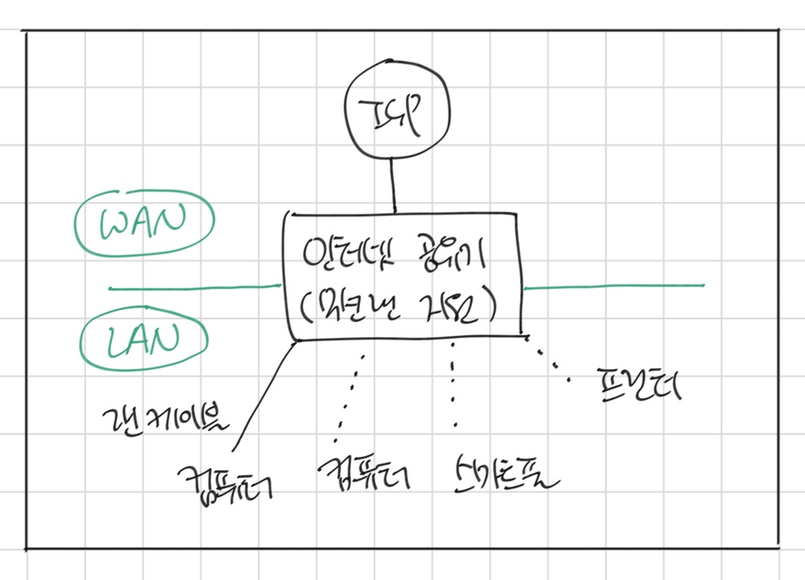
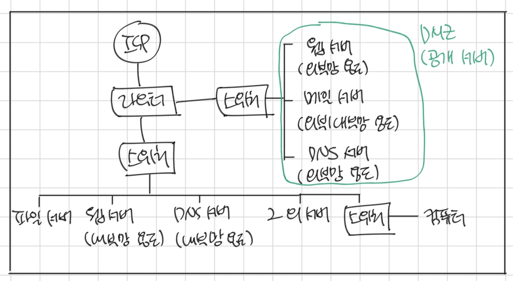
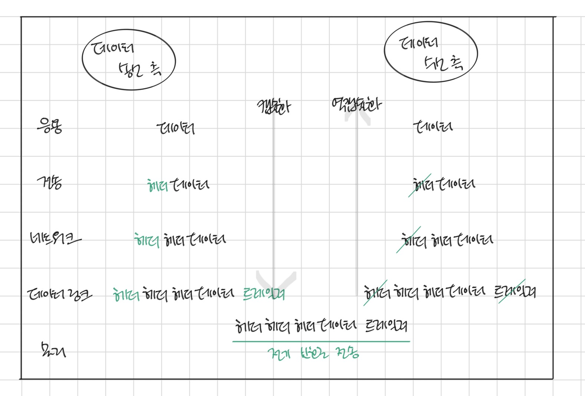
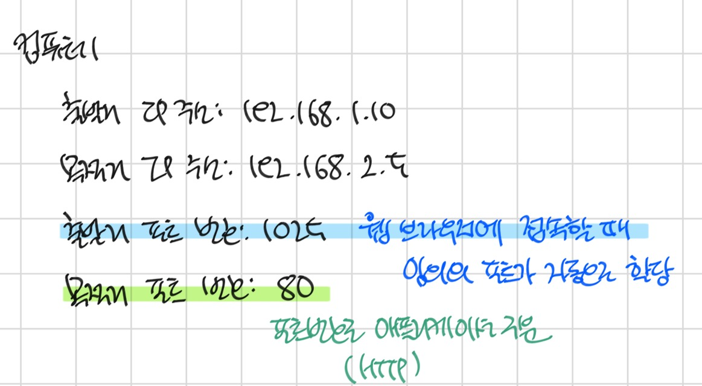
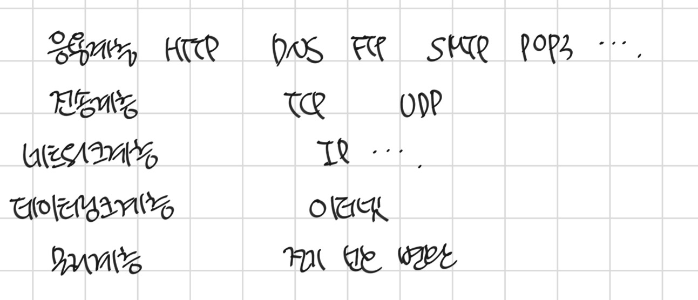
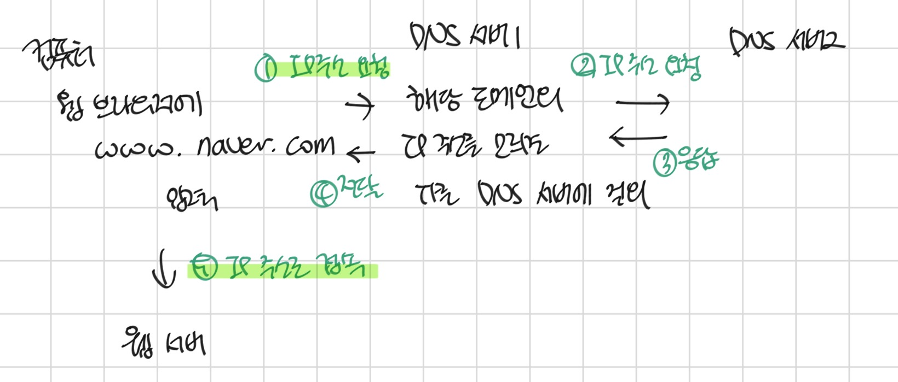

# 모두의 네트워크

📖 2024.06.29 - 2024.07.08

### Lesson1: 네트워크 구조
컴퓨터 네트워크: 컴퓨터간의 연결  
  ▶ 이러한 네트워크를 통해서 '파일 전송', '웹 사이트 열람', '메일 송수신' 등을 할 수 있음

패킷: 네트워크를 통해 전송되는 데이터의 작은 조각  
  * 큰 데이터를 그대로 보내면 네트워크의 대역폭(네트워크에서 이용 가능한 최대 전송 속도로 정보를 전송할 수 있는 단위 시간당 전송량)을 너무 많이 차지해서 다른 패킷의 흐름을 막을 위험이 있음

### Lesson2: 정보의 양을 나타내는 단위
비트: 0과 1의 정보를 나타내는 최소 단위  
  * 1바이트: 8비트, 컴퓨터는 기본적으로 바이트 단위로 데이터를 읽고 쓰는 작업을 수행
문자 코드: 숫자와 문자의 대응표  
  * 예: ASCII 코드

### Lesson3: 랜과 왠
LAN: Local Area Network, 가정이나 빌딩 안에 있는 사무실 같이 지리적으로 제한된 곳에서의 네트워크
WAN: Wide Area Network, ISP가 제공하는 서비스를 사용하여 구축된 네트워크  
  * ISP: Internet Service Provider, 통신 회사
  * 예: LAN과 LAN의 연결

|   |LAN |WAN |
|---|----|----|
|범위|좁음|넓음|
|속도|빠름|느림|
|속도|빠름|느림|
|오류|적음|많음|

### Lesson4: 가정에서 하는 랜 구성

인터넷 공유기: 가정용 라우터, 최근에는 라우터 기능뿐만 아니라 허브, 스위칭 허브, 방화벽과 같은 다양한 기능도 제공  

### Lesson5: 회사에서 하는 랜 구성

서버를 운영하기 위해 
1. 서버를 사내에 설치하거나(=온프레미스) 
2. 데이터 센터에 두거나(=온프레미스)
3. 클라우드에 둘 수 있음

### Lesson6: 네트워크의 규칙
프로토콜: 통신을 하기 위한 규칙

### Lesson7: OSI모델과 TCP/IP 모델
OSI모델: 네트워크 기술의 기본이 되는 모델
  * 데이터 송수신 시, 컴퓨터의 역할을 일곱 개 계층으로 나누어 설명할 수 있음

1. 7계층, 응용 계층, Application Layer, 애플리케이션 계층  
  이메일, 파일 전송, 웹 사이트 조회 등 애플리케이션에 대한 서비스 제공
2. 6계층, 표현 계층, Presentation Layer, 프레젠테이션 계층
  문자 코드, 압축, 암호화 등의 데이터를 변환
3. 5계층, 세션 계층, Session Layer  
  세션 체결, 통신 방식 결정
4. 4계층, 전송 계층, Transport Layer, 트랜스포트 계층  
  신뢰할 수 있는 통신을 구현
5. 3계층, 네트워크 계층, Network Layer
  다른 네트워크와 통신하기 위한 경로 설정 및 논리 주소를 결정
6. 2계층, 데이터 링크 계층, Data Link Layer  
  네트워크 기기 간의 데이터 전송및 물리 주소를 결정
7. 1계층, 물리 계층, Physical Layer  
  시스템 간의 물리적인 연결과 전기 신호를 변환 및 제어

데이터를 전송하는 쪽은 데이터를 보내기 위해 상위 계층 → 하위 계층으로 데이터를 전달  
데이터를 받는 쪽은 데이터를 받기 위해 하위 계층 → 상위 계층으로 전달된 데이터를 수신

TCP/IP 모델
1. 응용 계층  
  OSI 모델에서의 응용 계층 + 표현 계층 + 세션 계층
2. 전송 계층
  OSI 모델에서의 전송 계층
3. 인터넷 계층  
  OSI 모델에서의 네트워크 계층
4. 네트워크 접속 계층  
  OSI 모델에서의 데이터 링크 + 물리 계층

### Lesson8: 캡슐화와 역캡슐화
헤더: 데이터 전달 시, 데이터의 앞부분에 전송하는 데 필요한 정보를 붙여서 다음 계층으로 보내야 하는데, 이 때 이 정보  
  * 캡슐화: 헤더를 붙여 나가는 것 ↔ 역캡슐화: 헤더를 하나씩 제거하는 것

웹 사이트 접속 시,
1. 응용 계층: 웹 사이트를 접속하기 위한 요청 데이터 생성
2. 전송 계층: 신뢰할 수 있는 통신이 이뤄지도록 데이터에 헤더 추가
3. 네트워크 계층: 다른 네트워크와 통신하기 위해 데이터에 헤더 추가
4. 데이터 링크 계층: 물리적 통신 채널을 연결하기 위해 헤더 및 트레일러 추가  
  * 트레일러: 데이터 전달 시, 데이터의 마지막에 추가하는 정보

### Lesson9: 물리 계층의 역할과 랜 카드의 구조
랜 카드: 0과 1의 정보가 컴퓨터 내부에 있는 랜카드로 전송되고 랜 카드는 0과 1을 전기 신호로 변환  
물리 계층: 컴퓨터와 네트워크 장비를 연결하고 컴퓨터와 네트웤 장비 간에 전송되는 데이터를 전기 신호로 변환하는 계층

### Lesson10: 케이블의 종류와 구조
전송 매체: 데이터가 흐르는 물리적인 선로
  * 유선: 트위스트 페어 케이블, 광케이블 등
  * 무선: 라디오파, 마이크로파, 적외선 등

트위스트 페어 케이블(랜 케이블, 랜선)  
  * UTP 케이블: Unshielded Twist Pair
  * STP 케이블: Shielded Twist Pair
    * Shield: 금속 호일이나 금속의 매듭과 같은 것, 노이즈를 막는 역할

랜 케이블
  * 다이렉트 케이블
    * 구리 선 여덟 개를 같은 순서로 커넥터에 연결
    * 컴퓨터와 스위치를 연결할 때 사용
  * 크로스 케이블
    * 구리 선 여덟 개 중 한쪽 커넷터의 1번과 2번에 연결되는 구리 선을 다른 쪽 커넥터의 3번과 6번에 연결한 케이블
    * 컴퓨터 간에 직접 랜 케이블로 연결할 때 사용

### Lesson11: 리피터와 허브의 구조
리피터
  * 전기 신호를 정형(일그러진 전기 신호를 복원)하고 증폭하는 기능을 가진 네트워크 중계 장비
  * 일대일 통신만 가능
허브
  * 전기 신호를 정형하고 증폭하는 기능
  * 포트(실제로 통신하는 통로)를 여러 개 가지고 있고 리피터 허브라고도 불림 * 포트를 여러 개 가지고 있어서 컴퓨터 여러 대와도 통신할 수 있음
  * 어떤 특정 포트로부터 데이터를 받을 경우, 해당 포트를 제외한 나머지 모든 포트로 받은 데이터 전송, 더미 허브

### Lesson12: 데이터 링크 계층의 역할과 이더넷

데이터 링크 계층  
  * 네트워크 장비 간에 신호를 주고받는 규칙을 정하는 계층
  * 랜에서 데이터를 정상적으로 주고받기 위해 필요한 계층
    * 이 계층에서 가장 많이 사용되는 규칙: 이더넷(Ethernet)

이더넷  
  * 컴퓨터 네트워크 기술 중 하나로 전 세계의 사무실이나 가정에서 일반적으로 사용되는 랜에서 가장 많이 활용되는 기술 규격
  * 여러 컴퓨터가 동시에 데이터를 전송해도 충돌이 일어나지 않는 구조로 되어있음
    * CSMA/CD
      * CS: Carrier Service, 데이터를 보내려고 하는 컴퓨터가 케이블에 신호가 흐르고 있는지 아닌지 확인한다는 규칙
      * MA: Multiple Access, 케이블에 데이터가 흐르고 있지 않다면 데이터를 보내도 좋다는 규칙
      * CD: Collision Detection, 충돌이 발생하고 있는지를 확인한다는 규칙

### Lesson13: MAC 주소의 구조
MAC 주소
* 랜에 사용되는 네트워크 모델인 이더넷의 물리적인 주소로 컴퓨터 네트워크에서 각각의 기기를 구분하기 위해 사용하는 주소
* 전 세계에서 유일한 번호로 할당

OSI 계층: 데이터 링크 계층, TCP/IP 계층: 네트워크 계층  
: 이더넷 헤더와 트레일러를 데이터에 추가

이더넷 헤더
* 목적지의 MAC 주소
* 출발지의 MAC 주소
* 유형: 프로토콜 종류를 식별하는 번호

트레일러
* FCS(Frame Check Sequence): 데이터 전송 도중에 오류가 발생하는지 확인하는 용도

프레임 = 이더넷 헤더 + 데이터 + 트레일러

`데이터 전송`
컴퓨터 1: 데이터 수신  
→ 허브: 1번 포트로 데이터 수신  
→ 허브: 2, 3, 4, 5번 포트로 전송  
→ 컴퓨터 2, 4, 5: 목적지 MAC 주소가 다르므로 데이터 폐기  

* 만일 컴퓨터 1, 2가 3으로 데이터를 전송하는 경우, CSMA/CD를 통해 충돌 회피 

### Lesson14: 스위치의 구조
스위치
* MAC 주소 테이블: 스위치의 포트 번호와 해당 포트에 연결되어 있는 컴퓨터의 MAC 주소가 등록되는 데이터베이스
  * 컴퓨터에서 목적지 MAX 주소가 추가된 프레임이라는 데이터가 전송되면 MAC 주소가 없을 경우 주소와 포트를 함께 등록(= MAC 주소 학습 기능)
  * Flooding: MAC 주소 테이블에 주소가 저장되어 있지 않아 데이터(프레임)가 모든 포트로 전송되는 경우
* MAC 주소 필터링: MAC 주소를 기준으로 목적지를 선택하는 것, 불필요한 데이터를 네트워크에 전송하지 않게 됨

### Lesson15: 데이터가 케이블에서 충돌하지 않는 구조
통신
1. 전이중 통신 방식: 데이터의 송수신을 동시에 통신하는 방식
* 컴퓨터 간을 직접 랜 케이블로 연결하는 방식
* 컴퓨터를 스위치에 연결하는 방식
* 데이터를 동시에 전송해도 충돌 X

2. 반이중 통신 방식: 회선 하나로 송신과 수신을 번갈아가면서 통신하는 방식
* 컴퓨터를 허브에 연결하는 방식

* 충돌 도메인: 충돌이 발생할 때 그 영향이 미치는 범위
  * 허브: 접속되어 있는 모든 컴퓨터가 충돌 도메인
  * 스위치: 접속되어 있는 모든 컴퓨터에 영향을 미치지 않음

* ARP: Address Resolution Protocol
  * 네트워크 계층 주소와 데이터 링크 계층 주소 사이의 변환을 담당하는 프로토콜
  * 목적지 컴퓨터의 IP 주소를 이용하여 MAC 주소를 찾기 위한 프로토콜
  * 출발지 컴퓨터가 목적지 주소를 몰면 MAC 주소를 알아내기 위해 네트워크에 브로드캐스트를 하는데, 이것을 ARP 요청이라고 함  
  ↔ 지정된 IP 주소를 갖고 있는 컴퓨터는 MAC 주소를 응답으로 보내는데, 이를 ARP 응답이라고 함
  * 출발지 컴퓨터에서는 MAC 주소를 얻은 후에 MAC 주소와 IP 주소의 매핑 정보를 메모리에 보관, 이를 ARP 테이블이라고 함
    * 단, IP 주소가 변경되는 경우도 있으므로 ARP 테이블에서는 보존 기간이 따로 존재

### Lesson16: 이더넷의 종류와 특징

### Lesson17: 네트워크 계층의 역할
OSI 모델에서의 네트워크 계층: 서로 다른 네트워크에 있는 목적지로 데이터를 전송하기 위해 필요
  * 데이터 링크 계층에서는 이더넷 규칙을 기반으로 데이터의 전송을 담당하지만, 같은 네트워크에 있는 컴퓨터에서의 데이터 전송만 가능
  * 네트워크 간의 통신을 가능하게 하는 것이 네트워크 계층의 역할
  * 이 계층을 통해 다른 네트워크로 데이터를 전송하려면 라우터라는 네트워크 장비 필요
    * 라우터
      * 서로 다른 네트워크 간 통신을 할 경우, 필요
      * 데이터의 목적지가 정해지면 해당 목적지까지 어떤 경로로 가는 것이 좋은지를 알려주는 기능을 함
      * 네트워크에서 데이터를 보내려면 목적지 주소가 필요
      * 랜에서는 MAC 주소만으로도 통신할 수 있지만, 다른 네트워크에는 데이터를 보낼 수 없고 IP 주소가 필요
      * 라우팅: IP 주소로 목적지를 지정하는 것뿐만 아니라 데이터를 어떤 경로로 보낼지 결정하는 것

IP 주소: 어떤 네트워크의 어떤 컴퓨터인지 구분할 수 있도록 하는 주소

IP: Internet Protocol
* 네트워크 계층의 대표적인 프로토콜
  * 인터넷에 있는 한 컴퓨터에서 다른 컴퓨터로 데이터를 보내는 데 사용되는 네트워크 계층 프로토콜
* 네트워크 계층에서는 캡슐화할 때 IP헤더를 붙임
  * IP 헤더: 버전, 헤더 길이, 서비스 유형, 전체 패킷 길이, ID(일련번호), 조각 상태, 조각의 위치, TTL, 프로토콜, 헤더 체크섬, `출발지 IP 주소`, `목적지 IP 주소`
    * 데이터를 정확하게 전달하기 위해 필요한 정보가 포함되어 있음
  * IP 패킷: IP 프로토콜을 사용하여 캡슐화 한 데이터
    * 데이터 링크 계층: 프레임

### Lesson18: IP 주소의 구조
IP 주소: 데이터를 다른 네트워크의 목적지로 보내려면 IP주소가 필요
  * 컴퓨터 네트워크에서 장치들이 서로를 인식하고 통신하기 위해 사용하는 주소

IP 주소 종류
  * IPv4 / IPv6
    * IPv4: 32비트
    * IPv6: 128비트
  * 공인IP / 사설IP 
    * 인터넷에 직접 연결되는 컴퓨터나 라우터에는 공인 IP 주소 할당
    * 회사나 가정의 랜에 있는 컴퓨터는 사설 IP 주소 할당

IP 주소 구성
  * 네트워크 ID: 어떤 네트워크인지를 나타내고
  * 호스트 ID: 해당 네트워크에서 어느 컴퓨터인지를 나타냄

### Lesson19: IP 주소의 클래스 구조
클래스: 네트워크 크기
  * IP 주소는 네트워크 ID를 크게 만들거나 호스트 ID를 작게 만들어 네트워크 크기를 조정할 수 있음

|클래스|내용|
|------|---|
|A 클래스|대규모 네트워크 주소|
|B 클래스|중형 네트워크 주소|
|C 클래스|소규모 네트워크 주소|
|D 클래스|멀티캐스트 네트워크 주소|
|E 클래스|연구 및 특수용도 네트워크 주소|

### Lesson20: 네트워크 주소와 브로드캐스트 주소의 구조
IP 주소 구성
  * 네트워크 주소
    * 호스트 ID가 10진수고 첫 번째 숫자가 0인 경우
    * 전체 네트워크에서 작은 네트워크를 식별하는 데 사용(= 네트워크의 대표 주소)
  * 브로드캐스트 주소
    * 호스트 ID가 10진수고 마지막 숫자가 255인 경우
    * 네트워크에 있는 컴퓨터나 장비 모두에게 한 번에 데이터를 전송하는 데 사용되는 전용 IP 주소

* 멀티캐스트: 한 컴퓨터(호스트)에서 패킷을 여러 컴퓨터로 동시에 전송하는 것
* 브로드캐스트: IP 네트워크에 있는 모든 컴퓨터(호스트)로 데이터를 전송하는 방식

### Lesson21: 서브넷의 구조
서브넷팅(Subneting): 네트워크를 분할하기 위해 IP 주소의 구성을 변경하는 작업
서브넷(Subnet): 분할된 네트워크
  * 호스트 ID로 사용되던 비트를 서브넷 ID로 변경하여 사용
서브넷 ID: IP 주소의 네트워크 부분을 늘리기 위해 서브넷 마스크로 사용되는 비트(= 서브넷 비트)
서브넷 마스크: 네트워크 ID와 호스트 ID를 식별하기 위한 값
  *IP 주소의 네트워크 부분만 나타나게 하여 같은 네트워크인지를 판별하게 하는 마스크

** 정보처리기사와 함께하는 서브넷, 서브넷 마스크 **
IPv4 주소 A 클래스에 대한 표준 네트워크 서브넷 마스크
  * 표준 서브넷 마스크: 전체를 하나의 네트워크망으로 사용 하고자 할 경우
  * 1옥텟을 네트워크 ID로 쓰는 A클래스 ▶ 255.0.0.0
  * 나머지 옥텟은 호스트 ID로 실제로 컴퓨터에 부여되는 ID
IPv4 주소 B 클래스에 대한 표준 네트워크 서브넷 마스크
  * 2옥텟을 네트워크 ID로 쓰는 B클래스 ▶ 255.255.0.0
IPv4 주소 C 클래스에 대한 표준 네트워크 서브넷 마스크
  * 3옥텟을 네트워크 ID로 쓰는 C클래스 ▶ 255.255.255.0

192.168.0.1/25가 의미하는 서브넷 마스크 값
  * 11111111 11111111 11111111 10000000 = 255.255.255.128
  * 네번째 옥텟 자리에 서브넷을 부여함으로써 네트워크 2개가 추가로 생겨서 2개의 회사로 나누어 네트워크를 부여할 수 있음

IPv4의 C클래스 네트워크를 26개의 서브넷으로 나누고, 각 서브넷에는 4~5개의 호스트를 연결하려고 할 때의 서브넷 마스크
  * /25 ▶ 2개
  * /26 ▶ 4개
  * /27 ▶ 8개
  * /28 ▶ 16개
  * /29 ▶ 32개 → 11111111 11111111 11111111 11111000(= 248)

클래스 B주소를 가지고 서브넷 마스크 255.255.255.240으로 서브넷을 만들었을 때 나오는 서브넷의 수와 호스트의 수가 맞게 짝지어진 것
  * 11111111 11111111 00000000 00000000  
  ▶ 8 + 4 = 12자리를 추가로 네트워크 ID로 사용  
  ▶ 서브넷: 1 2 4 8 16 32 64 128 256 512 1024 2048 => 4096  
  + 호스트: 1 2 4 8 => 16
  ▶ 서브넷 = 4096개
    호스트 - 네트워크 주소 1개(호스트가 모두 0) - 브로드캐스트 주소 1개(호스트가 모두 1) = 14개

### Lesson22: 라우터의 구조
라우터(Router)
  * 네트워크를 분리할 수 있음
    * 스위치와 허브는 네트워크를 분리할 수 없음

서로 다른 네트워크에 있는 컴퓨터간에 데이터를 전송하려면,
1. 라우터의 IP 주소를 설정(= 네트워크의 출입구 설정, 기본 게이트웨이)
2. 라우터에 데이터 전송
3. 라우팅: 경로 정보를 기반으로 현재의 네트워크에서 다른 네트워크로 최적의 경로를 통해 데이터 전송
  * 라우팅 테이블: 경로 정보가 등록되어 있는 테이블
  * 라우팅 프로토콜: 라우팅 정보를 교환하기 위한 프로토콜

### Lesson23: 전송 계층의 역할
전송 계층: 목적지에 신뢰할 수 있는 데이터를 전달하는 계층
  * 오류 점검: 오류 발생 시 데이터 재전송
  * 애플리케이션 식별: 전송된 데이터의 목적지가 어떤 애플리케이션인지 식별

통신 종류
  * 연결형 통신
    * 신뢰할 수 있고 정확하게 데이터를 전송하는 통신 방식
    * TCP
  * 비연결형 통신
    * 신뢰성을 보장하지 않지만 효율적으로 데이터를 전송하는 통신 방식
    * 동영상 등
    * UDP

### Lesson24, 25: TCP의 구조, 일련번호와 확인 응답 번호의 구조
TCP 헤더: 전송 계층에서 TCP로 전송할 때 붙이는 헤더
  * 세그먼트: TCP 헤더가 붙은 데이터
  * 구성
    * 출발지 포트 번호
    * 목적지 포트 번호
    * 일련번호
      * 송신 측에서 수신 측에 '이 데이터가 몇 번째 데이터인지' 알려주는 역할
    * 확인 응답 번호
      * 수신 측이 몇 번째 데이터를 수신했는지 송신 측에 알려주는 역할
      * 다음 번호의 데이터를 요청하는데도 사용
    * 헤더 길이
    * 예약 영역
    * 코드 비트
      * 연결의 제어 정보 기록
      * SYN: 연결 요청, ACK: 확인 응답, FIN: 연결 종료
    * 윈도우 크기
      * 버퍼의 한계 크기, 얼마나 많은 용량의 데이터를 저장해 둘 수 있는지
      * 버퍼: 받은 세그먼트를 일시적으로 보관하는 장소
    * 체크섬
    * 긴급 포인터
    * 옵션

연결: TCP 통신에서 정보를 전달하기 위해 사용되는 가상의 통신로로 연결을 확립하고 데이터를 전송
  * SYN과 ACK을 사용하여 확인
    * 3-way 핸드셰이크: SYN → SYN + ACK → ACK
  * 연결을 끊을 때도 확인 작업 필요 
    * FIN → ACK → FIN → ACK

일련번호와 확인응답번호

### Lesson26: 포트 번호의 구조
포트: 애플리케이션 구분
  * 0~1023번: 잘 알려진 포트
    * 주요 프로토콜이 사용하도록 예약
    * 일반적으로 사용하는 서버 측 애플리케이션에서 사용
  * 1024번: 예약된 포트지만 사용되지 않는 포트
  * 1025번~: 랜덤 포트, 클라이언트 측의 송신 포트

포트 번호 활용 예시

### Lesson27: UDP의 구조
UDP: 데이터를 효율적으로 빠르게 보내는 것
  * UDP 헤더
    * UDP 데이터 그램: UDP 헤더가 있는 데이터
    * 구성
      * 출발지 포트 번호
      * 목적지 포트 번호
      * 길이
      * 체크섬
  * 브로드캐스트: 랜에 있는 컴퓨터나 네트워크 장비에 데이터를 일괄로 보낼 수 있음

### Lesson28: 응용 계층의 역할
* 애플리케이션: 사용자가 하고 싶은 일을 할 수 있도록 도와줌
  * 분류
    * 클라이언트: 서비스를 요청하는 측
    * 서버: 서비스를 제공하는 측

* 응용 계층
  * 애플리케이션과 데이터를 주고받기 위해 필요
  * 클라이언트의 요청을 전달하기 위해 서버가 이해할 수 있는 데이터로 변환
  * 전송 계층으로 전달
  * 대표적인 프로토콜
    * HTTP: 웹 사이트 접속
    * FTP: 파일 전송
    * SMTP: 메일 송신
    * POP3: 메일 수신
    * DNS: 네트워크에서 컴퓨터나 네트워크 장비에 붙여진 이름을 기반으로 IP주소 확인(= 이름 해석)

### Lesson29: 웹 서버의 구조(웹 사이트 접속)
WWW: World Wide Web
  * HTML
    * 웹 사이트에서 문장 구조나 문자를 꾸미는 태그를 사용하여 작성하는 마크업 언어
    * 하이퍼 텍스트를 작성하는 마크업 언어
      * 하이퍼 텍스트: 문자, 이미지, 하이퍼링크 등을 사용할 수 있음
  * URL
    * 인터넷에서 파일 위치를 지정하기 위해 기술된 주소, 웹 사이트 주소를 지정하기 위해 사용
  * HTTP
    * 클라이언트(웹 브라우저)는 웹 사이트를 보기 위해 서버(웹 서버 프로그램)의 80번 포트를 사용해서 HTTP 통신
    * 클라이언트: HTTP 요청 → 서버: HTTP 응답
    * HTTP/1.0: 요청을 보낼 때마다 연결했다 끊는 작업을 반복
    * HTTP/1.1: keepalive, 연결을 한 번 수립하면 데이터 교환을 마칠 때까지 유지하고, 데이터 교환이 끝나면 연결을 끊는 구조
    * HTTP/2.0: 기존 1.1에서 요청 순서대로 응답이 이뤄져 이전 요청 처리에 시간이 길어질 경우 다음 요청에 대한 처리가 늦어지는 문제를 개선

### Lesson30: DNS 서버의 구조(이름 해석)
DNS: 도메인 이름을 IP 주소로 변환(= 이름 해석)
  * 도메인 이름: 컴퓨터나 네트워크를 식별하기 위해 붙여진 이름(naver.com)
  * 호스트 이름(호스트 이름): www

### Lesson31: 메일 서버의 구조(SMTP와 POP3)
SMTP: 메일을 보내는 데 사용되는 프로토콜, 25번 포트
POP3: 메일을 받는 데 사용되는 프로토콜, 110번 포트

포털 사이트에 가입하거나 회사에서 메일 주소를 받으면 메일 서버를 사용할 수 있게 됨 → 메일을 보낼 때는 메일 서비스를 제공하는 포털사이트나 회사의 메일 서버에 메일을 보냄

* SMTP에 의한 메일 송신과 메일 전송
  1. 세션 시작 통지
  2. 송신자의 메일 주소 통지
  3. 목적지 메일 주소 통지
  4. 메일 본문 전송 통지
  5. 메일 본문 송신
  6. 세션 종료 통지
  7. 메일 서버1 → 메일 서버2 전송(SMTP 사용)

* POP3에 의한 메일 수신
메일 박스: 메일 보관
  * 메일 서버2는 POP3를 사용하여 메일 박스에서 메일을 가져와 컴퓨터 2로 전송
  1. 세션 시작 통지
  2. 수신자의 사용자 이름 통지 → 확인 응답
  3. 수신자의 비밀번호 통지 → 확인 응답
  4. 메일 확인 → 메일이 존재할 경우, 있음으로 확인 응답
  5. 메일 전송 요청
  6. 세션 종료 통지

+ ping: 목적지의 컴퓨터와 통신을 확인할 경우 사용하는 명령어
  * ICMP(Internet Control Message Protocol)을 사용해서 목적지 컴퓨터에 ICMP 패킷을 전송하고 패킷에 대한 응답이 제대로 오는지 확인

### Lesson32: 랜 카드에서의 데이터 전달과 처리
응용 계층
  * 애플리케이션 등에서 사용하는 데이터를 송수신하는 데 필요
전송 계층
  * 목적지에 데이터를 정확하게 전달하는 데 필요
네트워크 계층
  * 다른 네트워크에 있는 목적지에 데이터를 전달하는 데 필요
데이터 링크 계층
  * 랜에서 데이터를 송수신하는 데 필요
물리 계층
  * 데이터를 전기 신호로 변환하는 데 필요

컴퓨터의 데이터가 전기 신호로 변환되는 과정
1. 컴퓨터: 웹 브라우저에 URL을 입력하여 접속
2. 응용 계층: 컴퓨터에서 웹 브라우저를 이용해 웹 서버의 웹 사이트에 접속하기 위한 요청을 보내기 위해 HTTP 프로토콜 사용(HTTP 메세지 전송)
3. 전송 계층
  * 어느 애플리케이션에 데이터를 보내야 하는지 식별하는 데 필요한 포트 추가
  * 출발지 포트(웹 브라우저)는 잘 알려진 포트가 아닌 1025번 이상인 포트 중 무작위 선택
  * 목적지 포트: HTTP, 80
  * 웹 브라우저의 3500번 포트 → 웹 서버의 80번 포트로 데이터 전송
  * TCP 헤더를 가진 데이터: 세그먼트
4. 네트워크 계층
  * 세그먼트에 IP 헤더(출발지 IP 주소와 목적지 IP 주소 등)를 추가(= IP 패킷)
5. 데이터 링크 계층
  * IP 패킷에 이더넷 헤더 및 트레일러(FCS) 추가(= 이더넷 프레임)
6. 물리 계층
  * 전기 신호로 변환되어 네트워크로 전송
  * 랜 카드: 0과 1의 정보가 컴퓨터 내부에 있는 랜카드로 전송되고 랜 카드는 0과 1을 전기 신호로 변환 

### Lesson33: 스위치와 라우터에서의 데이터 전달과 처리
스위치
  * 데이터 링크 계층에서 데이터를 전기 신호로 변환하여 라우터로 전송
  * 물리 계층, 데이터 링크 계층

라우터
  * 물리 계층, 데이터 링크 계층, 네트워크 계층
  1. 데이터 링크 계층: 이더넷 프레임의 목적지 MAC 주소와 자신의 MAC 주소 비교  
  → 주소가 같을 경우, 이더넷 헤더와 트레일러를 분리하는 역캡슐화 수행
  2. 네트워크 계층: 자신의 라우팅 테이블과 목적지 IP주소 비교  
  현재 출발지 IP 주소를 라우터의 외부 IP 주소로 변경
  3. 데이터 링크 계층: 다른 라우터에 보내지도록 이더넷 헤더와 트레일러를 붙인 후
  4. 물리 계층: 데이터를 전기 신호로 변환하여 네트워크로 전달

### Lesson34: 웹 서버에서의 데이터 전달과 처리
물리 계층: 데이터가 전기 신호로 웹 서버에 도착
데이터 링크 계층
  * 이더넷 프레임의 목적지 MAC 주소와 자신의 MAC 주소 비교
  * 주소가 같으면 이더넷 헤더와 트레일러를 분리하고 네트워크 계층으로 전달
네트워크 계층
  * 목적지의 IP 주소와 웹 서버의 IP 주소가 같은지 확인
  * 주소가 같으면 IP 헤더를 분리하고 전송 계층에 전달
전송 계층
  * 목적지 포트 번호를 확인하여 어떤 애플리케이션으로 전달해야 되는지 판단
  * TCP 헤더를 분리하여 응용 계층에 전달
응용 계층

*용어 정리*
  * Header
    * 저장되거나 전송되는 데이터의 맨 앞에 위치하는 추가적인 정보 데이터
    * 데이터의 내용과 성격을 식별 또는 제어하는 데 사용
  * Trailer
    * 데이터의 맨 뒤에 위치하는 정보로 데이터의 무결성을 보장
  * Routing
    * 네트워크에서 패킷을 목적지까지 보낼 수 있는 여러 경로 중 한 가지 경로를 설정해 주는 과정
  * Switch
    * 랜을 구성할 때 단말기 간 스위칭 기능을 가진 통신망 중계 장치
    * 컴퓨터(호스트)에서 특정 단말기로 패킷을 보낼 수 있는 기능을 갖고 있어 통신 효율이 향상됨
  * Router
    * 서로 다른 네트워크를 연결해 주는 장치로 한 네트워크에서 다른 네트워크로 패킷을 전송할 수 있도록 함

### Lesson35: 무선 랜의 구조
무선 랜
  * 랜 케이블이 닫지 않는 곳에서도 통신할 수 있음
  * 유선보다 속도가 불안정하고
  * 전파가 약하면 연결이 잘 안 됨
  * 유선 랜에 비해 통신 내용이 해킬될 위험이 높음
  * 구성
    * 무선 액세스 포인트(무선 공유기, 무선 AP)
    * 무선 클라이언트
      * 컴퓨터가 무선 액세스 포인트와 통신하려면 `무선 랜 칩`과 `무선 랜 어댑터`가 필요
      * 최근 나온 컴퓨터에 대부분 무선 랜 칩 내장
      * 무선 랜 어댑터
        * USB 포트에 꽂아 사용하는 USB 메모리 방식 어댑터
        * 컴퓨터 카드 방식 어댑터
  * 연결하는 방식
    * 인프라스트럭처
      * 무선 액세스 포인트를 통해 통신하는 방식
    * 애드 훅
      * 무선 클라이언트끼리 직접 통신
  * 규격
    * IEEE802.11 규격을 준수하는 기기로 구성
      * 종류: IEEE802.11ad/ac/n/a/g/b
    * 무선 클라이언트(컴퓨터 등)과 무선 공유기가 규격이 같아야 사용할 수 있음

### Lesson36: SSID의 구조
* 무선 액세스 포인트와 무선 클라이언트를 연결하려면 혼선을 피하기 위해 SSID(Service Set IDentifier)라는 액세스 포인트의 고유 이름을 사용해야 함
  * SSID: 무선 랜을 통해 전송되는 패킷의 각 헤더에 붙는 고유 식별자로, 하나의 무선 랜을 다른 무선 랜과 구분하는 역할
* 네트워크 이름, 인증, 암호화, 암호화 키 설정 필요
  * 이러한 설정을 미리 해둠으로써 무선 클라이언트가 자동으로 무선 액세스 포인트를 찾아서 통신할 수 있음
* 연결 과정
  1. 비컨 전송
    * 비컨(Beacon): 자기를 알리는 신호
    * 무선 액세스 포인트는 비건을 네트워크에 있는 모든 기기에 주기적으로 전송
    * 무선 클라이언트는 이 신호를 잡아서 연결
  2. SSID 문의
    * 신호를 받은 무선 클라이언트는 자신이 갖고 있는 SSID와 같은지 무선 액세스 포인트에 문의
  3. 같은 SSID라고 응답
  4. 인증
  5. 접속 요구
  6. 승인 응답
* 채널
  * 무선 랜은 여러 기기를 동시에 연결할 수 있도록 주파수 대역을 분할하는데, 이 주파수 대역을 채널이라고 함
    * 채널은 주파수가 데이터를 보내고 받는 길
  * 전파가 겹치는 무선 공유기들이 같은 채널로 설정되어 있으면 주파수가 서로 겹치면서 전파 간섭이 생기고 통신 속도가 느려짐
  * 정리
    * 하나의 채널에 여러 클라이언트가 접속하는 것
      * 채널 자원의 분할(시간 분할)로 인해 각 클라이언트가 사용할 수 있는 대역폭이 줄어들 수 있음
      * 한 도로에 여러 차가 동시에 주행할 때, 각 차가 조금씩 속도를 줄여야 하는 것과 비슷
    * 전파 간섭
      * 주로 다른 Wi-Fi 라우터들이 같은 채널을 사용할 때 발생