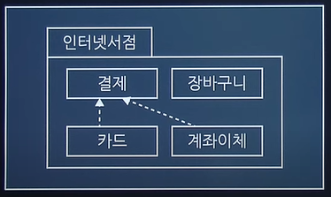

# 정보처리기사 실기

## 1. Triple-A
`Authentication`: 보안 기능에서 사람이나 프로세스의 신분을 `확인`하는 것
`Authorization`: 검증된 사용자에게 어떤 수준의 권한과 서비스를 `허용`하는 것
`Accounting`: 사용자의 자원에 대한 정보를 모아서 과금, 감사, 용량증설, 리포팅 등을 실시하는 것

### 정보보안의 3요소
- `기밀성`: 인가된 사용자만 접근
- `무결성`: 인가된 사용자만 인가된 방법으로 자원 수정
- `가용성`: 인가된 사용자는 언제든지 접근 가능

### 접근 제어
1. 강제적 접근제어(`MAC`, Mandatory Access Control)
: 높은 보안 수준을 요구하는 정보가 낮은 보안 수준의 주체에게 노출되지 않도록 하는 접근 제어 방법
2. 임의적 접근제어(`DAC`, Discretionary Access Control)
: `객체의 소유주`가 접근 여부를 결정
3. 역할기반 접근제어(`RBAC`, Role Based Access Control)
: 조직내에서 맡은 `역할`에 기초하여 자원에 대한 접근허용 여부를 결정하는 방법

## MAC 보안 모델
1. `Bell-LaPadula` Confidentiality Model; BLP
    - `기밀성` 강조
    - No Read Up: 낮은 등급의 주체는 높은 등급의 객체를 읽을 수 없음
    - No Write Down: 높은 등급의 주체는 낮음 등급의 객체를 수정할 수 없음
2. `Biba Integrity` Model
    - `무결성` 강조
    - No Read Down: 높은 등급의 주체는 낮은 등급의 객체를 읽을 수 없음
    - No Write Up: 낮은 등급의 주체는 상위 등급의 객체를 수정할 수 없음
3. Clark-Wilson Integrity Model
    - 무결성 강조
    - 상업용
4. Brewer Nash, Chinese Wall Model
    - 이익 충돌 방지를 위한 모델
5. Lattice
    - 정보의 흐름을 안전하게 제어

<br/>

## 2. GRANT
사용자에게 접속 권한, 생성 권한 등의 `권한을 부여`하는 명령어

```
INSERT INTO TABLE(COL1, COL2) VALUES(VAL1, VAL2);
SELECT * FROM TABLE WHERE COL1=VAL1 GROUP BY... HAVING... ORDER BY...;
UPDATE TABLE SET COL1=VAL1 WHERE COL2=VAL2;
DELETE FROM TABLE WHERE COL1=VAL1;
GRANT UPDATE ON TABLE TO USER;
REVOKE SELECT ON TABLE FROM USER;
```

<br/>

## 3. Spoofing
- `IP Spoofing`
    - IP 자체의 보안 취약성을 악용한 것으로 `자신의 IP 주소를 속여 접속`하는 공격
- `ARP Spoofing`
    - `Mac 주소를 속여` 랜에서의 통신 흐름을 왜곡시키는 공격
    - 공격 대상의 컴퓨터와 서버 사이의 트래픽을 공격자의 컴퓨터로 우회시켜 패스워드 정보 등 원하는 정보를 획득할 수 있음
- `DNS Spoofing`
    - 공격 대상에 전달되는 `DNS IP 주소를 조작`하여 의도치 않는 주소로 접속하는 공격
    - 공격 대상은 정상적인 URL을 통해서 접속하지만, 실제로 가짜 사이트로 접속됨

<br/>

## 4. 결합도(Coupling), 응집도(Cohesion)
모듈의 독립성을 판단하는 두 가지 지표
- `결합도(Coupling)`: 모듈과 모듈간의 상호 의존 정도
- `응집도(Cohesion)`: 모듈 내부의 기능적인 집중 정도

### 결합도(Coupling)
1. 자료(`Data`): 파라미터로 `값`만을 전달하는 경우
2. 스탬프(`Stamp`): 파라미터로 배열이나 오브젝트, 스트럭쳐 등의 `객체`가 전달되는 경우
3. 제어(`Control`): 파라미터로 값뿐만 아니라 `제어 요소`도 전달되는 경우
4. 외부(External): 어떤 모듈에서 선언한 데이터(변수)를 외부의 다른 모듈에서 참조하는 경우
5. 공통(`Common`): 공유되는 `공통` 데이터 영역(`전역변수`)을 여러 모듈이 사용하는 경우
6. 내용(`Content`): 한 모듈이 다른 모듈의 내부 기능 및 그 내부 자료를 직접 참조하거나 수정하는 경우
    - 내용 결합도가 높을 경우, 스파게티 코드가 될 수 있음

- `Spaghetti Code`: 소스 코드가 복잡하게 얽힌 경우
- `Alien Code`: 아주 오래되거나 참고문서가 없어 유지보수가 어려운 경우
- `Legacy Code`: 더 이상 쓰기 힘들고 난해한 경우

### 응집도(Cohesion)
1. 우연적(`Coincidental`): 모듈 내부의 각 구성요소들이 연관이 없을 경우
2. 논리적(`Logical`): 유사한 성격을 갖는 요소들이 한 모듈에서 처리
3. 시간적(`Temporal`): 특정 시간에 처리되어야 하는 활동들을 한 모듈에서 처리
4. 절차적(`Procedural`): 모듈 안의 구성요소들이 그 기능을 `순차적`으로 수행
5. 통신적(`Communicational`): `동일한 입력과 출력`을 사용하여 다른 기능을 수행하는 활동들이 모여있을 경우
6. 순차적(`Sequential`): 모듈 내에서 `한 활동에서 나온 출력값을 다른 활동이 사용`할 경우
7. 기능적(`Functional`): 모듈 내부의 모든 기능이 `단일한 목적`을 위해 수행되는 경우

<br/>

## 5. 디자인 패턴 (시험 직전에 확인)
### 생성 패턴(Creational Patterns) 5 : 객체 생성에 대한 패턴
|종류|설명|
|----|---|
|Abstract Factory|서브 클래스를 상세히 정의하지 않고도 서로 관련성이 있는 여러 객체들을 생성하기 위한 인터페이스를 제공하는 패턴|
|`Builder`|복잡한 객체들을 단계별로 생성하는 패턴|
|`Factory Method`|상위 클래스에서 객체를 생성하는 인터페이스를 정의하고, 하위 클래스에서 인스턴스를 생성하는 패턴<br/>Virtual-Constructor 패턴|
|Prototype|원본 객체를 복사하여 새 객체를 생성하는 패턴|
|`SingleTon`|오직 하나의 객체만을 생성하는 패턴|

### 구조 패턴(Structural Patterns) 7 : 클래스나 객체를 조합해 더 큰 구조를 만드는 패턴
|종류|설명|
|----|---|
|`Adapter`|호환되지 않는 인터페이스를 가진 객체들간의 기능을 변환하여 호환성을 제공하는 패턴|
|Bridge|추상화 클래스 계층과 구현 클래스 계층을 분리하는 패턴|
|Composite|객체 집합 속에 또 다른 객체 집합을 갖는 패턴|
|Decorator|새로운 기능이 추가될 때마다 새로운 객체를 만들고, 이전 객체의 기능은 새로운 객체내에서도 그대로 유지되는 패턴|
|Facade|서브시스템이 복잡할 경우 간단한 인터페이스를 통해 서브 시스템의 주요기능을 사용할 수 있도록 하는 패턴|
|Fly Weight|인스턴스의 공유를 통해 불필요한 객체 생성을 하지 않도록 하는 패턴|
|Proxy|원래 객체에 대한 접근을 제어하여, 요청이 원래 객체에 전달되기 전 또는 후에 추가적인 작업을 수행할 수 있도록 하는 패턴|

### 행위 패턴(Behavioral Patterns) 11 : 객체나 클래스 간 알고리즘이나 상호 작용을 정의하기 위한 패턴
|종류|설명|
|----|---|
|Chain of Responsibility|여러개의 객체를 체인으로 연결하여 그 객체의 체인을 순차적으로 걸어 가면서 최종적인 객체를 결정|
|Command|명령을 나타내는 클래스의 인스턴스를 하나로 표현|
|Interpreter|언어나 표현식을 해석하고 실행하는데 사용|
|Iterator|집합체의 요소에 차례로 액세스를 실시|
|Mediator|중개자을 통해서 행동을 일으키게 하는 방식|
|Memento|객체의 상태를 저장하고 복원하는 데 사용되며, 주로 "뒤로 가기" 기능이나 객체의 상태를 일시적으로 저장해야 하는 상황에서 유용|
|`Observer`|주로 분산 이벤트 핸들링 시스템을 구현하는데 사용|
|State|상태를 클래스로 표현하고 클래스를 전환하여 상태 변경을 나타내는 방법|
|Strategy|특정 작업 또는 알고리즘의 다양한 전략(방법)을 정의하고, 이들을 동적으로 교체하여 사용할 수 있게 하는 패턴|
|Template Method|슈퍼 클래스로 처리의 틀을 정해서 서브 클래스로 그 구체적 내용을 정하는 방식|
|Visitor|데이터 구조와 처리를 분리하는 방법|

<br/>

## 6. 파일 구조
파일의 구조는 파일을 구성하는 레코드들이 보조기억장치에 편성되는 방식을 의미하는 것으로, 편성 방법에 따라 `순차`, `색인`, `랜덤`, `해싱` 등이 있다.

<br/>

## 7. V모델
1. `단위(Unit) 테스트`
: 개발자가 명세서의 내용대로 정확히 구현되었는지 `단위 중심으로 테스트`
    - 정적
        - 소스코드의 실행없이 내부 확인
        - 도구
            - PMD, SonarQube, FindBugs, CheckStyle, CppCheck, Cobertura
    - 동적: 입력값에 대한 출력값 확인
2. `통합(Integration) 테스트`
: 단위 테스트를 통과한 컴포넌트 간의 `인터페이스를 테스트`
    - 빅뱅 테스트: 모든 모듈이 결합된 프로그램 전체가 대상
    - `상향식` 테스트: 드라이버(`Driver`) 사용
    - `하향식` 테스트: 깊이 우선 통합법, 넓이 우선 통합법 사용, 스텁(`Stub`) 사용
    - 혼합식 통합 테스트: : 하위 수준-상향식 통합, 상위 수준-하향식 통합 사용, 샌드위치(Sandwich)식 통합 테스트 방법
    - 회귀 테스팅(Regression Testing):  통합 테스트가 완료 된 후 변경된 모듈이나 컴포넌트가 있을 경우, 다른 부분에 영향을 미치는지 테스트하여 새로운 오류 여부를 확인
3. `시스템(System) 테스트`
: 전체 시스템 또는 제품의 동작에 대해 테스트
    - 기능 요구사항 테스트: 기능 관련
    - 비기능 요구사항 테스트: 기능 외 성능, 보안, 품질 관련
4. `인수(Acceptance) 테스트`
: 계약상의 요구사항이 만족되었는지 확인
    - 알파 테스트: 개발자 + 사용자
    - 베타 테스트: 사용자
    - 형상 테스트: 구조 확인

<br/>

### Test Oracle
: 테스트의 결과가 참인지 거짓인지를 판단하기 위해서 `사전에 정의된 참값을 입력하여 비교`하는 기법
- 종류
    - `참(True) 오라클`: `모든` 입력값에 대해 기대하는 결과를 전수 검사
    - `샘플링 오라클`: 특정 `몇몇` 입력값에 대해서만 검사
    - `휴리스틱 오라클`: 특정 `몇몇` 입력값에 대해서만 검사 + 나머지는 `추정`으로 처리
    - `일관성 검사 오라클`: 이전 수행결과와 현재 수행결과가 동일한지 검사

### 화이트/블랙박스 테스트
- 화이트 박스 테스트: 모듈 내부 소스 코드를 보면서 수행하는 테스트
    - 종류
        - `기본 경로 커버리지(Base Path Coverage)`: 수행 가능한 모든 경로 테스트
        - `데이터 흐름 테스트(Data Flow Testing)`: 프로그램에서 변수의 정의와 변수 사용의 위치에 초점을 맞추어 검사
        - `조건 커버리지(Condition Coverage)`: 각 개별 조건식이 적어도 한 번은 참과 거짓의 결과가 되도록 수행
        - 구조적 커버리지: 애플리케이션에서 테스트를 수행한 정도
            - `구문(문장) Coverage`: 코드 구조 내의 `모든 구문`에 대해 한 번 이상 수행하는 테스트 커버리지
            - `조건 Coverage`: 결정 포인트 내의 모든 `개별 조건식(if 조건문 내 and와 or로 연결된 개별 조건문)`에 대해 수행하는 테스트 커버리지
            - `결정(분기) Coverage`: `결정 포인트(if 조건문 전체)` 내의 모든 `분기`문에 대해 수행하는 테스트 커버리지
            - 조건/결정 Coverage: 결정 포인트와 개별 조건식이 모두 T/F를 가져야 함
            - 변경/조건 Coverage: 모든 결정 포인트 내의 개별 조건식은 적어도 한 번의 T/F를 가져야 함
            - 다중 조건 Coverage: 결정 포인트 내의 모든 개별 조건식의 가능한 조합을 100% 보장
        - 루프 테스트

- 블랙 박스 테스트: 외부 사용자의 요구사항 명세를 보면서 수행하는 테스트
    - `동등(동치, 균등) 분할 테스트(Equivalence Partitioning Testing)`: 입력값의 범위를 유사한 특징을 갖는 동등그룹으로 나누고 각 그룹마다 대표값을 선정하는 테스트 기법
    - `경곗값 분석 테스트(Boundary Value Analysis Testing)`: 경계값을 테스트 케이스로 선정하여 검사
    - `원인-결과 그래프 테스트(Cause-Effect Graphing Testing)`: 입력 데이터간의 관계와 출력에 영향을 미치는 상황을 체계적으로 분석하여 효용이 높은 테스트 케이스를 선정하여 검사
    - `오류 예측 테스트(Fault Based Testing)`
    - `의사 결정 테이블 테스트(Decision Table Testing)`
    - `상태 전이 테스트(State Transition Testing)`

### SW 테스트 방법
- `결함 집중(파레토 법칙)`
    - 대다수의 결함은 소수의 특정 모듈에 집중되는 경향이 있다.
- `살충제 패러독스`
    - 동일한 테스트 케이스를 반복적으로 수행하는 경우 더 이상 새로운 결함을 찾아낼 수 없다.
- `오류-부재의 궤변`
    - 거의 모든 결함을 확인 후 제거하였다고 해도 사용자의 요구 또는 비즈니스 목적을 충족시키지 못하는 경우 품질이 높다고 할 수 없다.

### 소프트웨어 생명 주기
- `폭포수 모형 (Waterfall Model)`
    - 계획 → 분석 → 설계 → 구현 → 테스트 → 유지보수
    - 이전 단계로 돌아갈 수 없다는 전제
    - 각 단계가 끝난 후에는 다음 단계를 수행하기 위한 `결과물`이 명확하게 산출되어야 함
- `나선형 모델`
    - `계획 및 정의 → 위험 분석 → 공학적 개발 → 고객 평가`
- 프로토타입 모형(Prototype Model, 원형 모델)
    - 실제 개발될 소프트웨어에 대한 `견본품`을 만들어 최종 결과물을 예측하는 모형
- RAD 기법 모델
    - `짧은 개발 기간`동안 개발하기위한 순차적 프로세스 모델
- V 모델
    - 단위 테스트 → 통합 테스트 → 시스템 테스트 → 인수 테스트
    - 작업 결과의 `검증(테스트)`에 초점
- 4세대 기법
    - `자동화 도구`들을 이용하여 요구사항 명세서로부터 실행코드를 자동으로 생성할 수 있게 해주는 방법

### 애자일 방법론
- eXtreme Programming: 수시로 발생하는 고객의 요구사항에 유연하게 대응하기 위해 고객의 참여와 개발 과정의 반복을 극대화하여 개발 생산성을 향상시키는 방법
    - `5가지 핵심 가치: 의사소통, 피드백, 존중, 용기, 단순성`
- Scrum
    - 짧은 단위시간(Sprint) 내 실행가능한 SW 개발
    - 매일 15분 정도의 Scrum meeting 회의

<br/>

## 8. UI
UI: 사용자가 제품, 서비스와 상호작용할 수 있도록 만들어진 매개체 <br/>
UX: 사용자 경험의 약자로, 사용자가 어떠한 서비스나 제품을 직간접적으로 이용하면서 느끼는 종합적인 만족

### UI 설계 원칙 4가지
- `직관성`
- `유효성`: 사용자의 목적을 정확하게 달성해야 함
- `학습성`
- `유연성`: 사용자의 요구사항을 최대한 수용해야 함

### UI 종류
- `GUI`(Graphic User Interface)
- `CLI`(Command Line Interface) = CUI(Character User Interface)
- `NUI`(Natural User Interface): 키보드나 마우스 없이 신체 부위를 이용하는 사용자 인터페이스(터치, 음성 포함)
- `OUI`(Organic User Interface): 입력장치가 곧 출력장치가 되고, 현실에 존재하는 모든 사물이 입출력장치로 변화할 수 있는 사용자 인터페이스

<br/>

## 9. UML(Unified Modeling Language) (시험 직전에 확인)
: 표준화된 모델링(개발하기 위한 그림을 그려주는) 언어

### 종류
### 구조적(정적) 다이어그램
- 객체: 객체 정보
- 클래스
    -시스템을 구성하는 `클래스 사이의 관계` 표현
    - 자기만의 속성(field)과 일정한 행동(method)으로 구성
- 패키지: 클래스 다이어그램의 `집합, 그룹`
    
- 컴포넌트: 컴포넌트끼리의 구조 관계를 표현
- 컴포지트: 복합구조
- 배치(Deployment): SW, HW 등을 포함한 시스템의 물리적 구조를 나타냄

### 행위적(동적) 다이어그램
- `유스케이스`: 사용자 관점에서 바라본 시스템을 표현
    - 구성요소(Component): System, Actor, UseCase, Relation
        - System: 만들고자 하는 프로그램
        - Actor: 시스템의 외부에 있고 시스템과 상호작용을 하는 사람(시스템의 기능을 사용하는 사람), 시스템(시스템에 정보를 제공하는 또 다른 시스템)
        - UseCase: 사용자 입장에서 바라본 시스템의 기능
        - Relation: 액터와 유스케이스 사이의 의미있는 관계
            - `연관`: 유스케이스와 액터간의 상호작용이 있음
            - `확장`: "글을 등록한다" 기능을 수행 할 때 "파일을 첨부한다" 기능을 `선택`적으로 수행 할 수 있다는 것
            - `포함`: "글을 등록한다" 기능을 동작하기 위해서 "로그인 한다" 기능이 `반드시` 동작되어야 한다는 것
            - `일반화(Generalization)`: `그룹`을 만들어 이해도를 높이기 위한 관계,  "글을 검색한다"를 "글쓴이로 검색한다"와 "날짜로 검색한다"로 구체화 한 것
- 활동: 활동의 흐름
- 상태: 객체의 상태 변화
- 순차: 시간의 흐름에 따른 객체 사이의 상호 작용
- 커뮤니케이션
- 인터렉션 오버뷰: 활동 + 순차
- 타이밍: 시간 흐름에 따른 상태 변화

### UML 클래스 관계
1. `일반화 관계(Generalization)`: 한 클래스가 다른 클래스를 포함하는 상위 개념일 때의 `IS-A 관계`
2. `실체화 관계(Realization)`: 한 객체가 다른 객체에게 오퍼레이션을 `수행`하도록 지정(추상 클래스와 구현)
3. `의존관계(Dependency)`: 연관관계와 같이 한 클래스가 다른 클래스에서 제공하는 기능을 사용할 때 표시(참조, 매개변수, `일시성`)
4. `연관관계(Association)`: 2개 이상 사물이 서로 관련된 관계(참조, 긴밀성, 양방향성)
    - `직접 연관관계(Directional)`: 한쪽으로만 방향성이 있는 연관관계(명령/수행)
    - `집합 연관관계(Aggregation)`
        - 클래스들 사이의 전체 또는 부분과 같은 관계
        - 한 객체가 다른 객체를 소유하는 `HAS-A 관계`
        - 전체가 삭제되더라도 부분은 삭제되지 않는 경우
    - `합성 연관관계(Composition)`
        - 부분 객체가 전체 객체에 속하는 관계로 긴밀한 `필수적` 관계
        - 전체가 삭제되면 부분도 삭제되는 경우

<br/>

## 10. 암호화 알고리즘
- 단방향(Hash): `MD ▶ SHA`
- 양방향
    - 대칭키
        - 빠른 속도
        - 많은 양
        - 키 개수: n*(n-1)/2
        - 종류
            - Stream: RC4
            - Block: `DES ▶ AES`, IDEA, SEED, ARIA
                - DES: 페이스텔 구조
                - AES: 비페이스텔 구조
    - 비대칭키(공개키)
        - 느린 속도
        - 적은 양 ◀ 내용보다는 키를 암호화하는 방식으로 사용
        - 키 개수: 2*n
        - 종류
            - 소인수분해: `RSA`, Robin
            - 이산대수: DH, `DSA`, EIGmal
            - 타원곡선: `ECC`, ECDSA

<br/>

## 11. 테스트 케이스 구성요소

- 테스트 항목
- 테스트 조건
- 테스트 데이터
- 테스트 예상결과
- 테스트 시나리오: 전체적인 테스트 케이스 모음

<br/>

## 13. OSI 7 Layer Model
1. 물리 계층(Physical Layer)
    - 0과 1의 비트 정보를 회선에 보내기 위한 전기적 신호 변환
    - 단위: `비트`
    - 주요 장비: `허브`, `리피터` 등
2. `데이터 링크 계층(Data Link Layer)`
    - `인접 노드 간` 프레임 전송, 신뢰성 있는 정보 전달
    - 단위: `프레임`
    - 주요 장비: `스위치`, `브릿지` 등
3. `네트워크 계층(Network Layer)`
    - 단말기 간 데이터 전송을 위한 `최적화된 경로` 제공
    - 단위: `패킷`
    - 주요 장비: `라우터` 등
    - 프로토콜
        - `IP`: 데이터 전달
        - `ICMP`: IP 패킷을 처리할 때 발생되는 문제를 알려주는 프로토콜
        - `ARP`: 논리 주소인 `IP 주소` ▶ 실제적인 물리 주소인 `MAC 주소`로 변환
        - `RARP`: 실제적인 물리 주소인 `MAC 주소` ▶ 논리 주소인 `IP 주소`로 변환
4. 전송 계층(Transport Layer)
    - `단말기(종단)`간의 연결, 신뢰성 있는 정보 전달
    - 단위: `세그먼트(TCP)` / `데이터그램(UDP)`
    - 프로토콜
        - TCP
            - FTP(20-데이터, 21-제어): 파일 전송
            - telnet(23): 원격지의 호스트 컴퓨터에 접속하기 위해 사용되는 인터넷 프로토콜
            - HTTP(80): 웹 서비스
            - SMTP(25): 메일 송신
            - POP3(110): 메일 수신
        - UDP
            - DHCP: IP 자동 할당
            - SNMP: 네트워크 관리
            - DNS(53): 도메인 ▶ IP 주소로 변환
5. 세션 계층(Session Layer)
    - 송수신 간의 논리적 연결
    - 단위: 데이터
6. `표현 계층(Presentation Layer)`
    - 데이터 형식 설정, `암/복호화`
    - 단위: 데이터
7. 응용 계층(Application Layer)
    - 일반적인 응용 서비스를 수행
    - 단위: 데이터

### 데이터 교환 방식
- 전용 회선: 회선을 직접 연결
- 교환 회선
    - 회선 교환 방식: 전화국에서 회선을 직접 연결해주는 형태
    - 축적 후 교환 방식
        - 메시지 교환: 길게 보냄
        - 패킷 교환: 짧게 보냄
            - 가상 회선: 패킷 전송을 하기 전에 논리적인 연결을 먼저 수행하여 패킷을 주고 받음(TCP)
            - 데이터 그램: 각 패킷 전송을 미리 정해진 경로 없이 독립적으로 처리하여 교환하는 방식(UDP)

### 공격 기법
### Dos(Denial of Service)
- `Ping Of Death`: 정상 크기보다 `큰 ICMP 패킷`을 작은 조각(Fragment)으로 쪼개어 공격 대상이 조각화된 패킷을 처리하게 만드는 공격
- `Smurf Attack`: `IP를 위조`하여 ICMP 받을 대상에 과부하
- `Land Attack`: Packet의 `보내는 사람과 받는 사람을 동일`하게 설정
- `Teardrop Attack`: Fragment를 재조립 시 정확한 조립을 위해 오프셋이라는 값을 더하게 되는데 이 `오프셋` 값을 고의적으로 수정하여 시스템의 기능을 마비시켜 버리는 방법
- SYN Flooding: 접속을 요청하는 SYN Packet을 대량으로 전송해 네트워크를 마비 시킴
- UDP Flooding: 많은 수의 UDP packet을 전송하여 정상적인 서비스가 불가능하도록 하는 공격
- Ping Flooding: 많은 ICMP Echo를 보내 이에 대한 응답을 하기 위해 자원을 모두 사용해버려 시스템이 정상적으로 동작하지 못하도록 하는 공격

### DDoS (Distributed Denial of Service)
- `Phishing`: 공격자가 사람들을 속이기 위해 악성 이메일을 보내는 것
- `Pharming`: 피싱 기법 중 하나로, 정확한 웹 페이지 주소를 입력해도 `가짜 웹 페이지에 접속하게 하여` 개인정보를 훔치는 것
- `Sniffing`: 네트워크 중간에서 남의 패킷 정보를 `도청`하는 것
- Smishing: SMS와 Phishing의 결합어로 문자메시지를 이용한 피싱
- Qshing: QR코드와 피싱(Phishing)의 합성어로 QR코드를 이용한 피싱
- `Ransomware`: 컴퓨터 시스템을 감염시켜 `접근을 제한`하고 일종의 몸값을 요구하는 악성 소프트웨어
- `Key Logger`: 컴퓨터 사용자의 `키보드 움직임을 탐지`해 ID, 패스워드 등 개인의 중요한 정보를 몰래 빼가는 해킹 공격
- SQL Injection: 임의로 작성한 SQL 구문을 애플리케이션에 삽입하는 공격 방식
- `XSS`(Cross Site Scripting): 악의적인 스크립트를 포함하여 정보 유출 등의 공격을 하는 것

### 기타
- `Rainbow Table Attack`
    - 해시함수에 입력한 값과 해시값을 저장한 일종의 정답지를 갖고 일치하는 해시값을 통해 Key 값을 찾는 방식
    - `Salt`: 해커들의 레인보우 테이블이 키 값에 대한 해시값을 갖고 있으므로, 해당 값에 다른 값을 덧붙여서 다른 암호 값으로 저장되도록 추가하는 값
- `Session HiJacking`
    - 다른 사람의 세션 상태를 훔치거나 가로채는 해킹 기법
    - 로그인된 상태를 가로채는 것

### Routing Protocol
- 정적: 관리자가 직접 라우터에 경로 설정
- 동적: 라우터가 직접 경로 설정
    - `EGP`: 외부 게이트웨이 프로토콜
        - `BGP`: Board Gateway Protocol
    - `IGP`: 내부 게이트웨이 프로토콜
        - `Distance Vector`
            - `RIP`: Routing Information Protocol
                - 인접한 라우터간 일정 시간마다 상태 공유
                - 최대 홉수 15로 제한
        - `Link State`
            - `OSPF`: Open Shortest Path First (Protocol)
                - 변경된 데이터가 있을 때마다 상태 공유
                - 가장 많이 사용되는 내부 라우팅 프로토콜
                - 홉 수 제한 X


<br/>

## 15. SQL
```
SELECT COUNT(*) AS CNT FROM A CROSS JOIN B WHERE A.NAME LIKE B.NAME

CNT
4

-- CROSS JOIN(상호 조인): 한쪽 테이블의 모든 행과 다른 쪽 테이블의 모든 행을 조인

```

<br/>

## 16. Python
`출력값: false가 아닌 False 유의`
```
x, y = 100, 200;
print(x == y);

# False

```

<br/>

## 17. C
```
struct jsu{
    char name[12];
    int os, db, hab, hhab;
};
int main(){
    struct jsu st[3]{{"데이터1", 95, 88}, {"데이터2", 84, 91}, {"데이터3", 86, 75}};
    struct jsu *p; /* 포인터 변수 선언 */

    p = &st[0]; /* & - 주소값 반환 */
    (p + 1) -> hab = (p + 1) -> os + (p + 2) -> db;
    (p + 1) -> hhab = (p + 1) -> hab + p -> os + p -> db;
    printf("%d\n", (p + 1) -> hab + (p + 1) -> hhab);
}

/*
name    os    db    hab    hhab
데이터1  95    88
데이터2  84    91  (84+75) (159+95+88)
데이터3  86    75

159 + 342 = 501

*/

```

<br/>

## 18.C
```
void main(){
    int *arr[3]; /* 포인터 변수 선언 */
    int a = 12, b = 24, c = 36;

    arr[0] = &a; /* &연산자: 주소값 반환 */
    arr[1] = &b;
    arr[2] = &c;

    printf("%d\n", *arr[1] + *arr + 1);
    /* *연산자: 포인터변수에 저장되있는 주소가 가르키는 실제 데이터값을 불러오는 연산자 */
}

/*
              10        11        12
arr[3] = |a의 주소값|b의 주소값|c의 주소값|
  10          12        24        36

24 +  12 + 1 = 37

*/
```

<br/>

## 19. Java
```
int a = 3, b = 4, c =3, d = 5;
if((a == 2 | a == c) & !(c > d) & (1 == b^c != d)){
    a = b + c;
    if(7 == b^c !=a){
        System.out.println(a);
    } else {
        System.out.println(b);
    }
} else {
    a = c + d;
    if(7 == c^d !=a){
        System.out.println(a);
    } else {
        System.out.println(d);
    }

}

// ^: exclusive or
// 1^1 = 0
// 1^0 = 1
// 0^1 = 1
// 0^0 = 0

// 7
```

<br/>

## 20. Java
```
class Connection{
    private static Connection _in = null;
    private int count = 0;

    static public Connection get(){
        if(_in == null){
            _in = new Connection();
            return _in;
        }
        return _in;
    }

    public void count() {count++;}
    public int get() {return count;}
}
public class Testcon{
    public static void main(String[] args){
        Connection conn1 = Connection.get();
        conn1.count();
        Connection conn2 = Connection.get();
        conn2.count();
        Connection conn3 = Connection.get();
        conn3.count();

        System.out.println(conn1.getCount());
    }
}

// 3
```


<br/>

📚 참고 자료 <br/>
https://simuing.tistory.com/entry/2021-%EC%A0%95%EB%B3%B4%EC%B2%98%EB%A6%AC%EA%B8%B0%EC%82%AC-%ED%95%84%EA%B8%B0%EC%9A%94%EC%95%BD-%ED%99%94%EB%A9%B4-%EC%84%A4%EA%B3%84 <br/>
https://ksr930.tistory.com/47
