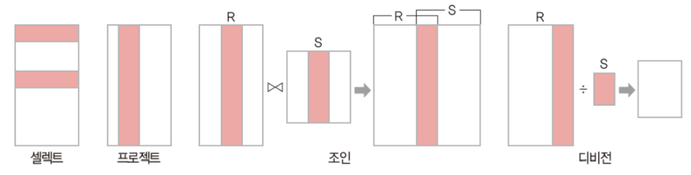

# 정보처리기사 실기

## 1. 형상 관리 절차
`식별 → 통제(BaseLine 설정) → 감사 → 기록(형상 관리 위원회: Configuration Control Board)`

### 형상관리 지원 도구
- `RCS`(Revision Control System): `공유 폴더 방식`, 로컬PC 공유 폴더에 저장, CVS와 달리 `소스 파일의 수정을 한 사람으로 제한`하여 다수의 사람이 파일의 수정을 동시에 할 수 없도록 파일 잠금 방식으로 형상을 관리하는 도구
- `CVS ▶ SVN`: `클라이언트-서버 방식`, 버전 관리 자료가 중앙 시스템(서버)에 저장되어 관리
- `Git`: `분산 저장소 방식`, `로컬 PC`와 `원격지 PC`에 저장되어 관리

### 형상관리 용어
|용어|설명|
|---|---|
|`import`|맨 처음 프로제트 시작 시 저장소에 등록|
|`checkout`|저장소에서 소스파일 받아오기|
|`add`|새 파일을 버전 관리 대상으로 추가|
|commit|수정한 파일을 저장소에 저장하여 갱신(=check-in)|
|`update`|저장소에 있는 최신 버전으로 자신의 작업공간을 동기화|
|diff|이전 개발자가 처음 추가한 파일과 이후 변경된 파일의 차이 확인|
|merge|충돌난 파일에 대해 합치는 작업|
|trunk|개발 메인 디렉토리|
|branch|메인 개발 과정과 별도로 새로운 기능의 테스트와 같이 추가적인 작업을 수행하기 위한 서브 디렉토리|

<br/>

## 2. 디자인 패턴 (시험 직전에 확인)
### 생성 패턴(Creational Patterns) 5 : 객체 생성에 대한 패턴
|종류|설명|
|----|---|
|Abstract Factory|서브 클래스를 상세히 정의하지 않고도 서로 관련성이 있는 여러 객체들을 생성하기 위한 인터페이스를 제공하는 패턴|
|`Builder`|복잡한 객체들을 단계별로 생성하는 패턴|
|`Factory Method`|상위 클래스에서 객체를 생성하는 인터페이스를 정의하고, 하위 클래스에서 인스턴스를 생성하는 패턴<br/>`Virtual-Constructor 패턴`|
|Prototype|원본 객체를 복사하여 새 객체를 생성하는 패턴|
|`SingleTon`|오직 하나의 객체만을 생성하는 패턴|

### 구조 패턴(Structural Patterns) 7 : 클래스나 객체를 조합해 더 큰 구조를 만드는 패턴
|종류|설명|
|----|---|
|`Adapter`|호환되지 않는 인터페이스를 가진 객체들간의 기능을 변환하여 호환성을 제공하는 패턴|
|`Bridge`|`기능과 구현에 대해서 두 개의 별도의 클래스로 구현`하는 패턴|
|Composite|객체 집합 속에 또 다른 객체 집합을 갖는 패턴|
|Decorator|새로운 기능이 추가될 때마다 새로운 객체를 만들고, 이전 객체의 기능은 새로운 객체내에서도 그대로 유지되는 패턴|
|Facade|서브시스템이 복잡할 경우 간단한 인터페이스를 통해 서브 시스템의 주요기능을 사용할 수 있도록 하는 패턴|
|Fly Weight|인스턴스의 공유를 통해 불필요한 객체 생성을 하지 않도록 하는 패턴|
|Proxy|원래 객체에 대한 접근을 제어하여, 요청이 원래 객체에 전달되기 전 또는 후에 추가적인 작업을 수행할 수 있도록 하는 패턴|

### 행위 패턴(Behavioral Patterns) 11 : 객체나 클래스 간 알고리즘이나 상호 작용을 정의하기 위한 패턴
|종류|설명|
|----|---|
|Chain of Responsibility|여러개의 객체를 체인으로 연결하여 그 객체의 체인을 순차적으로 걸어 가면서 최종적인 객체를 결정|
|Command|명령을 나타내는 클래스의 인스턴스를 하나로 표현|
|Interpreter|언어나 표현식을 해석하고 실행하는데 사용|
|Iterator|집합체의 요소에 차례로 액세스를 실시|
|Mediator|중개자을 통해서 행동을 일으키게 하는 방식|
|Memento|객체의 상태를 저장하고 복원하는 데 사용되며, 주로 "뒤로 가기" 기능이나 객체의 상태를 일시적으로 저장해야 하는 상황에서 유용|
|`Observer`|주로 분산 이벤트 핸들링 시스템을 구현하는데 사용|
|State|상태를 클래스로 표현하고 클래스를 전환하여 상태 변경을 나타내는 방법|
|Strategy|특정 작업 또는 알고리즘의 다양한 전략(방법)을 정의하고, 이들을 동적으로 교체하여 사용할 수 있게 하는 패턴|
|Template Method|슈퍼 클래스로 처리의 틀을 정해서 서브 클래스로 그 구체적 내용을 정하는 방식|
|Visitor|데이터 구조와 처리를 분리하는 방법|

<br/>

## 3. UML(Unified Modeling Language) (시험 직전에 확인)
: 표준화된 모델링(개발하기 위한 그림을 그려주는) 언어
- 구성 요소: `사물`, `관계`, `다이어그램`

### 종류
### 구조적(정적) 다이어그램
- 객체: 객체 정보
- `클래스`
    - 시스템을 구성하는 `클래스 사이의 관계` 표현
    - 객체들의 타입을 정의하고, `객체들간의 관계`를 도식화하여 시스템의 틈정 모듈이나 일부 및 전체를 구조화
- 패키지: 클래스 다이어그램의 `집합, 그룹` <br/>
    
- 컴포넌트: 컴포넌트끼리의 구조 관계를 표현
- 컴포지트: 복합구조
- 배치(Deployment): SW, HW 등을 포함한 시스템의 물리적 구조를 나타냄

### 행위적(동적) 다이어그램
- `유스케이스`: 사용자 관점에서 바라본 시스템을 표현
    - 구성요소(Component): System, Actor, UseCase, Relation
        - System: 만들고자 하는 프로그램
        - Actor: 시스템의 외부에 있고 시스템과 상호작용을 하는 사람(시스템의 기능을 사용하는 사람), 시스템(시스템에 정보를 제공하는 또 다른 시스템)
        - UseCase: 사용자 입장에서 바라본 시스템의 기능
        - Relation: 액터와 유스케이스 사이의 의미있는 관계
            - `연관`: 유스케이스와 액터간의 상호작용이 있음
            - `확장`: "글을 등록한다" 기능을 수행 할 때 "파일을 첨부한다" 기능을 `선택`적으로 수행 할 수 있다는 것
            - `포함`: "글을 등록한다" 기능을 동작하기 위해서 "로그인 한다" 기능이 `반드시` 동작되어야 한다는 것
- 활동: 활동의 흐름
- 상태: 객체의 상태 변화
- 순차: 시간의 흐름에 따른 객체 사이의 상호 작용
- 커뮤니케이션
- 인터렉션 오버뷰: 활동 + 순차
- 타이밍: 시간 흐름에 따른 상태 변화

### UML 클래스 관계
1. `일반화 관계(Generalization)`: 한 클래스가 다른 클래스를 포함하는 상위 개념일 때의 `IS-A 관계`
2. `실체화 관계(Realization)`: 인터페이스를 구현받아 추상 메서드를 오버라이딩하는 것
    - `Interface`: 클래스와 같은 기타 모델 요소 또는 컴포넌트가 `구현해야 하는 오퍼레이션 세트를 정의`하는 모델 요소
3. `의존관계(Dependency)`: 연관관계와 같이 한 클래스가 다른 클래스에서 제공하는 기능을 사용할 때 표시(참조, 매개변수, `일시성`)
4. `연관관계(Association)`: 2개 이상 사물이 서로 관련된 관계(참조, 긴밀성, 양방향성)
    - `직접 연관관계(Directional)`: 한쪽으로만 방향성이 있는 연관관계(명령/수행)
    - `집합 연관관계(Aggregation)`
        - 클래스들 사이의 전체 또는 부분과 같은 관계
        - 한 객체가 다른 객체를 소유하는 `HAS-A 관계`
        - 전체가 삭제되더라도 부분은 삭제되지 않는 경우
    - `합성 연관관계(Composition)`
        - 부분 객체가 전체 객체에 속하는 관계로 긴밀한 `필수적` 관계
        - 전체가 삭제되면 부분도 삭제되는 경우

<br/>

## 5. 테스트
1. `단위(Unit) 테스트`
: 개발이 명세서의 내용대로 정확히 구현되었는지 `단위 중심으로 테스트`
    - 정적
        - 소스코드의 실행없이 내부 확인
        - 도구
            - PMD, SonarQube, FindBugs, CheckStyle, CppCheck, Cobertura
    - 동적: 입력값에 대한 출력값 확인
2. `통합(Integration) 테스트`
: 단위 테스트를 통과한 컴포넌트 간의 `인터페이스를 테스트`
    - 빅뱅 테스트: 모든 모듈이 결합된 프로그램 전체가 대상
    - `상향식` 테스트: 드라이버(`Driver`) 사용
    - `하향식` 테스트: 깊이 우선 통합법, 넓이 우선 통합법 사용, 스텁(`Stub`) 사용
    - 혼합식 통합 테스트: : 하위 수준-상향식 통합, 상위 수준-하향식 통합 사용, 샌드위치(Sandwich)식 통합 테스트 방법
    - `회귀` 테스팅(Regression Testing):  통합 테스트가 완료 된 후 변경된 모듈이나 컴포넌트가 있을 경우, 다른 부분에 영향을 미치는지 테스트하여 새로운 오류 여부를 확인
3. `시스템(System) 테스트`
: 전체 시스템 또는 제품의 동작에 대해 테스트
    - 기능 요구사항 테스트: 기능 관련
    - 비기능 요구사항 테스트: 기능 외 성능, 보안, 품질 관련
4. `인수(Acceptance) 테스트`
: 계약상의 요구사항이 만족되었는지 확인
    - 알파 테스트: 개발자 + 사용자
    - 베타 테스트: 사용자
    - 형상 테스트: 구조 확인

### 애플리케이션 테스트 유형 구분
- 프로그램 실행 여부
    - 정적 테스트: `소스코드의 실행없이` 코드의 의미를 분석하여 결함을 찾아내는 코드 분석 기법
    - 동적 테스트: `소스코드를 실행하여` 프로그램의 동작이나 결과를 확인하고, 메모리 누수, 스레드 결함등을 분석하는 기법
- 테스트 기법
    - 화이트박스 테스트
    - 블랙박스 테스트
- 테스트에 대한 시각
    - 검증 테스트: 개발자 주도
    - 확인 테스트: 사용자 주도
- 테스트 목적
    - `회복`: 시스템에 여러 가지 결함을 주어 실패하도록 한 후 올바르게 `복구`되는지를 확인
    - 안전: 불법적인 침입으로부터 시스템을 보호할 수 있는지를 확인
    - `강도`: `과부하` 시에도 소프트웨어가 정상적으로 실행되는지를 확인
    - 성능
    - 구조
    - `회귀(Regression)`: `변경 또는 수정된 코드에 새로운 결함이 없음을 확인`
    - 병행: 변경된 소프트웨어와 기존 소프트웨어에 동일한 데이터를 입력해 결과를 비교
- 테스트 기반
    - 명세 기반 테스트: 사용자의 요구사항 명세를 빠짐없이 구현하고 있는지 확인
    - 구조 기반 테스트: 소프트웨어 내부의 논리 흐름에 따라 테스트 케이스를 작성하고 확인
    - `경험 기반 테스트`: `테스터의 경험을 기반으로 수행`
`
### 테스트 하네스(Test Harness)의 구성 요소
1. 테스트 `드라이버`: `상향식` 테스트에서 사용하는 임시 모듈, 가상의 서버 역할
2. 테스트 `스텁`: `하향식` 테스트에서 사용하는 임시 모듈, 가상의 클라이언트 역할
3. 테스트 `슈트`: 테스트 케이스의 집합
4. 테스트 `케이스`: 사용자의 요구사항을 정확하게 준수했는지 확인하기 위한 입력 값, 실행 조건, 기대 결과 등으로 만들어진 테스트 항목의 명세서
5. 테스트 `스크립트`: 자동화된 테스트 실행 절차에 대한 명세서
6. `목 오브젝트`: 사전에 사용자의 행위를 조건부로 입력해 두면, 그 상황에 맞는 예정된 행위를 수행하는 객체

### Test Oracle
: 테스트의 결과가 참인지 거짓인지를 판단하기 위해서 `사전에 정의된 참값을 입력하여 비교`하는 기법
- 종류
    - `참(True) 오라클`: `모든` 입력값에 대해 기대하는 결과를 전수 검사
    - `샘플링 오라클`: 특정 `몇몇` 입력값에 대해서만 검사
    - `휴리스틱 오라클`: 특정 `몇몇` 입력값에 대해서만 검사 + 나머지는 `추정`으로 처리
    - `일관성 검사 오라클`: 이전 수행결과와 현재 수행결과가 동일한지 검사

### 화이트/블랙박스 테스트
- 화이트 박스 테스트: 모듈 내부 소스 코드를 보면서 수행하는 테스트
    - 종류
        - `기본 경로 커버리지(Base Path Coverage)`: 수행 가능한 모든 경로 테스트
        - `데이터 흐름 테스트(Data Flow Testing)`: 프로그램에서 변수의 정의와 변수 사용의 위치에 초점을 맞추어 검사
        - 구조적 커버리지: 애플리케이션에서 테스트를 수행한 정도
            - `구문(문장) Coverage`: 코드 구조 내의 `모든 구문`에 대해 한 번 이상 수행하는 테스트 커버리지
            - `조건 Coverage`: 결정 포인트 내의 모든 `개별 조건식(if 조건문 내 and와 or로 연결된 개별 조건문)`에 대해 수행하는 테스트 커버리지
            - `결정(분기) Coverage`: `결정 포인트(if 조건문 전체)` 내의 모든 `분기`문에 대해 수행하는 테스트 커버리지
            - 조건/결정 Coverage: 결정 포인트와 개별 조건식이 모두 T/F를 가져야 함
            - 변경/조건 Coverage: 모든 결정 포인트 내의 개별 조건식은 적어도 한 번의 T/F를 가져야 함
            - 다중 조건 Coverage: 결정 포인트 내의 모든 개별 조건식의 가능한 조합을 100% 보장
        - 루프 테스트

- 블랙 박스 테스트: 외부 사용자의 요구사항 명세를 보면서 수행하는 테스트
    - `동등(동치, 균등) 분할 테스트(Equivalence Partitioning Testing)`: 입력값의 범위를 유사한 특징을 갖는 동등그룹으로 나누고 각 그룹마다 대표값을 선정하는 테스트 기법
    - `경곗값 분석 테스트(Boundary Value Analysis Testing)`: 경계값을 테스트 케이스로 선정하여 검사
    - `원인-결과 그래프 테스트(Cause-Effect Graphing Testing)`: 입력 데이터간의 관계와 출력에 영향을 미치는 상황을 체계적으로 분석하여 효용이 높은 테스트 케이스를 선정하여 검사
    - `오류 예측 테스트(Error Guessing Testing)`
    - `비교 검사 테스트(Comparison Testing)`: 여러 버전의 동일한 테스트 자료를 제공하여 동일한 결과가 출력되는지 테스트하는 기법

### SW 테스트 방법
- `결함 집중(파레토 법칙)`
    - 대다수의 결함은 소수의 특정 모듈에 집중되는 경향이 있다.
- `살충제 패러독스`
    - 동일한 테스트 케이스를 반복적으로 수행하는 경우 더 이상 새로운 결함을 찾아낼 수 없다.
- `오류-부재의 궤변`
    - 거의 모든 결함을 확인 후 제거하였다고 해도 사용자의 요구 또는 비즈니스 목적을 충족시키지 못하는 경우 품질이 높다고 할 수 없다.

<br/>

## 5. SSO(Single Sign-on)
하나의 시스템에서 인증에 성공하는 다른 시스템에 대한 접근 권한도 얻는 시스템(CGV Login ▶ CJ Mall Login)

<br/>

## 6. 요구사항 분석 기법
### 구조적 분석
: 하향식 접근 방식(폭포수 모형)
- DFD: 프로세스와 프로세스 간에 존재하는 상호작용 표현 <br/>
    

- DD: 데이터 흐름도(Data Flow Diagram)에 기술된 자료들에 대해 정의
```
= 정의
+ 연결
() 생략
{} 반복
[|] 선택
** 주석

```

- Mini spec.: 자료 흐름도를 보완 설명
- ERD: 시스템에서 처리되는 개체와 속성 그리고 관계를 표현하여 개체를 모델화하는 도구
- STD(State Transition Diagram): 시스템의 상태와 변화를 모델링

<br/>

## 7. 프로세스 스케쥴링
: 프로세스가 생성되어 실행될 때 필요한 시스템의 여러 자원을 해당 프로세스에 할당하는 작업

1. 비선점(Non-Preemptive): 이미 할당된 CPU를 다른 프로세스가 강제로 빼앗아 사용할 수 없는 스케줄링 기법
    - FCFS: First Come First Served, 
    - SJF: Shortest Job First
        - 가장 적은 평균 대기 시간을 제공하는 최적 알고리즘
        - 단점: `기아 현상 발생 ▶ 대안: HRN`
    - HRN: Hightest Response-ratio Next
        - 우선순위를 계산하여 그 숫자가 가장 높은 것부터 낮은 순으로 우선순위가 부여
        - 우선순위 = (대기 시간 + 실행 시간)/(실행 시간)
    - 우선순위(Priority)
        - 단점: 기아 현상 발생
    - 기한부(Deadline)
2. 선점(Preemptive): 하나의 프로세스가 CPU를 할당받아 실행하고 있을 때 우선순위가 높은 다른 프로세스가 CPU를 강제로 빼앗아 사용할 수 있는 스케줄링 기법
    - Round Robin: 프로세스는 할당된 시간 동안만 실행한 후 실행이 완료되지 않으면 다음 프로세스에 CPU를 넘겨주고 큐의 뒤로 배치
    - SRT: Shortest Remaining Time, SJF의 선점형 버전
    - MLQ(다단계 큐): 항상 가장 높은 우선순위 큐의 프로세스에 CPU를 할당 (우선순위가 낮은 큐에서 작업 실행 중이더라도 상위 단계의 큐에 프로세스가 도착하면 CPU를 빼앗는 선점형 스케줄링)
    - MFQ(다단계 피드백 큐)
        - 프로세스 생성 시 가장 높은 우선 순위 준비 큐에 등록되며 등록된 프로세스는 FCFS 순서로 CPU를 할당받아 실행
        - 해당 큐의 CPU 시간 할당량(Time Quantum)이 끝나면 한 단계 아래의 준비 큐로 이동
        - 단계가 내려갈수록 시간 할당량(Time Quantum)이 증가

### 프로세스 상태 전이도

+ 실행 → 대기: Block

### 문맥 교환(Context Switching)
하나의 프로세스가 CPU를 사용 중인 상태에서 다른 프로세스가 CPU를 사용하도록 하기 위해, 이전의 프로세스의 상태를 보관하고 새로운 프로세스의 상태를 적재하는 작업
### PCB(Process Control Block)
운영체제가 프로세스를 제어하기 위해 정보를 저장해 놓는 곳으로, 프로세스의 상태 정보를 저장하는 자료구조
### System Catalog
- DBMS에서 지원하는 모든 데이터 객체에 대한 정의나 명세에 관한 정보를 유지관리하는 시스템 테이블
- 일반 사용자도 SQL을 이용해 내용을 검색할 수 있음
- Meta Data: 시스템 카탈로그에 저장된 정보
### Data Dictionary
- DD에 수록된 데이터를 실제로 접근하는데 필요한 정보를 유지 관리하는 시스템
- 시스템만 접근할 수 있음
### 기아 현상
특정 프로세스의 우선 순위가 낮아서 원하는 자원을 계속 할당받지 못하는 상태
### 에이징 기법
오랫동안 Ready 상태인 프로세스의 우선순위를 주기적으로 올려주는 것

<br/>

## 8. Subnet Mask
```
192.168.1.0/24
3개의 서브넷 -> 뒤에 2자리의 비트를 빌려서 네트워크 아이디를 써야함
0000 0000
0100 0000 <- 2번째 네트워크: IP 주소(.64 ~ .127)
1000 0000
1100 0000

맨 앞: 네트워크 ID
맨 뒤: 브로드캐스트 ID
그 외: 호스트 IP

```

<br/>

## 9. 용어
`사회공학`: 기술적인 방법이 아닌 사람들 간의 기본적인 신뢰를 기반으로 사람을 속여 비밀정보를 획득하는 기법 <br/>
`다크 데이터`: 기업이 정보를 수집한 후, 저장만 하고 분석에 활용하고 있지 않은 다량의 데이터

<br/>

## 10. SIEM
- 네트워크 하드웨어 및 응용 프로그램에 의해 생성된 보안 경고의 실시간 분석 제공
- `빅데이터 수준의 데이터를 장시간 심층 분석`한 인덱싱 기반 
- 주요 기능: 데이터 통합, 상관 관계, 알림, 대시 보드

### 보안 솔루션
- 방화벽(Firewall): 네트워크 간에 전송되는 정보를 선별하는 기능을 가진 침입 차단 시스템
    - 웹 방화벽(Web Firewall): 웹 기반 공격을 방어할 목적으로 만들어진 웹서버 특화 방화벽
- 침입 탐지 시스템(IDS: Intrusion Detection System): 컴퓨터 시스템의 비정상적인 사용, 오용 등을 실시간으로 탐지하는 시스템
    - `이상 탐지`: 정상에서 벗어날 경우, 탐지(오류율↑)
    - 오염 탐지: 잘못될 경우 탐지(사용↑)
- 침입 방지 시스템(IPS: Intrusion Prevention System): 방화벽과 침입탐지 시스템을 결합한 것
- 데이터 유출 방지(DLP: Data Language/Loss Prevention): 내부 정보의 유출을 방지하기 위한 보안 솔루션
    - USB ▶ 컴퓨터: 데이터 전송 가능 / 컴퓨터 ▶ USB: 데이터 전송 불가능
- NAC(Network Access Control): 네트워크에 접속하는 내부 PC의 MAC 주소를 IP 관리 시스템에 등록한 후 일관된 보안 관리 기능을 제공하는 보안 솔루션
- ESM(Enterprise Security Management)
    - 다양한 장비에서 발생하는 로그 및 보안 이벤트를 통합관리하는 보안 솔루션
    - 단기 이벤트성 위주의 분석
- SIEM(Security Information and Event Management)
    - 네트워크 하드웨어 및 응용 프로그램에 의해 생성된 보안 경고의 실시간 분석 제공
    - `빅데이터 수준의 데이터를 장시간 심층 분석`한 인덱싱 기반

<br/>

## 11. 용어
- `Trust Zone`: 독립적인 보안 구역을 따로 두어 중요한 정보를 보호하는 하드웨어 기반의 보안 기술
- `TypoSquatting`: 사용자가 사이트의 URL 주소를 입력할 때, 철자를 잘못 입력하거나 빠뜨리는 실수를 이용하여, 해커가 만들어 놓은 유사한 URL로 접속하도록 유도하는 공격

### 공격 기법
### Dos(Denial of Service)
- `Ping Of Death`: 정상 크기보다 큰 ICMP 패킷을 작은 조각(Fragment)으로 쪼개어 공격 대상이 조각화된 패킷을 처리하게 만드는 공격
- `Smurf`: IP를 위조하여 `ICMP 받을 대상에 과부하`
- `Land Attack`: Packet의 `보내는 사람과 받는 사람을 동일`하게 설정
- `Teardrop Attack`: Fragment를 재조립 시 정확한 조립을 위해 오프셋이라는 값을 더하게 되는데 이 `오프셋` 값을 고의적으로 수정하여 시스템의 기능을 마비시켜 버리는 방법
- SYN Flooding: 접속을 요청하는 SYN Packet을 대량으로 전송해 네트워크를 마비 시킴
- UDP Flooding: 많은 수의 UDP packet을 전송하여 정상적인 서비스가 불가능하도록 하는 공격
- Ping Flooding: 많은 ICMP Echo를 보내 이에 대한 응답을 하기 위해 자원을 모두 사용해버려 시스템이 정상적으로 동작하지 못하도록 하는 공격

### DDoS (Distributed Denial of Service)
- `Phishing`: 공격자가 사람들을 속이기 위해 악성 이메일을 보내는 것
- `Pharming`: 피싱 기법 중 하나로, 정확한 웹 페이지 주소를 입력해도 가짜 웹 페이지에 접속하게 하여 개인정보를 훔치는 것
- `Sniffing`: 네트워크 중간에서 남의 패킷 정보를 `도청`하는 것
- Smishing: SMS와 Phishing의 결합어로 문자메시지를 이용한 피싱
- Qshing: QR코드와 피싱(Phishing)의 합성어로 QR코드를 이용한 피싱
- `Ransomware`: 컴퓨터 시스템을 감염시켜 접근을 제한하고 일종의 몸값을 요구하는 악성 소프트웨어
- `Key Logger`: 컴퓨터 사용자의 키보드 움직임을 탐지해 ID, 패스워드 등 개인의 중요한 정보를 몰래 빼가는 해킹 공격
- SQL Injection: 임의로 작성한 SQL 구문을 애플리케이션에 삽입하는 공격 방식
- `XSS`(Cross Site Scripting): 악의적인 스크립트를 포함하여 정보 유출 등의 공격을 하는 것

### 기타
- `Rainbow Table Attack`
    - 해시함수에 입력한 값과 해시값을 저장한 일종의 정답지를 갖고 일치하는 해시값을 통해 Key 값을 찾는 방식
    - `Salt`: 해커들의 레인보우 테이블이 키 값에 대한 해시값을 갖고 있으므로, 해당 값에 다른 값을 덧붙여서 다른 암호 값으로 저장되도록 추가하는 값
- `Session HiJacking`
    - 다른 사람의 세션 상태를 훔치거나 가로채는 해킹 기법
    - 로그인된 상태를 가로채는 것

<br/>

## 12. 관계 대수(Relation Algebra) & 관계 해석 (Relation Calculus)
### 관계 대수(Relation Algebra)
- 주어진 릴레이션 조작을 위한 연산 집합
- 원하는 정보를 얻기 위해 어떻게 질의를 해석하는지 기술한 `절차적` 언어
    - 일반 집합 연산: 합집합(∪), 교집합(∩), 차집합(-), 카티션 프로덕트(X)
    - 순수 관계 연산: SELECT(σ), PROJECT(∏), DIVISION(÷), JOIN(▷◁) <br/>
        
        - SELECT(σ - 아톰)
            - σ조건(테이블): 테이블에서 조건을 만족하는 튜플을 구하기 위한 연산
        - PROJECT(∏)
            - ∏속성리스트(테이블): 테이블에서 주어진 속성들의 값으로만 구성된 튜플 반환 
        - JOIN(▷◁)
            - R▷◁S: 테이블 R과 테이블 S에서 공통으로 가지고 있는 속성을 이용해서 하나의 새로운 테이블을 만드는 연산자
        - DIVISION(÷)
            - X⊃Y인 두 개의 릴레이션 R(x)와 S(y)가 있을 때, R의 속성이 S의 속성 값을 모두 가진 튜플에서 S가 가진 속성을 제외한 속성만을 구하는 연산
            ```
            R1          S1      S2
            A B C       A       B C
            1 2 3       1       5 6
            4 5 6               8 9
            4 8 9
            5 2 3
            3 5 6

            R1 ÷ S1     R1 ÷ S2
            B C         A
            2 3         4 (56, 89를 모두 갖고 있는 A값)

                ```

### 관계 해석 (Relation Calculus)
- 원하는 정보가 무엇인지만 정의하는 `비절차적` 특성
- 종류
    - 정량자
        - ∀: 모든 것에 대하여(for all)
        - ∃: 존재한다(There exist)
    - 연산자
        - V: OR
        - ㅅ: AND
        - ㄱ: NOT

##### 정량자: 문장의 변수 부분에 적용되어 그 변수의 적용범위를 나타내는 역할을 하는 것

<br/>

## 14. SQL
`NULL은 SELECT COUNT에 포함되지 않음`
```
부서 TABLE
부서코드    부서명
     10    영업팀
     20    개발팀
     30    기획팀

직원 TABLE
직원코드    부서코드
   1000         10
   2000         10
   3000         10
   4000         20
   5000         20
   6000         30
   7000         30

SELECT DISTINCT COUNT(직원코드) FROM 직원 WHERE 부서코드 = '10';
-- 3

DELETE FROM 직원 WHERE 부서코드 = '10';
SELECT DISTINCT COUNT(직원코드) FROM 직원;
-- 4

```

```
INSERT INTO TABLE(COL1, COL2) VALUES(VAL1, VAL2);
SELECT * FROM TABLE WHERE COL1=VAL1 GROUP BY COL2 HAVING COL3 ORDER BY COL4;
UPDATE TABLE SET COL1=VAL1 WHERE COL2=VAL2;
DELETE FROM TABLE WHERE COL1=VAL1;
GRANT UPDATE ON TABLE TO USER;
REVOKE SELECT ON TABLE FROM USER;
CREATE INDEX idx_name ON STUDENT(NAME ASC);
```

<br/>

## 14. SQL
```
SELECT DEPT FROM STUDENT; -- 200
SELECT DISTINCT DEPT FROM STUDENT; -- 3
SELECT COUNT(DISTINCT DEPT) FROM STUDENT WHERE DEPT='건축과'; -- 1

```

<br/>

## 15. C (보류)
```
static int field[4][4] = {{0, 1, 0, 1}, {0, 0, 0, 1}, {1, 1, 1, 0}, {0, 1, 1, 1}};
static int mines[4][4] = {{0, 0, 0, 0}, {0, 0, 0, 0}, {0, 0, 0, 0}, {0, 0, 0, 0}};
void calculate(int w, int h, int j, int i){
    if(i>=0 && i<w && j>=0 && j<h) mines[i][j]++;
}
void main(){
    int x, y, j, i, w=4, h=4;
    for(y=0; y<h; y++){
        for(x=0; x<w; x++){
            if(field[x][y]==0) continue;
            for(j=y-i; j<=y+1; j++){
                for(i=x-i; i<=x+1; i++){
                    calculate(w, h, j, i);
                }
            }
        }
    }
}

```

<br/>

## 16. C
```
int main(){
    int result[5];
    int ary[] = {77, 32, 10, 99, 50};
    for(int i=0; i<5; i++){
        result[i]=1;
        for(int j=0; j<5; j++)
            if(ary[i]<ary[j]) result[i]++;
    }
    for(int i=0; i<5; i++){
        printf("%d", result[i]);
    }
}

result[0] = 2
result[1] = 4
result[2] = 5
result[3] = 1
result[4] = 3

24513

```

<br/>

## 17. C
```
int x, y;
int cnt = 0;
for(int i=6; i<=30; i++){
    x = 0;
    y = i/2;
    for(int j=1; j<=y; j++){
        if(i%j==0)
            x = x + j;
    }
    if(x==i){
        cnt++;
    }
}
printf("%d", cnt);

/*
  i 6 7 8 9 10 11 12 13 14 15 16 17 18 19 20 21 22 23 24 25 26 27 28 29 30
  x 6 6 7 7  8  1 16 16 10  9 15  1 21  1 22 11 14  1 36  6 16 13 28  1 42
  y 3 3 4 4  5  1  6  6  7  7  8  8  9  9 10 10 11 11 12 12 13 13 14 14 15
  j 3 3 4 4  5  1  6  6  7  5  8  1  9  1 10  1 11  1 12  5 13  9 14  1 15
cnt 1                                                              1

2
*/

```

<br/>

## 18. Java
```
static int[] makeAry(){
    int[] tmp = int new[4];
    for(int i=0; i<tmp.length; i++){
        tmp[i] = i;
    }
    return tmp;
}

public static void main(String[] args){
    int[] inData = makeAry();
    for(int i=0; i<inData.length; i++)
        System.out.print(inData[i]);
}

/*
inData
tmp 0 1 2 3
값  0 1 2 3

0123

*/

```

<br/>

## 19. Java
`구하는 값에 맞춰서 시작부터 도전할지 끝부터 도전할지 확인`
```
int max = 0;
for(int i=1; i<999; i++){
    if(i%3==0 && i%2!=0)
        max = i;
}
System.out.print(max);

// 3의 배수지만 짝수가 아닌 998이하의 가장 큰 수
// 3 9 15 ... 975 981 987 993

```

<br/>

## 20. Python
`출력형태 확인, list = []`
```
tData = [1, 2, 3, 4, 5];
tData = list(map(lambda num : num + 100, tData));
print(tData);

# [101, 102, 103, 104, 105]

```
