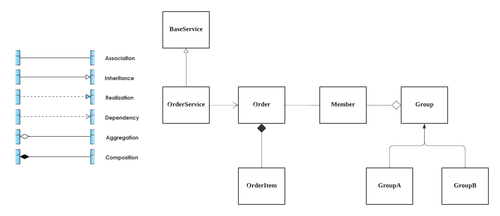

### Ngrok

로컬 개발 서버를 안전하게 외부에 노출시킬 수 있는 HTTPS 터널링 도구

- 터널링: 로컬 컴퓨터에서 실행 중인 웹 서버를 외부 인터넷에서 접근할 수 있도록 임시 HTTPS 주소를 만들어주는 기술

로컬 개발환경인 localhost에서 구동 중인 웹 서비스를 외부 인터넷 환경에서 접근할 수 있도록 만들어줌  
Webhook 테스트, 실시간 데모, 로컬 개발환경 접근 등에 유용

- Webhook: 외부 서비스에서 특정 이벤트가 발생했을 때, 내 서버에 실시간으로 알림을 보내주는 시스템

```bash
ngrok authtoken '본인의 authtoken 코드'
ngrok http '본인의 로컬 서버 포트'
```

### Prompt Engineering

1. 효과적인 코드 프롬프트의 기본 원칙

- 풍부한 맥락 제공: 사용 언어·프레임워크·라이브러리·에러 메시지·코드 목적 등 관련 정보 명시
- 명확한 목표나 질문 제시: “왜 코드가 안 돼?”와 같은 모호한 질의 대신, 원하는 결과와 현재 상황을 명확하게 기술
- 복잡한 작업 분할: 대규모 기능 개발 등은 한 번에 모두 요청하지 않고, 작은 단계로 쪼개어 요구
- 입출력 예시나 기대 동작 포함: 실제 입력·출력이나 동작 예시 제공
- 역할(페르소나) 활용: “React 시니어 개발자처럼 코드 검토” “성능 전문 지도로 최적화 요청” 등 책임 있는 역할을 부여
- 회화적 반복 개선: AI의 첫 번째 답변을 바탕으로 추가 요청이나 수정 요구를 통해 점진적으로 원하는 결과에 도달
- 코드 일관성 유지: AI가 코드 스타일, 네이밍, 주석을 참고하므로 코드의 일관성과 명확성을 항상 유지함

2. 디버깅을 위한 프롬프트 패턴

```javascript
function mapUsersById(users) {
  const userMap = {};
  for (let i = 0; i <= users.length; i++) {
    const user = users[i];
    userMap[user.id] = user;
  }
  return userMap;
}
const result = mapUsersById([{ id: 1, name: 'Alice' }]);
```

“왜 mapUsersById 함수가 동작하지 않을까?”
→ “mapUsersById 함수가 사용자 배열을 id별로 매핑해야 하는데, [ {id: 1, name: "Alice"} ] 입력 시 TypeError: Cannot read property 'id' of undefined 에러 발생. 코드는 다음과 같다: [코드 포함] 기대 결과는 { "1": ... } 이런 현상 원인과 해결책은?”

- 추가 디버깅 프롬프트 전략
  - 버그 원인 후보 목록화 요청(“TypeError의 가능한 원인?” 등)
  - 코드 동작 논리 직접 설명 후 검토 요청(“내 설명이 맞는지, 문제점을 찾아달라”)
  - 돌발 상황 테스트케이스 요청(“이 함수가 실패할 수 있는 입력 2개만 제안”)
  - 꼼꼼한 코드 리뷰어 역할 부여(“이 코드를 리뷰하며 문제점과 개선사항을 설명”)

3. 리팩토링/최적화를 위한 프롬프트 패턴

```javascript
async function getCombinedData(apiClient) {
  // Fetch list of users
  const usersResponse = await apiClient.fetch('/users');
  if (!usersResponse.ok) {
    throw new Error('Failed to fetch users');
  }
  // ... (이하 생략)
}
```

“getCombinedData 함수를 리팩토링 하라”
→ “중복 제거, 성능 개선, 두 fetch 병렬화, 에러 메세지 분리, 데이터 결합은 효율적 방식으로 개선하라. 주석과 개선 포인트 설명까지”

- 추가 리팩토링 팁
  - 단계별 요청(“가독성 개선→알고리듬 최적화” 순차 적용)
  - 다른 접근 방식 요청(“함수형 스타일로도 구현해줘” 등)
  - 코드+설명 방식 요청을 통한 학습과 튜토리얼화
  - 결과 코드에 대한 테스트 추가 요청

### Prompt Engineering(2)

핵심은 프로젝트마다 ‘CLAUDE.md’ 파일을 활용해 컨벤션, 아키텍처, 패턴, 금지사항 등을 명확히 문서화하고, 코드 내 ‘anchor comment’로 AI를 효과적으로 가이드하는 것

테스트 코드는 반드시 사람이 작성해야 하며, AI가 테스트, 마이그레이션, 보안, 등 핵심 영역을 수정하지 못하도록 경계를 엄격히 설정해야 함

[예제 md 파일](https://github.com/julep-ai/julep/blob/dev/AGENTS.md)

세션 관리와 맥락 오염 방지  
작업별로 Claude 세션을 새로 시작하는 것이 중요
하나의 긴 대화에 여러 작업(예: DB 마이그레이션, 프론트엔드 디자인 등)을 혼합하면 컨텍스트가 섞여 의도하지 않은 결과 초래  
규칙: 한 작업 = 한 세션, 완료 시 세션 새로 시작

### 커밋 전 주의사항

작업 파일 커밋 전 항상 어떤 파일에 어떤 내용 수정했는지 확인 후 커밋

- 잠시 테스트한다고 작성하거나 주석 처리한 내역까지 같이 올리지 않도록 유의

### 관심사 분리

컴퓨터 프로그램을 만들 때, 서로 다른 역할을 하는 코드들을 독립적인 별개의 모듈(부분)로 나누어 작성하는 설계 원칙  
각 모듈은 오직 하나의 관심사(역할, 책임)에만 집중

- 판단 기준
  - 클래스/메서드가 한 번에 너무 많은 일을 하고 있지는 않은가
  - 요구사항이 변경된다면, 코드의 한 부분만 수정해서 해결할 수 있는가
  - 로직을 다른 곳에서도 사용할 가능성이 있는가

예시

- View
  - 사용자에게 정보를 보여주고(Presentation), 사용자 입력을 받는 것에만 집중
- Business Logic
  - 잔액을 계산하고, 업데이트하고, 유효성을 검사하는 등 실제 '일'을 처리하는 것에 집중

```cs
public partial class wndRegister : Window
{
    private void Button_Register_Click(object sender, RoutedEventArgs e)
    {
        string username = txtUsername.Text;
        string password = txtPassword.Password;

        if (!ValidationHelper.IsValid(username, password, out string errorMessage))
        {
            MessageBox.Show(errorMessage);
            return;
        }
    }
}
```

- JSON 구조를 계층화시키는 것이 좋은 이유

```json
{
  "userId": 1,
  "email": "chrome123@naver.com",
  "nickname": "nick",
  "accessToken": "...",
  "tokenType": "Bearer"
}

{
  "accessToken": "...",
  "tokenType": "Bearer",
  "userInfo": {
    "email": "chrome123@naver.com",
    "nickname": "nick"
  }
}
```

1. **관심사 분리**: LoginResponse는 인증 정보, UserResponse는 사용자 정보
2. **재사용성**: UserResponse를 다른 API에서도 활용 가능
3. **유지보수성**: 사용자 정보 구조 변경 시 UserResponse만 수정하면 됨
4. **확장성**: 나중에 UserResponse에 필드 추가해도 LoginResponse는 영향 없음
5. **책임 분담**: 각 클래스가 명확한 역할을 가짐

### Log Level

**ERROR**

- 반드시 확인해야 할 심각한 문제 발생
  - 데이터베이스 연결 실패, 외부 API 호출 실패
  - 처리되지 않은 예외 발생
  - 시스템 장애를 유발할 수 있는 문제
  - `log.error("DB Connection Failed!", exception);`

**WARN**

- 에러는 아니지만, 잠재적인 문제 또는 주의가 필요한 상황
  - 비정상적인 파라미터 요청 (ex: 음수 값의 페이지 번호)
  - 곧 사용 중지될(Deprecated) API 호출
  - 재시도하는 작업
  - `log.warn("Invalid page number requested: {}", pageNum);`

**INFO**

- 서비스의 주요 흐름 및 의미 있는 이벤트 (정상 상황)
  - 사용자 로그인/로그아웃, 회원가입
  - 주요 기능(핵심 비즈니스 로직)의 시작과 끝
  - 중요한 설정 값 변경, 서버 시작/종료
  - `log.info("User '{}' logged in successfully.", userId);`

**DEBUG**

- 개발 단계에서 상세한 정보 확인
  - SQL 쿼리 파라미터 확인
  - 외부 API 요청/응답 전문(full text) 확인
  - 변수의 상세한 값 추적
  - `log.debug("Executing query with params: {}", params);`

**TRACE**

- 가장 상세한 정보 (DEBUG보다 더 깊게)
  - 메서드의 시작과 끝, 루프의 매 반복마다의 상태 등
  - 매우 드물게 사용됨

| 계층           | 주요 로그 레벨  | 로깅 내용 예시                                                                    |
| -------------- | --------------- | --------------------------------------------------------------------------------- |
| Controller     | `INFO`, `WARN`  | `GET /users/123 요청 들어옴`, `잘못된 요청 파라미터`                              |
| Service        | `INFO`, `ERROR` | `주문 시작`, `재고 부족으로 주문 실패`                                            |
| Repository     | DEBUG           | 프레임워크가 쿼리 실행 로그를 자동으로 남겨주므로, 직접 로그를 남기는 경우는 드묾 |
| Global Handler | ERROR           | 처리되지 않은 예외 발생                                                           |

### PowerShell vs CMD

| 항목      | `cmd` (Command Prompt)                | `PowerShell`                         |
| --------- | ------------------------------------- | ------------------------------------ |
| 출시 시기 | DOS 시절부터 존재                     | Windows PowerShell: 2006년           |
| 기반      | 문자열 기반 셸 (텍스트 파싱)          | 객체 기반 셸 (.NET 객체 사용)        |
| 목적      | 전통적인 명령어 실행, 배치 스크립트용 | 시스템 관리 자동화, 복잡한 작업 처리 |
| 사용 언어 | 배치(batch) 스크립트                  | PowerShell 스크립트 (.ps1), C# 유사  |

| 기능             | `cmd`              | `PowerShell`                                      |
| ---------------- | ------------------ | ------------------------------------------------- |
| 파이프라인 처리  | 문자열만 전달      | .NET 객체 전달 가능                               |
| 스크립트 확장자  | `.bat`, `.cmd`     | `.ps1`                                            |
| 루프 및 조건     | `if`, `for` 제한적 | `foreach`, `if`, `switch` 등 프로그래밍 언어 수준 |
| JSON, XML 처리   | 매우 어려움        | 내장 Cmdlet으로 쉽게 처리 가능                    |
| 관리자 권한 실행 | 가능               | 가능 + 더 강력한 권한 사용 가능                   |

| 상황                                      | 추천 셸                                          |
| ----------------------------------------- | ------------------------------------------------ |
| 간단한 명령 실행 (ex: `ping`, `ipconfig`) | `cmd`도 충분                                     |
| 복잡한 자동화, 시스템 관리, 스크립트 작업 | `PowerShell` 추천                                |
| 리눅스와 비슷한 명령어를 원함             | `PowerShell` (Ubuntu 스타일 alias 많음)          |
| 최신 Windows 스크립트 작성                | `PowerShell Core` 또는 `Windows PowerShell` 권장 |

### gradle-wrapper.jar

- Gradle 프로젝트를 빌드할 때 로컬에 Gradle이 설치되어 있지 않아도 자동으로 Gradle을 다운로드하고 실행할 수 있도록 도와주는 도구

1. ./gradlew 실행 →
2. gradle/wrapper/gradle-wrapper.jar 실행 →
3. gradle-wrapper.properties 읽고 Gradle 다운로드 →
4. 프로젝트 빌드

- **git에서 함께 관리되어야 함**

```bash
java.lang.ClassNotFoundException: org.gradle.wrapper.GradleWrapperMain
```

### .jar

✅ library-app-0.0.1-SNAPSHOT.jar

- 실행 가능한 JAR (fat/uber jar)
- Spring Boot에서 기본으로 생성되는 JAR 파일
- 내부에 애플리케이션 클래스 + 모든 의존 라이브러리가 포함됨.
- `java -jar library-app-0.0.1-SNAPSHOT.jar`로 실행 가능
- MANIFEST.MF 파일에 Main-Class, Start-Class 등의 정보가 있음

❌ library-app-0.0.1-SNAPSHOT-plain.jar

- 실행 불가능한 순수 클래스 파일만 포함된 JAR
- 오직 프로젝트의 .class 파일만 들어 있음 (의존 라이브러리는 없음)
- 보통 IDE나 다른 빌드 환경에서 참고용으로 사용
- java -jar 명령으로 실행하면 Main-Class not found 오류 발생

### 인코딩과 디코딩/암호화와 복호화

- Encoding
  - 데이터를 특정 형식이나 규칙에 따라 다른 형태로 변환하는 과정
  - 주요 목적은 데이터의 효율적인 저장, 전송, 그리고 시스템 간 호환성을 확보
- Decoding
  - 인코딩된 데이터를 원래의 형태로 되돌리는 역과정
- 특징
  - 보안이 주목적이 아님
  - 공개된 표준 알고리즘 사용
  - 인코딩 규칙만 알면 누구나 디코딩 가능
- Encryption
  - 데이터를 제3자가 읽을 수 없도록 의도적으로 변환하는 과정
- Decryption
  - 암호화된 데이터를 원래 형태로 되돌리는 과정
- 특징
  - 보안이 주목적
  - 키 기반 접근 제한(올바른 키 없이는 원본 데이터 복원 불가능)

### base64

- 바이너리 데이터를 텍스트 형태로 인코딩하는 방식
  - 바이너리 데이터: 컴퓨터가 0과 1로만 표현하는 모든 데이터
- 이메일이나 웹 같은 시스템은 원래 텍스트만 다루도록 설계 → 이미지, 동영상, 실행 파일 같은 바이너리 데이터를 전송해야 할 때, Base64는 이런 바이너리 데이터를 텍스트로 변환해서 안전하게 전송할 수 있게 함
- 원본보다 약 33% 정도 크기가 커짐
  - 입력: 8비트씩 처리 (1바이트 = 8비트)
  - 출력: 6비트씩 문자로 표현
  - 3바이트(24비트)를 인코딩하면, 원본: 3바이트 = 24비트, Base64: 24비트 ÷ 6비트 = 4문자 = 4바이트가 되므로 따라서 3바이트 → 4바이트로 변환
- 이메일 첨부파일, 웹에서 이미지 임베딩 (Data URL), API에서 바이너리 데이터 전송, 인증 토큰 등에서 사용

```html

<!--
이미지 파일이 서버에 별도로 저장되어 있어야 함
브라우저가 HTML을 읽고, 다시 서버에 이미지 파일을 요청해서 가져옴
총 2번의 요청이 필요 (HTML 1번 + 이미지 1번)
-->


<!--
이미지를 Base64로 인코딩해서 HTML 코드 안에 직접 넣는 방식
서버 요청 횟수가 줄어듦
작은 아이콘이나 로고에 유용
HTML 파일 크기가 커짐
캐싱이 안 됨 (브라우저는 URL을 기준으로 파일을 캐싱)
-->
```

### 메모리 vs 디스크

- 메모리 (RAM)
  - 임시 저장 공간 - 전원이 꺼지면 데이터가 사라짐
  - 매우 빠름
  - 용량이 작음 (보통 8GB, 16GB, 32GB)
- 디스크 (HDD/SSD)
  - 영구 저장 공간 - 전원이 꺼져도 데이터 유지
  - 상대적으로 느림
  - 용량이 큼 (보통 256GB, 512GB, 1TB 이상)

### CSRF(Cross-Site Request Forgery)

- 사용자가 이미 로그인된 상태라는 점을 악용해서 공격자가 위조된 요청을 자동으로 보내게 만드는 방식
  - 서버는 폼을 생성하거나 페이지를 렌더링할 때 **임의의 난수 토큰(CSRF Token)**을 HTML에 포함시킴
  - 클라이언트는 요청 시 이 토큰을 함께 전송하고, **서버는 세션(또는 쿠키 등)에 저장된 토큰과 비교하여 일치 여부를 검증**.
- 토큰이 일치하지 않으면 요청을 거부하여 위조 공격을 방지

```html
@Html.AntiForgeryToken() <button id="saveBtn">저장</button>
```

```cs
document.getElementById("saveBtn").addEventListener("click", () => {
    const token = document.querySelector('input[name="__RequestVerificationToken"]').value;

    fetch("/Photo/Create", {
        method: "POST",
        headers: {
            "Content-Type": "application/json",
            "RequestVerificationToken": token
        },
        body: JSON.stringify({ title: "사진 제목" })
    })
    .then(res => {
        if (res.ok) alert("성공!");
        else alert("실패!");
    });
});
```

### CORS(Cross-Origin Resource Sharing)

- 내 웹사이트: <https://myapp.com>
- 외부 API 서버: <https://api.example.com>

1. 브라우저에서 요청: `fetch("https://api.example.com/data")`
2. 브라우저는 다른 출처(origin) 의 응답 데이터를 함부로 읽을 수 없음
3. **외부 API 서버**가 응답 헤더에 `Access-Control-Allow-Origin: https://myapp.com`을 추가하면, 브라우저는 응답을 막지 않고 자바스크립트 코드(fetch 등)가 데이터를 읽을 수 있게 허용

### 생성자 예외

> 생성자는 “객체를 만들기만” 해야 하고, 실패 가능성이 있는 일은 “만든 다음에” 하는 게 안전

| 구분               | 생성자에서 예외 던짐                          | 따로 처리 (예: `create()` / `init()` 메서드)    |
| ------------------ | --------------------------------------------- | ----------------------------------------------- |
| **객체 생성 시점** | 실패하면 **객체 자체가 안 생김**              | 객체가 먼저 생성되어 참조 유지 → 상태 추적 가능 |
| **디버깅/로그**    | 실패 시 객체 참조 없음 → **원인 추적 어려움** | 객체 유지 가능 → **상태 확인·로그 용이**        |
| **리소스 관리**    | 생성 도중 실패 시 **리소스 누수 위험**        | 명확히 try-catch로 관리 가능                    |
| **상속 구조**      | 부모 생성자에서 예외 터지면 자식 생성 안 됨   | 초기화 로직을 분리해 **안정적**                 |

- 초기화 실패 후 부분적으로 초기화된 객체를 사용할 때의 위험성(invariant violation)

1. 부분 초기화

```cs
public class DatabaseConnection
{
    private SqlConnection _connection;
    private SqlTransaction _transaction;

    // Invariant: _connection과 _transaction은 둘 다 있거나 둘 다 없어야 함

    public DatabaseConnection(string connectionString)
    {
        _connection = new SqlConnection(connectionString);
        _connection.Open();  // ✅ 성공

        _transaction = _connection.BeginTransaction();  // ❌ 여기서 예외 발생!

        // 결과: _connection만 열려있고 _transaction은 null
    }

    public void ExecuteQuery()
    {
        // Invariant 위반! _transaction이 null인데 사용하려 함
        var cmd = _connection.CreateCommand();
        cmd.Transaction = _transaction;  // NullReferenceException!
    }
}
```

2. 일관성 없는 상태

```cs
public class UserProfile
{
    // Invariant: Email이 있으면 반드시 EmailVerified 상태도 있어야 함
    public string Email { get; private set; }
    public bool EmailVerified { get; private set; }
    public DateTime? VerificationDate { get; private set; }

    public UserProfile(string email)
    {
        Email = email;  // ✅ 설정됨

        // 이메일 검증 API 호출
        EmailVerified = VerifyEmail(email);  // ❌ 예외 발생!

        // VerificationDate는 설정 안 됨
    }

    // 결과: Email은 있는데 EmailVerified는 false, VerificationDate는 null
    // 이후 코드에서 "이메일이 있으면 검증됐을 것"이라 가정하면 버그 발생
}
```

3. 리소스 누수

```cs
public class FileProcessor
{
    private FileStream _inputFile;
    private FileStream _outputFile;

    // Invariant: 두 파일 모두 열려있거나 모두 닫혀있어야 함

    public FileProcessor(string input, string output)
    {
        _inputFile = File.OpenRead(input);    // ✅ 성공
        _outputFile = File.OpenWrite(output); // ❌ 예외! (디스크 공간 부족)

        // 결과: _inputFile만 열려있음 → 리소스 누수 (파일 핸들이 닫히지 않음)
    }
}
```

- 대안

```cs
public class DatabaseConnection
{
    private DatabaseConnection() { }  // private 생성자

    public static DatabaseConnection Create(string connectionString)
    {
        SqlConnection conn = null;
        SqlTransaction trans = null;

        try
        {
            conn = new SqlConnection(connectionString);
            conn.Open();
            trans = conn.BeginTransaction();

            // 모든 초기화 성공 후에만 객체 생성
            return new DatabaseConnection
            {
                _connection = conn,
                _transaction = trans
            };
        }
        catch
        {
            trans?.Dispose();
            conn?.Dispose();
            throw;
        }
    }
}

// 사용
var db = DatabaseConnection.Create(connectionString);  // 완전히 초기화된 객체
db.ExecuteQuery();  // 안전하게 사용
```

### 디렉터리에서 r/w/x 의미

| 권한 | 디렉터리에서 의미            |
| ---- | ---------------------------- |
| `r`  | **목록 보기** (`ls`)         |
| `w`  | **파일 생성/삭제/이름 변경** |
| `x`  | **들어가기 (`cd`)**          |

### 클래스 다이어그램

[Structural Relationship]

- Association  
  ├─ Aggregation  
  └─ Composition

[Usage Relationship]

- Dependency

[Type Relationship]

- Generalization
- Realization

1. Association

- 클래스 간에 구조적으로 연결되어 있고, 객체가 객체를 멤버로 참조하는 관계

```java
public class Order {
  private Member member;
}
public class Member {
  private List<Order> orders;
}
```

2. Aggregation

- Association 관계에서 생명 주기는 독립

```java
public class Group {
  private List<Member> members;
  // Member는 Group 없어져도 존재 가능
}
```

3. Composition

- Association 관계에서 생명 주기를 완전 공유

```java
public class Order {
  private List<OrderItem> orderItems;
  // orderItems는 Order없이 존재 불가능

  public void addItem(Product product) {
    orderItems.add(new OrderItem(product));
  }
}
```

4. Dependency

- 일시적으로 다른 클래스를 사용하는 관계
- 구조적 소유 ❌, 사용 시점 의존 ⭕

```java
public class OrderService {
  public void placeOrder(Member member) {
    member.validate();
  }

  public Order findOrder(Long orderId) {
    return repository.findById(orderId);
  }
}
```

5. Generalization

- 상속

```java
class Group {
    void add() {
        System.out.println("member added");
    }
}

class GroupA extends Group {
    @Override
    void add() {
        System.out.println("GroupA member added");
    }
}
class GroupB extends Group {
    @Override
    void add() {
        System.out.println("GroupB member added");
    }
}
```

6. Realization

- 구현

```java
interface BaseService {
    void order();
}

class OrderService implements BaseService {
    @Override
    public void order() {
        System.out.println("ordered");
    }
}
```



### 📚 참고

[[HTTPS] - HTTPS 사설 인증서 발급 및 구현 & ngrok 사용법](https://velog.io/@donggoo/HTTPS-HTTPS-%EC%82%AC%EC%84%A4-%EC%9D%B8%EC%A6%9D%EC%84%9C-%EB%B0%9C%EA%B8%89-%EB%B0%8F-%EA%B5%AC%ED%98%84-ngrok)
[프로그래머를 위한 프롬프트 엔지니어링 플레이북](https://news.hada.io/topic?id=21303)
[Claude로 실제 코드를 배포하며 얻은 실전 노트](https://news.hada.io/topic?id=21352)  
[시스템 분석 및 설계 with Visual Paradigm](https://wikidocs.net/292254)
