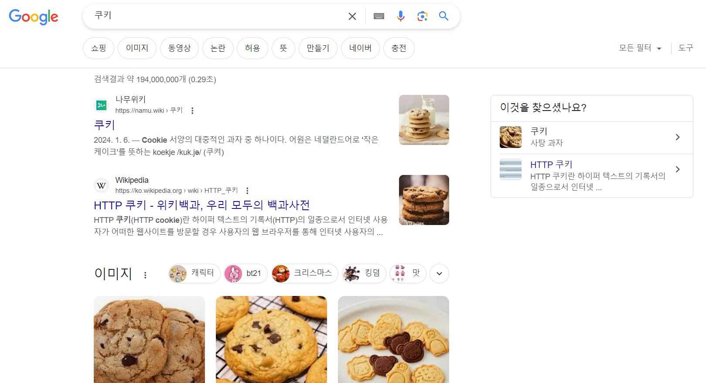
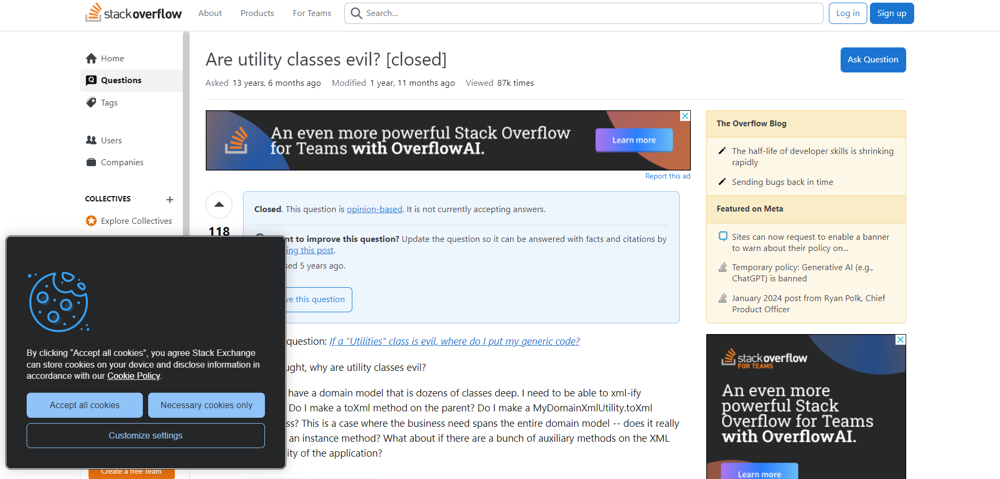
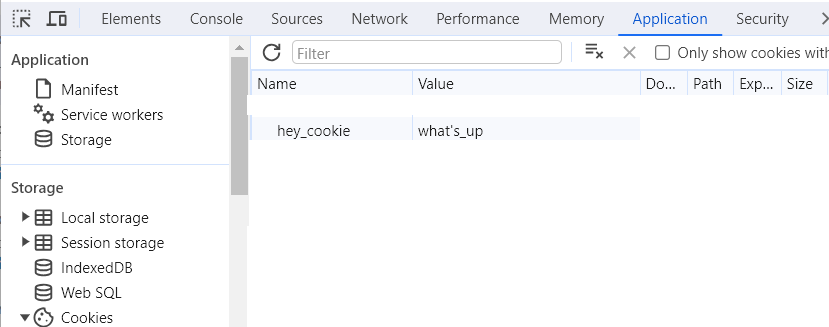

# 10_Cookie_너만은_남아_있을_줄_알았어
조금 더 생각해 보고 싶은 부분을 공부한 글입니다.

- 작성일: 2024-01-20
- 수정일: 2024-01-21

<br/>


#
### 주제를 선정한 이유
최근에 Submit Page 이후에도 값을 남겨 활용해야 하는 문제가 있었습니다.  
사용해 본 방법이 URL에 parameter로 넘기기, 쿠키 설정하기였습니다.  
결론적으로 URL parameter를 넘기는 방식으로 진행했지만, 마침 쿠키.. 처음으로 설정해 보고 불러와 봤기 때문에 글로 정리해 보고자 합니다.

<br/>


#
### 쿠키란

아직은 인지도가 초코칩 쿠키보다 낮지만, 오른쪽 '혹시.. 이것을 ..?'이라는 물음 속에 제가 찾는 HTTP 쿠키가 있습니다.  

HTTP 쿠키를 검색해 보면, 쿠키란

- 서버가 사용자의 웹 브라우저에 전송하는 작은 데이터 조각
- 인터넷 사용자가 웹사이트를 방문할 때 사용자의 웹 브라우저를 통해 인터넷 사용자의 컴퓨터나 다른 기기에 설치되는 작은 기록 정보 파일
- 서버가 어떤 데이터를 브라우저 측에 저장한 후 다시 그 데이터를 받아오는 기술, 또는 그 데이터 자체

라고 불립니다.

쿠키에 대한 다양한 정의가 있지만, 공통으로 사용되는 단어는 `서비`, `사용자`, `웹 브라우저`, `데이터` 등이 있습니다. 크게 정의해보면 서버가 사용자의 웹 브라우저에 저장하는 데이터가 됩니다.  

<br/>


#
### HTTP 쿠키 특징
사이트를 돌아다니다 보면 종종 다음과 같이 `I want to make Cookie on your Browser`라는 모달창을 보게 됩니다.



클라이언트 서버 모델*에서는 서버가 클라이언트의 요청 없이 클라이언트에게 데이터를 보낼 수 없기 때문에, Accept Cookies 버튼과 같이 쿠키 요청을 요청합니다. 마치, '너 나에게 쿠키 달라고 요청하지 않을래?'와 같은 모양이 되는 것이죠.  

여기서 '오키! 요청 고!' 또는 화면상에서는 Allow를 클릭하면 서버는 Set-Cookie를 통해서 응답 헤더에 쿠키 정보를 담아서 보내줍니다.  
그렇게 쿠키를 받은 브라우저는 클라이언트 컴퓨터의 하드디스크에 저장합니다. 그리고 브라우저가 동일한 서버에 요청을 할 때, 저장해놓은 쿠키를 Cookie라는 요청 헤더에 담아 보내게 됩니다.  
이것은 마치.. '갖고 싶으면 생일 선물로 사줄께!'해서 '선물해 줄래?'라고 답하고 당분간은 선물해 준 사람 만날 때는 그 선물을 들고 나가는 것과 비슷하다고 볼 수 있습니다.  

굳이 요청을 요청해 가며 쿠키를 사용자의 웹 브라우저에 저장시켜 놓으려는 까닭은 크게 2가지 정도가 있습니다.
1. 과거 하드웨어 장비가 비쌌던 시절에는 모든 사용자 데이터를 서버에 저장하기가 부담스러웠었고, 
2. HTTP 프로토콜은 기본적으로 연결과 상태 정보를 저장하고 있지 않기 때문에 서버와 클라이언트 간의 연결 유지를 위해 식별 데이터로 쿠키를 사용하기 때문입니다.  
대표적인 예시로 오늘 하루동안 이 창을 열지 않음을 클릭하고 닫았는데, 다시 그 창이 나타나지 않도록 데이터를 갖고 있는 것이 쿠키라고 생각할 수 있습니다.

이러한 쿠키는 보통 다음과 같이 사용됩니다.
1. 세션 관리
    - 자동 로그인, 쇼핑몰 장바구니 등
2. 서비스 개인화
    - 서비스에서 사용자가 커스터마이징할 수 있는 정보나 테마 등의 세팅 값 저장
3. 트래킹
    - 사용자 행동 정보 기록 등

그러나 쿠키는 다음과 같은 단점도 존재합니다.
1. 성능 저하
    - 모든 요청마다 쿠키를 보내기 때문에 성능 저하의 원인이 될 수 있습니다.
2. 보안
    - 쿠키는 언제든지 변조될 수 있고, 노출될 가능성이 높은 저장 방식입니다.  
    따라서 민감정보를 쿠키에 담아서는 안 됩니다.

이 외에도 쿠키에는 다양하고 깊은 이야기가 있지만, 지금은 SetCookie 방법을 알아보도록 하겠습니다.

* 클라이언트 서버 모델: 사용자 조작에 따라 요청을 전달하는 `클라이언트`와 해당 요청을 받아 처리하는 `서버`로 소프트웨어를 나누고, 복수의 컴퓨터상에서 하나의 모델을 구현하는 시스템

<br/>


#
### 쿠키 설정과 사용
```javascript
function setCookie(name, value, exp) {
	var date = new Date();
	date.setTime(date.getTime() + exp*24*60*60*1000);
	document.cookie = name + '=' + value + ';expires=' + date.toUTCString() + ';path=/';
}

// setCookie(key, value, 기간);
setCookie("hey_cookie", "what's_up", 1);

function getCookie(name) {
	var value = document.cookie.match('(^|;) ?' + name + '=([^;]*)(;|$)');
    
	return value? value[2] : null;
};

// getCookie(key)
var response_cookie = getCookie("hey_cookie");

var deleteCookie = function(name) {
    var expires = new Date('Thu, 01 Jan 1970 00:00:00 UTC');
    document.cookie = name + '=; expires=' + expires.toUTCString();
    // 현재 날짜보다 이전으로 expires를 설정하여 브라우저가 쿠키를 삭제
}

// deleteCookie(key)
deleteCookie('hey_cookie');

```



```javascript
document.cookie.split(';',1);
// ["hey_cookie=what's_up"]0: "hey_cookie=what's_up"length: 1[[Prototype]]: Array(0)

document.cookie='hey_cookie=; expires=Thu, 01 Jan 1970 00:00:00 UTC;'
// 'hey_cookie=; expires=Thu, 01 Jan 1970 00:00:00 UTC;'

```

<br/>


#
### 정리
초코칩 쿠키가 아닌 HTTP 쿠키는
- 상태 유지와 서비스 맞춤화를 위해 사용되며,
- 보안과 성능 저하의 문제가 발생할 수 있으므로 사용에 유의해야 합니다.
- `document.cookie`를 사용해서 쿠키 설정을 변경할 수 있습니다.

<br/>


#
### 📚참고 자료
[HTTP 쿠키](https://developer.mozilla.org/ko/docs/Web/HTTP/Cookies)  
[HTTP 쿠키](https://ko.wikipedia.org/wiki/HTTP_%EC%BF%A0%ED%82%A4)  
[HTTP로 설명하는 쿠키(cookie)](https://www.daleseo.com/http-cookies/)  
SQL 첫걸음  
[🌐 웹 브라우저의 Cookie 헤더 다루기](https://inpa.tistory.com/entry/HTTP-%F0%9F%8C%90-%EC%9B%B9-%EB%B8%8C%EB%9D%BC%EC%9A%B0%EC%A0%80%EC%9D%98-%EC%BF%A0%ED%82%A4-%EA%B0%9C%EB%85%90-Cookie-%ED%97%A4%EB%8D%94-%EB%8B%A4%EB%A3%A8%EA%B8%B0)  
[HTTP 쿠키](https://velog.io/@junsikchoi/HTTP-%EC%BF%A0%ED%82%A4)  
[JavaScript - 쿠키를 사용해보자!](https://kihyeoksong.tistory.com/101)  
[[JS] 자바스크립트 쿠키 생성, 저장, 삭제 구현하기](https://kingofbackend.tistory.com/162#google_vignette)  
[[JS] 쿠키 사용자 정의 함수 (+ 쿠키 전체 삭제)](https://velog.io/@dpdnjs402/p43h1lup)  
