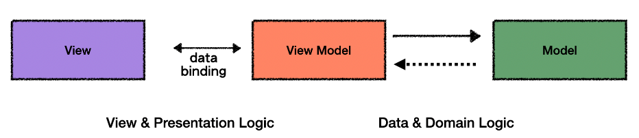

# 12_MVVM_거꾸로해도_MVVM
조금 더 생각해 보고 싶은 부분을 공부한 글입니다.

- 작성일: 2024-02-02
- 수정일: 2024-02-12

<br/>


#
### 주제를 선정한 이유
최근에 C#과 WPF를 시작하면서 MVVM 패턴을 알게되었습니다. 자바를 배울 때 MVC 패턴이 세상을 지배한 줄 알았는데, 비슷한듯 다른 MVVM 패턴에 대해 한 번 정리해보고자 합니다.

<br/>


#
### MVVM 정의

MVVM은 Model-View-ViewModel의 약어로,  UI 및 비 UI 코드를 분리하기 위한 UI 아키텍처 디자인 패턴입니다. Model의 데이터를 가공하는 ViewModel과, 그 ViewModel을 보여주는 View로 이루어져 있습니다.  
C#과 WPF에서는 XAML로 UI를 정의하고, 데이터 바인딩 태그를 사용하여 데이터 및 명령을 포함하는 ViewModel에 연결합니다.

1. Model
- 데이터의 구조, 속성 등

```cs
namespace Practice.Plugin.Models
{
	public class Student
	{
		public int Id {get; set;}
		public string Name {get; set;}
		public int Age {get; set;}
	}
}
```

2. View
- 유저가 보는 그래픽 컨트롤들의 집합
- 사용자가 보는 화면(구조, 레이아웃 및 모양)을 정의

```html
<!--MVVM 적용 전-->
<Window>
	<Grid>
		<StackPanel>
		<TextBox x:Name="idTextBox"/>
		<TextBox x:Name="nameTextBox"/>
		<TextBox x:Name="ageTextBox"/>
		<Button 
			x:Name="button01"
			Click="button01_Click"
			/>
		</StackPanel>
	</Grid>
</Window>


<!--MVVM 적용 후-->
<Window>
	<Window.Resources>
		<vm:WeatherVM x:Key="weatherVM"/>
	</Window.Resources>

	<Grid DataContext="{StaticResource weatherVM}">
		<StackPanel>
		<TextBox Text="{Binding Id}"/>
		<TextBox Text="{Binding Name}"/>
		<TextBox Text="{Binding Age}"/>
		<Button 
			Content="Button01"
			Command="{Binding SearchCommand}"
			/>
		</StackPanel>
	</Grid>
</Window>
```

3. ViewModel
- View와 Model를 연결하는 요소(MVC의 Controller 역할)
- 비즈니스 로직 처리

```cs
// MVVM 적용 전
namespace Practice.Plugin.Views
{
    public partial class MainWindow : Window
    {
        public MainWindow()
		{
            idTextBox.Text = "ID";
            nameTextBox.Text = "NAME";
            ageTextBox.Text = "AGE";
		}

        private void button01_Click(object sender, RoutedEventArgs e)
        {
            button01.Content = "BUTTON";
        }
	}
}


// MVVM 적용 후
namespace Practice.Plugin.ViewModels
{
    public class MainViewModel : INotifyPropertyChanged
    {
		private string _id;
		public string Id
		{
			get { return _id; }
			set 
			{ 
				_id = value;
				OnPropertyChanged("Id");
            }
        }

		private string _name_;
		public string Name
		{
			get { return _name; }
			set 
			{ 
				_name_ = value;
				OnPropertyChanged("Name");
            }
        }
		private string _age;
		public string Age
		{
			get { return _age; }
			set 
			{ 
				_age = value;
				OnPropertyChanged("Age");
            }
        }

		public SearchCommand SearchCommand{ get; set; }


        public WeatherVM()
		{
            SearchCommand = new SearchCommand(this);
		}


		public event PropertyChangedEventHandler? PropertyChanged;

        private void OnPropertyChanged(string propertyName)
		{
			PropertyChanged?.Invoke(this, new PropertyChangedEventArgs(propertyName));
        }
	}
}
```

#
### 정리
1. View
- 보여지는 것에만 집중
- 동작은 바인딩을 통해 ViewModel에 위임
	* 바인딩: View와 ViewModel의 상호작용이 일어난 것
- ViewModel의 속성을 바인딩하여 이용하므로 ViewModel과 의존 관계를 가짐
- ViewModel에서 제공하는 Model을 사용하므로 Model과 의존 관계를 가짐

2. ViewModel
- 추상화된 View로 보이지 않는 View의 완전한 동작을 구현
- ViewModel은 단지 바인딩될 수 있도록 속성을 노출할 뿐 View와 의존 관계를 가지지 않아야 함
- Model을 이용하므로 Model과 의존 관계를 가짐

3. Model
- 화면과 관련 없는 비즈니스 로직 처리
- View, ViewModel과 의존관계를 가지지 않음

<br/>


#
### 📚참고 자료
[MVVM이란?](https://velog.io/@ellyheetov/MVVM%EC%9D%B4%EB%9E%80)  
[데이터 바인딩 및 MVVM](https://learn.microsoft.com/ko-kr/windows/uwp/data-binding/data-binding-and-mvvm)  
[안드로이드 MVVM개념? 이 글 하나로 끝낸다.](https://velog.io/@squart300kg/mvvmComplete)  
[C#으로 본 MVVM 패턴 정리 및 활용](https://www.centbin.com/c%EC%9C%BC%EB%A1%9C-%EB%B3%B8-mvvm-%ED%8C%A8%ED%84%B4-%EC%A0%95%EB%A6%AC-%EB%B0%8F-%ED%99%9C%EC%9A%A9-%EB%B0%A9%EB%B2%95%EC%9D%84-%EC%9D%B4%EC%95%BC%EA%B8%B0%ED%95%A9%EB%8B%88%EB%8B%A4/)  
[MVVM Pattern을 사용하는 개발자를 위한 안내 v1.0 part1](https://kaki104.tistory.com/830)  
[MVVM 패턴의 고찰](https://forum.dotnetdev.kr/t/mvvm/2475)  