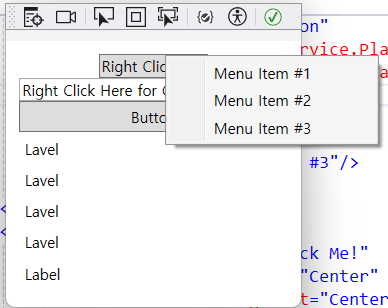
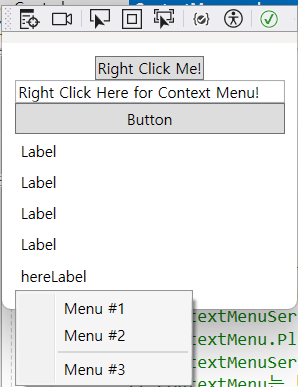

# 13_ContextMenu_니가_있어야_할_곳은_여기야
조금 더 생각해 보고 싶은 부분을 공부한 글입니다.

- 작성일: 2024-03-03
- 수정일: 

<br/>


#
### 주제를 선정한 이유
WPF를 공부하고 있습니다. xaml의 기본 기능을 연습하기 위해서 WPF Tutorials라는 사이트를 활용하고 있습니다. 그러던 중 오른쪽 버튼을 클릭했을 때, 마우스가 아닌 다른 곳에서 메뉴가 나오게 하는 방법은 뭐가 있을까..라는 궁금증이 생겼습니다. 간단하지만 유의해야 할 부분이 있어 정리해 
보고자 합니다🔥.

<br/>


#
### MenuContext 기본

```html
<Button Content="Right Click Me!"
        VerticalAlignment="Center"
        HorizontalAlignment="Center"
        Name="rightClickMeButton"
        >
    <Button.ContextMenu>
        <ContextMenu Name="buttonContextMenu">
            <MenuItem Header="Menu Item #1"/>
            <MenuItem Header="Menu Item #2"/>
            <MenuItem Header="Menu Item #3"/>
        </ContextMenu>
    </Button.ContextMenu>
</Button>
```

Button 태그에 ContextMenu를 설정하면 오른쪽 마우스 클릭 시, MenuItem들이 출력됩니다.



마우스가 함께 스크린샷에 나오지 않지만, 기본적으로 마우스를 클릭한 곳에 ContextMenu가 위치하게 됩니다.

만일, 마우스 위치와 관계없이 ContextMenu를 위치시키고 싶다면 어떻게 하면 좋을까요.

Tutorial에서는 비하인드 코드를 사용합니다. 오른쪽 마우스 클릭 대신 Click 이벤트로 변경한 상태입니다.

```html
<Window.Resources>
    <ContextMenu x:Key="cmButton">
        <MenuItem Header="Menu #1"/>
        <MenuItem Header="Menu #2"/>
        <Separator/>
        <MenuItem Header="Menu #3"/>
    </ContextMenu>
</Window.Resources>

<!--생략-->

<Button Height="25" 
        Click="Button_Click" 
        Content="Button"
        />
<Label Height="25" Content="Label"/>
<Label Height="25" Content="Label"/>
<Label Height="25" Content="Label"/>
<Label Height="25" Content="Label"/>
<Label Height="25" Name="imHere" Content="hereLabel"/>
```

```cs
private void Button_Click(object sender, RoutedEventArgs e)
{
    ContextMenu contextMenu = this.FindResource("cmButton") as ContextMenu;
    contextMenu.PlacementTarget = imHere as Label;
    contextMenu.IsOpen = true;
}
```

<div style="display: flex; align-items: center;">
  <div style="flex: 1;">
    
  </div>
  <div style="flex: 1;">
    원하는 위치에 두기 위해 PlacementTarget만 코드를 수정해서 시도했는데, 안 됩니다. 사실, 오른쪽 마우스를 클릭하면 당연히 그 자리에 위치하는 게 UX를 고려해서도 맞기에 그냥 넘어갈 수 있었지만.. '당연히 되겠지' 했던 게 안된다면.. 그건 또 다른 이야기이기 때문에 혼자만의 싸움이 시작되었습니다.
  </div>
</div>

<br/>

찾아보니, ContextMenu 태그에 ContextMenuService.Placement 속성의 기본값이 Mouse이기 때문에 다른 값으로 변경을 해주고 ContextMenuService.PlacementTarget을 함께 설정해 주면 가능합니다.
5번째 라벨에 '따란'하고 ContextMenu가 나옵니다.

<br/>

```html
<Window.Resources>
    <ContextMenu x:Key="cmButton"
                    ContextMenuService.PlacementTarget="{Binding ElementName=imHere}"
                    ContextMenuService.Placement="Bottom">
        <MenuItem Header="Menu #1"/>
        <MenuItem Header="Menu #2"/>
        <Separator/>
        <MenuItem Header="Menu #3"/>
    </ContextMenu>
</Window.Resources>
```



해결되었기 때문에 코드 정리를 시작했습니다. 같은 기능을 하는 중복된 코드는.. 제 마음이 신경 쓰이기 때문에 Behind Code에 있던 contextMenu.PlacementTarget를 지웠습니다.  
그리고 제가 설정한 위치에 메뉴가 다시 안뜨기 시작합니다.. 하..  
(이때 저는 코드 수정을 하면 항상 틈틈이 실행시켜서 확인해 봐야 한다는 것을 많이 배웠습니다..)  
같은 기능을 하는데 왜 cs 파일에 적으면 안 될까.. 를 찾던 중 오늘 글을 써야겠다고 마음먹게 한 내용을 찾았습니다.

```
ContextMenu와 같은 팝업 요소들(ToolTip 등)은 일반적인 UI 트리에 포함되지 않습니다. 이는 ContextMenu와 같은 팝업 요소들은 부모 요소(여기서는 Window)와 동일한 데이터 컨텍스트(Data Context)를 공유하지 않는다는 의미입니다. 즉, Window 태그 안에 포함이 되어있다고 해도 Data Context를 별개로 갖고 있게 된다는 의미입니다.  

그러므로 `Binding ElementName=imHere`를 사용할 때, `imHere`가 포함된 Window 태그가 포함된 Data Context가 아닌 ContextMenu의 독립적인 Data Context에서 imHere라는 이름의 요소를 찾기 때문에 바인딩이 실패하게 됩니다.  

이와 달리 Behind 코드에서는 Name 속성을 사용하여 XAML에서 요소에 이름을 지정하면, 해당 요소는 자동으로 해당 클래스의 필드로 생성이 되기 때문에 이를 통해 접근할 수 있습니다.  

즉, 한 문장으로 정리하자면 xaml과 cs 파일의 Data를 다루는 방식의 차이가 있으므로 xaml에서는 동작하지 않지만, cs에서는 동작할 수 있다는 것입니다.
```


#
### 정리
xaml과 cs 파일의 Data를 다루는 방식의 차이가 있다.
* xaml: 데이터를 다루는 범위는 DataContext에 따라 결정
* cs: DataContext의 범위와는 무관하게 클래스와 필드를 통한 Data 접근
    * 태그에 Name 부여 시, 클래스(Tag)와 필드(Property) 자동 생성


#
### 📚참고 자료
[The WPF ContextMenu](https://wpf-tutorial.com/common-interface-controls/contextmenu/)  
[ContextMenu 클래스](https://learn.microsoft.com/ko-kr/dotnet/api/system.windows.controls.contextmenu?view=windowsdesktop-8.0)