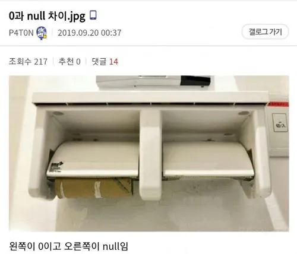

# 16_NULL_널_생각해
조금 더 생각해 보고 싶은 부분을 공부한 글입니다.

- 작성일: 2024-06-23
- 수정일: 

<br/>


#
### 주제를 선정한 이유
저는 작은 단위의 테스트에서는 문제 없지만, 큰 단위의 테스트를 진행할 때 제일 많이 발생했던 오류가 NullPointerException입니다. (그리고 아직도 나고 있습니다..) 그래서 null값에 대해서 if문으로 처리를 해주다 문득 null 값은 어디서 처리해주는 게 좋을까..라는 생각이 들어 정리해보고자 합니다.

<br/>

[](https://www.youtube.com/watch?v=LTIO4IQKKK4)

원모어찬스의 널 생각해와 함께 해보겠습니다.


## Null
  
나무위키에서 얻어왔습니다.
0이 없어요, 라면 null은 진짜 없어요인 셈이죠.

객체나 인스턴스가 생성되고 그 안의 데이터를 가져오려는데, 객체나 인스턴스가 Null, 즉 없으면 NullPointerException이 발생합니다.  

객체나 인스턴스가 생성되지 않았던 것에는 여러 이유가 있습니다. 저는 특정 프로그램에 종속적인 API와 데이터베이스를 사용하고 있는데, 형변환이 안되는 객체간에 형변환하다가 NullPointerException이 발생했습니다.

<br/>

## Null 처리
아래 내용은 [기억보단 기록을 - 3. 좋은 함수 만들기 - Null 을 다루는 방법](https://jojoldu.tistory.com/721)에서 보고 정리하였습니다.


### 1. 초기 방어
지금 제 코드 상태도 초기 방어 형태로 되어있습니다.  
간단하게 null 값 검사를 초기부터 하는 것입니다.

```java
private void somethingGood(SomeClass imInstance){
    if(imInstance == null){
        return ;
    }

    // ...
}
```

제가 생각하는 장점은, 조기 리턴으로 Null 값 처리 뿐만 아니라 실행 속도 측면에서도 잘못된 경우에 다음 코드까지 실행되지 않기에 좋지 않을까 생각합니다.  


### 2. Null Return X
더욱 근본으로 돌아가면 사실 null을 반환하지 않도록 하는 방법도 있습니다.
1. null 대신 예외 던지기

위의 코드가 수정이 필요한 이유는 요즘 제 야근의 근원.. 원인을 판단하는 부분이 없습니다. `return;` 이나 `return null;`을 여러 메서드에서 사용한다면.. 어디가 문제인지 찾기 어렵습니다.. 그래서 exception을 활용해봅니다. 이 곳이 문제라는 걸 알려줘야 합니다.

```java
private void somethingGood(SomeClass imInstance){
    if(imInstance == null){
        throw new MyException("내가 만든 Exception 발생!");
    }

    // ...
}
public class MyException extends RuntimeException{
    MyException(){}
    MyException(String message){
        super(message);
    }
}
```

MyException은 RuntimeException을 상속받았습니다. Exception을 상속받는 것과는 차이가 있는데, 다음에 자세히 정리해볼 예정입니다. 간단하게 Exception을 상속받을 경우엔 컴파일 시점에 확인되지만 RuntimeException은 컴파일 시점에 확인이 되지 않습니다. 또한, RuntimeException은 주로 논리적 오류를 처리할 때 사용되기에, Null 값 오류를 처리하기 위해서 Exception보다는 RuntimeException을 사용하는 것이 적합하다고 생각했습니다.

2. Null 대신 유효한 값이 반환
주로 예외가 발생해도 프로그램의 로직이 정상적으로 동작하기를 원하는 경우에 사용합니다. 대표적으로 자바에서는 조회 결과가 없을 때, Null보다는 빈 배열을 반환하는 경우가 있습니다. 저의 경우에는 enum을 활용했었습니다.

```java
private ResultType somethingGood(SomeClass imInstance){
    if(imInstance == null){
        return ResultType.None;
    }

    // ...
}
```

이런식으로 null일 경우, 다음 로직이 이어지기 위해서 null이나 exception보다는 해당 상황에 맞는 값을 돌려주면 됩니다.

이 경우에 가장 중요한 것은 
* 오류가 발생했을 때 더 이상 진행하면 안되는 경우에는 바로 Exception을 발생시켜야 하며, 
* 유효한 값 반환으로 인해 실제 오류가 발생한 지점에서 멀리 떨어진 함수에서 오류가 발생하게 해서는 안된다는 것입니다.


### 3. 파라미터에 null 값 전달하지 않도록 조심하기
1번과 2번 사이의 타협점.. 파라미터로 넘기지 마라.. 입니다.
* null을 return하지 마라 -> null을 인자로 전달하지 마라 -> null일 경우, 조기 return하자.

크게는 2가지 방법으로
1. 사전에 null 값을 처리하기

```java
if(imInstance != null){
    somethingGood(imInstance);
}

private void somethingGood(SomeClass imInstance){
    if(imInstance == null){
        throw new MyException("내가 만든 Exception 발생!");
    }

    // ...
}
```

2. 파라미터에서 null 방어하기

```java
private void somethingGood(SomeClass imInstance){
    imInstance = Objects.requireNonNull(imInstance, "Parameter 'imInstance' cannot be null");

    // ...
}
private void somethingGood(@NotNull SomeClass imInstance){
    throw new MyException("내가 만든 Exception 발생!");

    // ...
}
```

<br/>


#
### 정리
Null 처리는
1. 처리를 안해도 되게 Null 리턴을 좀 줄이고,
2. 메서드의 파라미터로 Null을 전달하지 못하도록 막아도 보고,
3. Null을 받아야 하는 경우,
    * 조기 리턴을 활용하거나
    * 예외를 발생시키거나
    * 로직 실행이 진행되어야 한다면, 유효한 값을 리턴하자.

🫠 안전한 프로그램이 되기 위해서는 이 3가지 방법을 적절히 혼용하여 사용하자!


#
### 📚참고 자료
[Null(프로그래밍 언어)](https://namu.wiki/w/Null(%ED%94%84%EB%A1%9C%EA%B7%B8%EB%9E%98%EB%B0%8D%20%EC%96%B8%EC%96%B4))  
[3. 좋은 함수 만들기 - Null 을 다루는 방법](https://jojoldu.tistory.com/721)
[5. Java 자바 [예외 처리] - 사용자 정의 예외와 예외 발생 시키기, 예외 정보 얻기](https://kephilab.tistory.com/84)  
