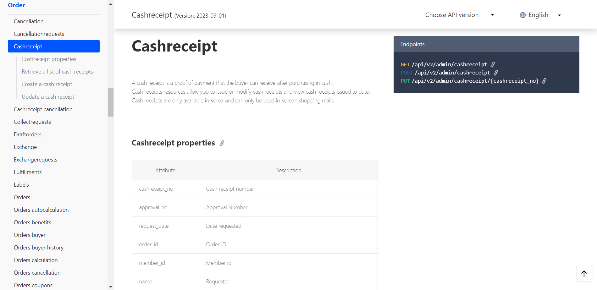
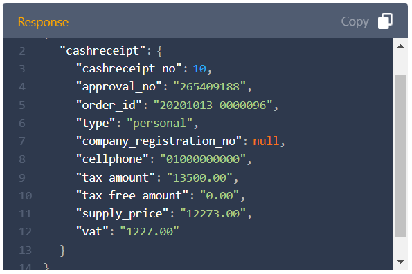
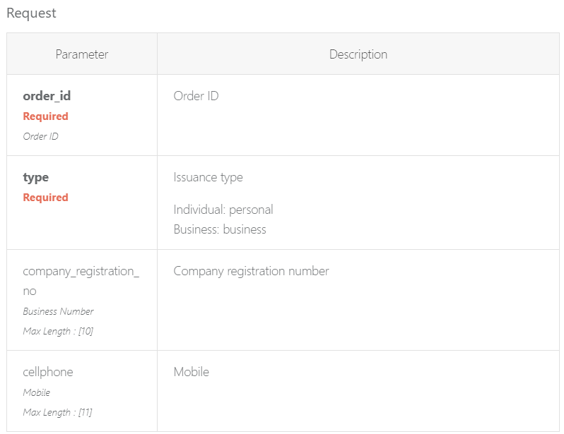

# 2_공식_문서를_어떻게_읽을_것인가
조금 더 생각해 보고 싶은 부분을 공부한 글입니다.

- 작성일: 2023-12-05
- 수정일: 2023-12-07

#
### 주제를 선정한 이유

학원에서 프로젝트를 진행할 때, 대부분의 문제를 블로그 글로 해결하였습니다.

물론 구글 검색을 통해서 공식 문서를 접하는 일도 있었지만, 영문보다는 사람들이 읽고 한국어로 정리해둔 글이 편해서 사실 공식 문서를 읽은 적이 거의 없었습니다.

 

그러다 최근에 VS Code라는 Code Editor에서 `VSCode Pets`라는 extension을 설치하면서 처음으로 공식 문서(보다는 가벼운 느낌이지만)를 제대로 읽어보게 되었습니다.
 
(귀여운 extension입니다, 사용해보시길 추천드립니다🤓!)

지금은 이렇게 짧고 간단한 문서를 읽었지만, 길고 많은 내용을 담은 문서는 어떻게 읽으면 좋을지 정리해보고 싶은 생각에 글을 작성하게 되었습니다.

#
### 공식 문서 종류
제가 접해본 공식 문서는 크게 5가지 입니다.
1. 언어에 대한 공식 문서(Java, JavaScript 등)
2. 프레임워크에 대한 공식 문서(Spring, SpringBoot, JUnit 등)
3. 라이브러리에 대한 공식 문서(React, jQuery 등)
4. API에 대한 공식 문서(공공 데이터 포털 등)
5. 그 외 기타(VScode-pets 등)

 

그 중에서도 오늘 이야기해보고 싶은 부분은 API입니다.

#
### API 문서

 

위에 보이는 이미지는 Cafe24에서 제공하는 API를 사용 방법을 정의한 문서입니다. REST 방식에 맞춰서 데이터를 조회, 등록, 수정 등을 하는 방법이 나와있습니다.

만일 해당 API 문서를 처음 접하게 된다면 어떻게 이용하면 좋을지 짧게 적어보고자 합니다.

1. 개략적인 요구사항 파악하기
    - 정확히는 현재 무엇을 필요로 하는지에 대한 고민이 필요합니다.
    이미지 상에는 Side Bar에 Order만 나와있지만, 이 외에도 Store, Customer, Product 등 다양한 카테고리가 있습니다.
     
    처음보는 문서에서 필요한 정보를 한 번에 찾기 어려울 수 있으므로 크게 내가 지금 `어떤 것을 필요로 하는지` 또는 `필요로 하는 것과 관련된 것은 무엇인지`에 대해서만 검색을 합니다.
     
    이미지를 예시로 설명하자면, 현금 영수증으로 처음부터 정보를 찾기보다는 주문 또는 결제 시에 현금 영수증을 발행할 수 있으므로 주문이나 결제 관련 카테고리를 먼저 찾아보는 것입니다.
     
    찾고 있는 내용과 유사한 주제가 나타난다면 해당 EndPoints를 언제 사용하는지에 대한 설명을 읽어봅니다.

2. CRUD 선택하기
    - 필요한 내용을 찾았다면, 목록을 조회하고 싶은 것인지 데이터를 등록하고 싶은 것인지 선택해야 합니다. 행위에 따라 REST 방식도 함께 결정됩니다.
     

    보통 CRUD는 다음과 같은 동사와 함께 쓰입니다.
    - 조회: GET - Retrieve a list ...
    - 등록: POST - Create ...
    - 수정: PUT/PATCH - Update ... 
    - 삭제: DELETE/PUT/PATCH - Delete ...

3. Response Data 확인하기
    - 큰 카테고리와 EndPoints가 결정되었다면, Response Data를 확인합니다. 실제로 필요한 정보가 응답 데이터에 포함이 되어있지 않다면 다시 1번부터 반복합니다.
     
    
    만일 현금 영수증을 발행하는 작업을 하고 싶다면 `Create a cash receipt`에서 `cash receipt_no` 또는 `approval_no`이 있는지 확인하는 것입니다. ID를 통해 실제로 현금영수증이 발행되었는지 조회할 수 있기 때문입니다.

4. Request 방식 확인하기
    - 응답데이터에 필요한 정보가 포함되어있다면 요청 방식을 살펴봅니다. 특히, 등록이나 수정은 Request Body를 사용해서 올바른 형식에 맞춰 데이터를 전송해야합니다. 그러므로 요청 방식을 상세히 살펴보는 것이 중요합니다.
     
     다음은 현금 영수증을 생성하고자 할 때, 사용하는 API 주소와 Request Body 내용입니다.

    - EndPoints: `POST /api/v2/admin/cashreceipt`
    <code><pre>
-d '{
    "request": {
        "order_id": "20201013-0000096",
        "type": "personal",
        "cellphone": "01000000000"
    }
}'
    </pre></code>
     

    - "request" 부분을 살펴보면 "order_id" / "type" / "cellphone"이 필요합니다. 직관적으로 알 수 있는 key 값이지만
        - 의미하는 바를 `다시 한 번 확인`하는 것이 중요하고,
        - 각 요청값이 `필수`인지 `선택`인지도 확인해야 합니다.

5. API TEST
    - 최종적으로 Local 환경에서 API 테스트를 수행합니다.

#
### 정리
공식_문서를_어떻게_읽을_것인가.

- 필요한 정보를 명확히 정리한다.
- 대분류 → 소분류로 범위를 좁혀가며 해당 정보의 위치를 탐색한다.
- 비슷한 정보를 발견하면
    - CRUD를 선택해서
    - Response Data를 확인한다.
- 해당 정보가 필요할 경우,
    - Request Body를 살펴서 각 요소 값의 의미와 사용 방법을 살펴본 후
    - API 통신을 시도해본다.

#
### 📚참고 자료
[Cafe24 Developers](https://developers.cafe24.com/docs/en/api/admin/#cashreceipt)  
