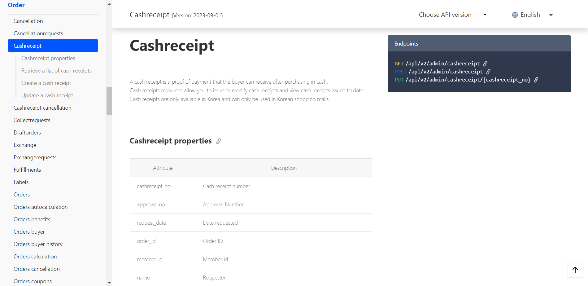

# 2_공식_문서를_어떻게_읽을_것인가
조금 더 생각해 보고 싶은 부분을 공부한 글입니다.

- 작성일: 2023-12-05
- 수정일: 2023-12-06

#
### 주제를 선정한 이유

학원에서 프로젝트를 진행할 때, 대부분의 문제를 블로그 글로 해결하였습니다.

물론 구글 검색을 통해서 공식 문서를 접하는 일도 있었지만, 영문보다는 사람들이 읽고 한국어로 정리해둔 글이 편해서 사실 공식 문서를 읽은 적이 거의 없었습니다.

 

그러다 최근에 VS Code라는 Code Editor에서 `VSCode Pets`라는 extension을 설치하면서 처음으로 공식 문서(보다는 가벼운 느낌이지만)를 제대로 읽어보게 되었습니다.
 
(귀여운 extension입니다, 사용해보시길 추천드립니다🤓!)

지금은 이렇게 짧고 간단한 문서를 읽었지만, 길고 많은 내용을 담은 문서는 어떻게 읽으면 좋을지 정리해보고 싶은 생각에 글을 작성하게 되었습니다.

#
### 공식 문서 종류
제가 접해본 공식 문서는 크게 5가지 입니다.
1. 언어에 대한 공식 문서(Java, JavaScript 등)
2. 프레임워크에 대한 공식 문서(Spring, SpringBoot, JUnit 등)
3. 라이브러리에 대한 공식 문서(React, jQuery 등)
4. API에 대한 공식 문서(공공 데이터 포털 등)
5. 그 외 기타(VScode-pets 등)

 

그 중에서도 오늘 이야기해보고 싶은 부분은 API입니다.

#
### API 문서

 

위에 보이는 이미지는 Cafe24에서 제공하는 API를 사용 방법을 정의한 문서입니다. REST 방식에 맞춰서 데이터를 조회, 등록, 수정 등을 하는 방법을 정의해 두었습니다.

처음 접하는 API를 어떻게 이용하면 좋을지에 대해 고민했던 부분을 짧게 적어보고자 합니다.

1. 개략적인 요구사항 파악하기
    - 정확히는 현재 무억을 필요로 하는지에 대한 고민이 필요합니다.
    이미지 상에는 Order만 나와있지만, 이 외에도 Store, Customer, Product 등 다양한 카테고리가 있습니다.
     
    처음보는 문서에서 필요한 정보를 한 번에 찾기는 어려울 수 있으므로 크게 내가 지금 `어떤 것을 필요로 하는지` 또는 `필요로 하는 것과 관련된 것은 무엇인지`에 대해서만 정리를 합니다.
     
    이미지를 예시로 설명하자면, 현금 영수증으로 처음부터 정보를 찾기보다는 주문 또는 결제 시에 현금 영수증을 발행할 수 있으므로 주문이나 결제 관련 카테고리를 먼저 찾아보는 것입니다.

2. CRUD 선택하기
    - 간단하게 주제를 설정했다면, 목록을 조회하고 싶은 것인지 데이터를 등록하고 싶은 것인지 확인을 해야합니다.
    보통 CRUD는 다음과 같은 동사와 함께 쓰입니다.
        - 조화: Retrieve a list ...
        - 등록: Create ...
        - 수정: Update ...
        - 삭제: Delete ...
    
    행위를 선택하면서 자연스럽게 REST 방식도 결정됩니다.
    - 조화: GET
    - 등록: POST
    - 수정: PUT/PATCH
    - 삭제: DELETE/PUT/PATCH

