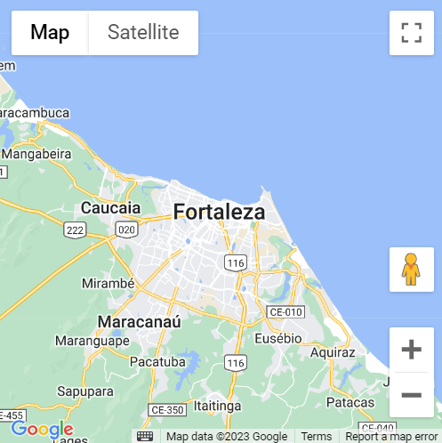
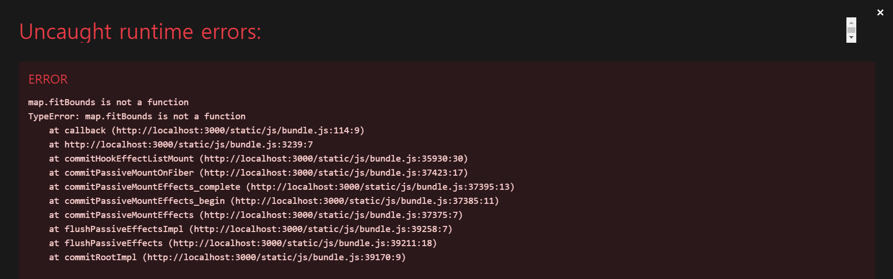
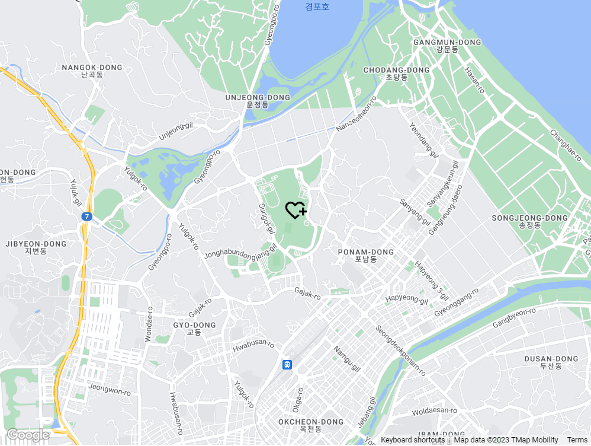
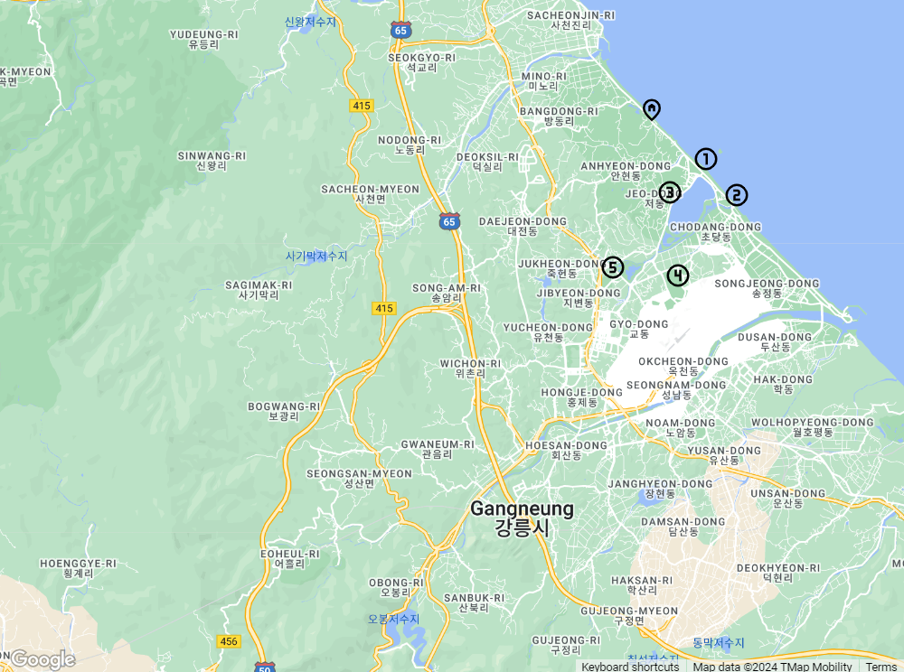
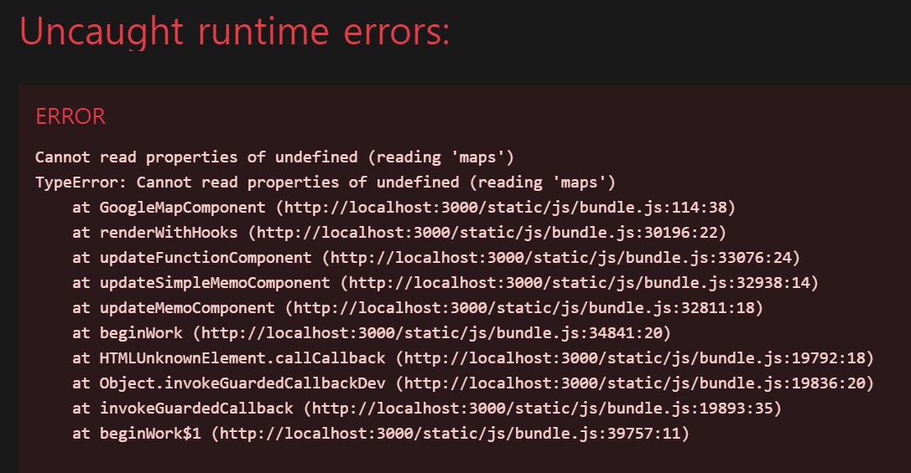
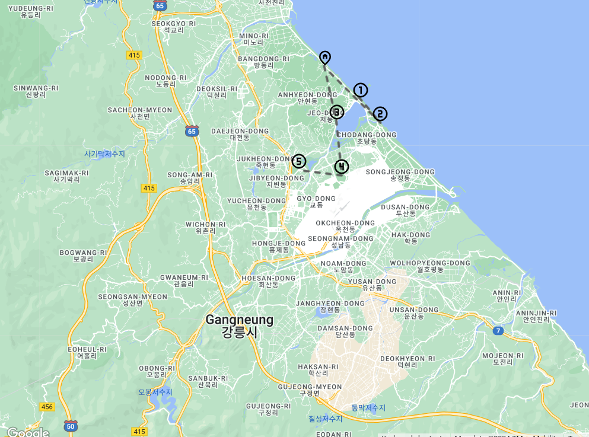

# 6_구글맵을_다시_띄울_수_있을까🤔
조금 더 생각해 보고 싶은 부분을 공부한 글입니다.

- 작성일: 2023-12-31
- 수정일: 2024-01-03

<br/>


#
### 주제를 선정한 이유
최종 Project에서 React에서 GoogleMap 구현을 담당했습니다.  
당시에 시간이 촉박해서 코드가 돌아갈 수 있게만 하자는 각오로 만들었던 코드를 다시 공부해 보고자 했습니다.  
여전히 프로젝트 진행 당시와 같은 오류를 발생시키고 있지만, 이번에는 정리를 꼼꼼하게 해두고자 합니다.

<br/>


#
### Google Map API 발급
Maps JavaScript API는 무료 등급 내에서 매월 28,000회의 호출을 할 수 있습니다.  
일정 사용량을 초과하면 요금이 부과되기 때문에 API Key를 발급받기 위해서는 카드 등록을 먼저 진행해야 합니다.  
저는 프로젝트 당시에 이미 API Key를 발급받아 따로 정리하지 않고, 참고 사이트만 추가하도록 하겠습니다.  

 * [구글지도 API 키 발급 받는 방법.](https://duopix.co.kr/google-map-key/)

<br/>


#
### Google Map Load
저는 구글맵 패키지를 사용했습니다.  
@react-google-maps/api  
api 공식 문서에 사용법이 자세히 나와 있습니다.

1. package install

```bash
# npm
npm i -S @react-google-maps/api

# yarn
yarn add @react-google-maps/api
```

2. execute sample code  

```javascript
import React from 'react'
import { GoogleMap, useJsApiLoader } from '@react-google-maps/api';

const containerStyle = {
  width: '400px',
  height: '400px'
};

const center = {
  lat: -3.745,
  lng: -38.523
};

function MyComponent() {
  const { isLoaded } = useJsApiLoader({
    id: 'google-map-script',
    googleMapsApiKey: "YOUR_API_KEY"
  })

  const [map, setMap] = React.useState(null)

  const onLoad = React.useCallback(function callback(map) {
    // This is just an example of getting and using the map instance!!! don't just blindly copy!
    const bounds = new window.google.maps.LatLngBounds(center);
    map.fitBounds(bounds);

    setMap(map)
  }, [])

  const onUnmount = React.useCallback(function callback(map) {
    setMap(null)
  }, [])

  return isLoaded ? (
      <GoogleMap
        mapContainerStyle={containerStyle}
        center={center}
        zoom={10}
        onLoad={onLoad}
        onUnmount={onUnmount}
      >
        { /* Child components, such as markers, info windows, etc. */ }
        <></>
      </GoogleMap>
  ) : <></>
}

export default React.memo(MyComponent)
```

"YOUR_API_KEY" 부분은 발급받은 API key 값을 입력해 주면 됩니다.  
하지만, 해당 코드를 git 저장소에 코드를 올릴 경우 API Key가 노출될 위험이 있습니다.  
그러므로 .env 파일을 이용해서 환경변수를 사용하는 것이 좋습니다.

```javascript
  const { isLoaded } = useJsApiLoader({
    id: 'google-map-script',
    googleMapsApiKey: "YOUR_API_KEY"
  })
  
  // using .env
  const { isLoaded } = useJsApiLoader({
    id: 'google-map-script',
    googleMapsApiKey: `${process.env.REACT_APP_GOOGLE_MAP_API_KEY}`
  })

```

.env 설정과 관련해서는 아랫글을 참고해 보시면 좋습니다.

 * [# 5_dotenv는_무엇일까](https://hj0216.tistory.com/882)

API Key를 제대로 입력한 경우, 다음과 같은 구글 지도가 나타납니다.



<br/>


#
### Google Map Marker
React 18 이후에는 Marker 대신 MarkerF를 사용해야 합니다.  
위치는 GoogleMap Component 사이입니다.

```javascript
<GoogleMap>
	...
	<MarkerF
		onLoad={onLoad}
		position={{ lat: center.lat , lng: center.lng }}
        icon={{
        	url: `${process.env.PUBLIC_URL}/images/heart_plus.svg`,
        	scaledSize: new window.google.maps.Size(32, 32),
		}}
	/>
	...
<GoogleMap />

```

이렇게 입력을 한 후, 실행을 하면 다음과 같은 오류가 나타납니다.

```bash
map.fitBounds is not a function
TypeError: map.fitBounds is not a function
...

```

잘 작동하던 map.fitBounds가 함수가 아니라는 오류입니다.  
리액트에서는 에러가 발생하면 저 멀리서 봐도 알 수 있습니다🤹.



문제는 <MarkerF> 안의 onload 속성 때문입니다.  
만일 onload 속성을 주석 처리하면 다음과 같이 마커가 지도에 표시됩니다.



MarkerF 컴포넌트의 onLoad option에 onload 변수를 인자로 넘겨주었습니다.  
정확히는 아래 변수를 onLoad option 값으로 설정한 것입니다.

```javascript
const onLoad = React.useCallback(function callback(map) {
  const bounds = new window.google.maps.LatLngBounds(center);
  map.fitBounds(bounds);

  setMap(map)
}, [])
```

Google Maps API는 <GoogleMap>이 로드될 때 onLoad 함수를 호출하면서 Map 객체를 인자로 전달합니다.  
그래서 위에서 정의한 onLoad 함수를 GoogleMap 컴포넌트의 onLoad 속성에 전달하는 것이 문제가 되지 않습니다.  
그러나 <MarkerF>가 로드될 때는 onload 함수 호출 시, Marker 객체를 전달하기 때문에 Map 객체를 인자로 받는 onload 값을 넘기면 오류가 발생하게 됩니다.  
따라서 Map 객체가 아니므로 fitBounds와 같은 function도 없으므로 위와 같은 오류가 발생하게 됩니다.  

마커를 표시하긴 했지만, 여행 일정에서 사용하려면 한 개만으로는 부족하기에 여러 개의 마커를 찍어보겠습니다.  

```javascript
{
  mapData
  .filter((item) => item.placeOrder !== null)
  .map((item) => (
    <MarkerF
        key={item.placeOrder}
        position={{ lat: item.center.lat , lng: item.center.lng }}
        icon={{
          url: `${process.env.PUBLIC_URL}/images/counter_${item.placeOrder}.svg`,
          scaledSize: new window.google.maps.Size(24, 24),
        }}
      />
))}

```

데이터 형식에 따라 코드가 일부 수정될 수 있겠지만, 중요한 것은 <MarkerF>를 반복문으로 돌려야 한다는 것입니다.  
저는 여행의 순서를 표시하기 위해 아이콘 파일 이름과 순번을 결합하였습니다.  
예를 들어 첫 번째 목적지는 순번이 1이고, 아이콘 파일 이름을 counter_1로 설정해 여행 순번에 따라 아이콘이 표시되도록 하였습니다.



<br/>


#
### Google Map Polyline
이제 거의 다 왔습니다.  
개략적인 여행지 간의 거리를 가시적으로 표현하기 위해 점선을 추가해 보겠습니다.  
기존에 진행했던 Polyline 설정 코드가 있으므로 빠르게 복사 + 붙여넣기를 실행했습니다.  
그리고 다시 만난 에러!

```javascript
const onLoad = React.useCallback(function callback(map) {
    const bounds = new window.google.maps.LatLngBounds(center);
    map.fitBounds(bounds);

    polyline.setMap(map)

    setMap(map)

  }, [])

const polyline = new window.google.maps.Polyline({
  path: coordinates,
  strokeColor: '#555555',
  strokeOpacity: 0,
  strokeWeight: 0.7,

  icons: [
    {
      icon: lineSymbol,
      offset: '0',
      repeat: '15px', // 실선과 실선 사이 길이
    },
  ],
})  

```



Cannot read properties of undefined (reading 'maps')  
new window.google.maps.Polyline에서 maps가 정의되지 않았다고 나오는 오류입니다. 분명 맵의 시작 위치를 잡아줄 때도, Marker를 만들 때도 나오지 않았던 오류인데 polyline에서만 나타납니다.  
열심히 구글링하던 중 저의 폴리라인과 다른 분의 폴리라인 변수 선언 위치가 약간 다르다는 것을 알게 되었습니다.  
그래서 위치를 이동시켰는데,

```javascript
const onLoad = React.useCallback(function callback(map) {
  const bounds = new window.google.maps.LatLngBounds(center);
  map.fitBounds(bounds);

  const polyline = new window.google.maps.Polyline({
    path: coordinates,
    strokeColor: '#555555',
    strokeOpacity: 0,
    strokeWeight: 0.7,

    icons: [
      {
        icon: lineSymbol,
        offset: '0',
        repeat: '15px', // 실선과 실선 사이 길이
      },
    ],
  })

  polyline.setMap(map)

  setMap(map)

}, [])

```



..? 점선이 나타났습니다.  
이에 대해 어떤 차이가 있어서 실행된건지 확인해보도록 하겠습니다.

window.google.maps 객체는 Google Maps가 완전히 로드될 때까지 정의되지 않습니다.  
그러나, Google Maps는 비동기적으로 로드되므로, 실행 순서가 Google Maps 로드 -> window.google.maps 객체 호출이 되도록 보장해야 합니다.  
onLoad 콜백 함수는 Google Maps가 로드되었을 때 호출되며, 그 안에서 window.google.maps.Polyline을 사용하여 폴리라인을 만들고, 그 폴리라인을 맵에 추가하는 등의 작업을 수행합니다.  
이렇게 하면 window.google.maps 객체가 이미 준비되었음을 보장하므로, 이전에 발생했던 오류를 방지할 수 있습니다.

<br/>


#
### 정리
6_구글맵을_다시_띄울_수_있을까🤔  
띄울 수 있다🤓

구글 맵 API 사용 시, 유의점
  - 일정 사용량 이상부터는 유료이므로, 환경변수를 사용하여 API Key 관리
  - Google Maps가 로드되고 난 후, new window.google.maps가 호출되도록 실행 순서 보장

<br/>


#
### 기타
- onload와 useCallback
useCallback을 통해 callback함수를 memoization, 즉 특정 함수를 저장해두고 재사용하는 최적화를 수행합니다.  
useCallback을 사용하지 않으면, 컴포넌트가 리렌더링될 때마다 새로운 onLoad 함수가 생성되어 불필요한 메모리 사용과 성능 저하를 초래할 수 있습니다.  
그로므로 useCallback을 사용하여 onLoad 함수를 컴포넌트가 처음 렌더링될 때 한 번만 생성하고, 그 이후에는 이전에 생성된 함수를 재사용하여 성능을 개선시킬 수 있습니다.  

<br/>


#
### 📚참고 자료
[Google Maps Platform FAQ](https://developers.google.com/maps/faq?hl=ko)  
[구글지도 API 키 발급 받는 방법.](https://duopix.co.kr/google-map-key/)  
[@react-google-maps/api](https://www.npmjs.com/package/@react-google-maps/api)  
[# 5_dotenv는_무엇일까](https://hj0216.tistory.com/882)  
[[React] react-google-map/api GoogleMap/MarkerF/InfoWindowF 사용](https://velog.io/@sanggyo/React-react-google-mapapi-GoogleMapMarkerFInfoWindowF-%EC%82%AC%EC%9A%A9)  
[Using the Public Folder](https://create-react-app.dev/docs/using-the-public-folder/)  
[구글맵 - 폴리라인 & 폴리곤 그리기](https://secr.tistory.com/95)  
[Maps JavaScript API의 스타일 참조](https://developers.google.com/maps/documentation/javascript/style-reference?hl=ko#style-features)
