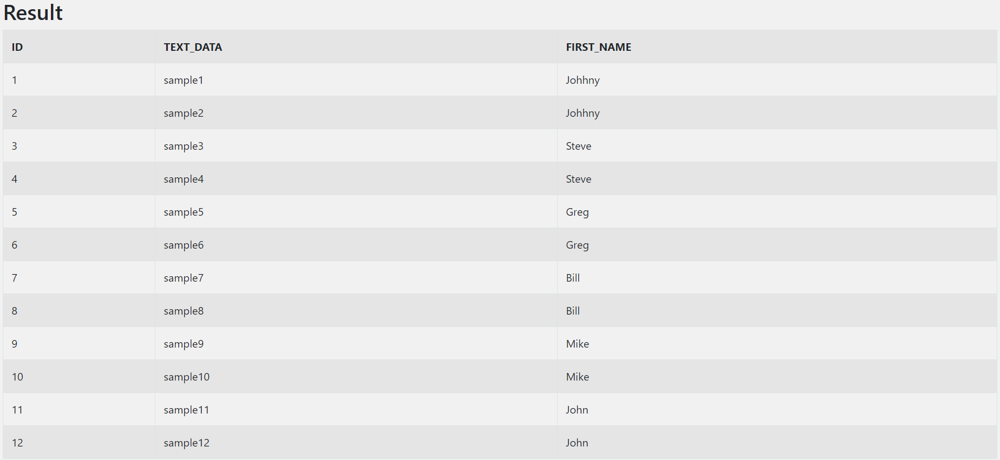
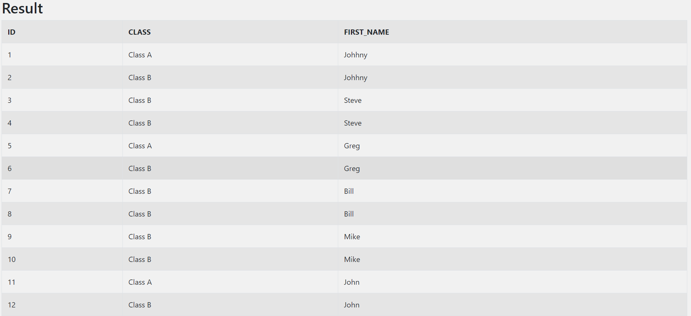
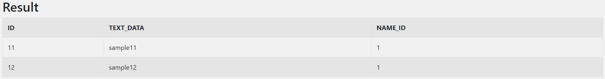
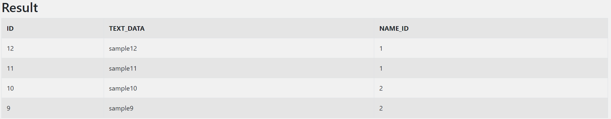

# 7_Multi_row_subquery_Returns와_헤어질_결심
조금 더 생각해 보고 싶은 부분을 공부한 글입니다.

- 작성일: 2024-01-05
- 수정일: 2024-01-07

<br/>


#
### 주제를 선정한 이유
Oracle query를 작성하다가 종종 `ORA-01427` 에러를 볼 수 있습니다.  

- `ORA-01427`: subquery returns more than one row  
단일행 하의 질의에 2개 이상의 행이 반환됨  

단일행 하의 질의에 1개의 행만 반환하기 위해 약 4시간을 고민했기에 그에 대한 기록을 남기고자 합니다.  

\+ 추가로, 단일행 오류를 만나기 전 단계까지 오는데도 꼬박 하루가 걸렸습니다🐳.

<br/>


#
### subquery란
서브 쿼리란 다른 쿼리 내부에 포함된 SELECT 문을 의미합니다.  
서브 쿼리를 포함하는 쿼리는 외부 쿼리, 서브쿼리는 내부 쿼리라고도 합니다.  

<br>


#
### subquery 종류
서브 쿼리의 종류로는 대표적으로 사용 위치에 따라
- SELECT 절에 사용될 경우, Scalar subquery
- FROM 절에 사용될 경우, Inline View
- WHERE 절에 사용될 경우, Nested subquery

가 있습니다.

1. Scalar subquery
메인 쿼리의 SELECT 절에서 칼럼처럼 사용됩니다.  
Scalar subquery에서는 단 하나의 칼럼만 사용할 수 있고, 반환하는 row도 단 하나만 가능합니다.  
그러므로, 주로 Scalar subquery는 메인 쿼리의 테이블과 Join을 하는 형태로 많이 사용됩니다.  
이런 서브쿼리는 JOIN 문으로도 풀어서 작성할 수 있습니다.

저도 Scalar subquery를 사용하다 `ORA-01427` 오류를 경험해서 이 글을 쓰기 시작했습니다😖.

간단한 예시는 다음과 같습니다.
- [SQL TEST](https://sqltest.net/)
- 이 사이트에서 테이블을 생성하고 SQL 구문을 실행해 볼 수 있습니다.

```sql
-- Scalar subquery
SELECT ID
      , TEXT_DATA
      , (SELECT FIRST_NAME 
            FROM sql_test_1 st1 
          WHERE st1.NAME_ID = st3.NAME_ID) FIRST_NAME
  FROM sql_test_3 st3
;

-- JOIN
SELECT ID, FIRST_NAME
      , TEXT_DATA
  FROM sql_test_3 st3
  JOIN sql_test_1 st1
    ON st1.NAME_ID = st3.NAME_ID
;
```


<br/>

---
\+ subquery와 Join  

subquery 찾아보다가 Join과의 사용상 차이점을 잘 설명해 놓은 글을 옮겨 적었습니다.

- subquery
    - 중첩 서브 쿼리는 메인 쿼리의 칼럼을 모두 사용할 수 있지만 메인 쿼리는 서브 쿼리의 칼럼을 사용할 수 없음
        - 질의 결과에 서브 쿼리 칼럼을 표시해야 한다면 조인 또는 Scalar subquery 등을 사용해야 함 
    - 서브 쿼리 레벨과는 상관없이 항상 메인 쿼리 레벨로 결과 집합이 생성
- Join
    - 조인에 참여하는 모든 테이블이 대등한 관계에 있으므로 조인에 참여하는 모든 테이블의 칼럼을 어느 위치에서라도 자유롭게 사용할 수 있음
    - 집합 간의 곱(Product)의 관계
        - 1:1 관계의 테이블이 조인하면 1(= 1 * 1) 레벨의 집합이 생성
        - 1:M 관계의 테이블을 조인하면 M(= 1 * M) 레벨의 집합이 생성
        - M:N 관계의 테이블을 조인하면 MN(= M * N) 레벨의 집합이 생성

- 예시
    - 조직(1)과 사원(M) 테이블 조인 -> 사원 레벨(M) 집합 생성
    - 메인 쿼리: 조직(1), 서브 쿼리: 사원(M) 테이블 사용 -> 조직(1) 레벨 집합 생성  
- SQL 문에서 서브 쿼리 방식을 사용해야 할 때 잘못 판단하여 조인 방식을 사용하는 경우 주의
    - 상황: 결과는 조직 레벨, 사원 테이블에서 확인해야 할 조건이 존재
    - 조인 사용 시, 결과 집합 = 사원(M) 레벨 -> SQL 문에 DISTINCT를 추가해서 결과를 다시 조직(1) 레벨로 변경
        - 조인 방식이 아니라 서브 쿼리 방식을 사용해야 함
        - 메인 쿼리로 조직을 사용하고 서브 쿼리로 사원 테이블을 사용하면 결과 집합은 조직 레벨
---

<br/>

2. Inline View
메인 쿼리의 FROM 절에서 사용하는 서브 쿼리로 서브 쿼리 자체를 하나의 테이블처럼 사용할 수 있습니다.  
따라서 인라인 뷰는 스칼라 서브 쿼리와는 다르게 여러 개의 칼럼이나 표현식, 여러 개의 로우를 반환할 수 있습니다.
추가로, Inline View를 사용할 때 복잡한 쿼리의 가독성을 높이기 위해 WITH 절을 사용할 수도 있습니다.

```sql
-- Inline View
SELECT ID
       , CASE
            WHEN ID IN ('1', '5', '11') THEN 'Class A'
            ELSE 'Class B'
         END CLASS
       , FIRST_NAME
  FROM
(
    SELECT ID
          , TEXT_DATA
          , (SELECT FIRST_NAME 
                FROM sql_test_1 st1 
              WHERE st1.NAME_ID = st3.NAME_ID) FIRST_NAME
     FROM sql_test_3 st3
)
;

-- WITH절
WITH st1_st3_t AS
(
   SELECT ID
          , TEXT_DATA
          , (SELECT FIRST_NAME 
                FROM sql_test_1 st1 
              WHERE st1.NAME_ID = st3.NAME_ID) FIRST_NAME
     FROM sql_test_3 st3
)
SELECT ID
       , CASE
            WHEN ID IN ('1', '5', '11') THEN 'Class A'
            ELSE 'Class B'
         END CLASS
       , FIRST_NAME
  FROM st1_st3_t
;
```



3. Nested subquery
WHERE 절에서 사용하는 서브 쿼리로 조건의 일부로 사용됨을 의미합니다.  
즉, 메인 쿼리 테이블의 특정 칼럼 값과 비교한 값을 반환하는 용도로 사용됩니다. 따라서 중첩 서브 쿼리는 인라인 뷰처럼 여러 개의 칼럼, 여러 개의 로우를 반환할 수 있습니다.  
다만, 중첩 서브 쿼리에서는 WHERE 절에서 사용되는 연산자에 따라 반환되는 row의 수를 확인해야 합니다.  
IN 연산자를 사용할 경우, 서브 쿼리에서 여러 건의 데이터를 반환받을 수 있습니다. 그러나 동등 연산자를 사용할 때 반환 데이터가 반드시 1건 또는 0건이어야 합니다.


```sql
-- 동등 연산자
SELECT ID
       , TEXT_DATA
       , NAME_ID
  FROM sql_test_3 st3
 WHERE st3.NAME_ID = (SELECT NAME_ID 
                        FROM sql_test_1 st1 
                       WHERE FIRST_NAME = 'John')
;
```



```sql

-- IN 연산자
SELECT ID
       , TEXT_DATA
       , NAME_ID
  FROM sql_test_3 st3
WHERE st3.NAME_ID IN (SELECT NAME_ID 
                       FROM sql_test_1 st1 
                      WHERE FIRST_NAME = 'John'
                         OR FIRST_NAME = 'Mike')
;
```



<br/>


#
### subquery 단점
`ORA-01427` 에러를 처리하기 위해 subquery를 정리하다가 단점을 새롭게 알게 되어 추가로 정리하고자 합니다.  
1. 성능 저하
- 실제로 데이터를 저장하지 않고 연산을 수행하기 때문에 발생
    - 서브 쿼리에 접근할 때마다 SELECT 구문을 실행해서 데이터를 만들어 내므로 실행 비용이 올라감
    - 연산 결과는 어딘가에 저장(Input)해 두는데 이때, 저장 비용과 접근 속도 문제 발생
2. 최적화 불가능
    - 서브 쿼리로 만들어지는 데이터는 테이블과 달리 데이터를 설명하는 메타 정보를 가지고 있지 않음
3. 가독성 저하

<br/>


#
### 📚참고 자료
[서브쿼리](https://tcpschool.com/mysql/mysql_multipleTable_subquery)  
[누구나 쉽게 SQL](https://thebook.io/080202/0164/)  
[SQL TEST](https://sqltest.net/)  
[서브쿼리 써, 말아?](https://medium.com/@connect2yh/%EC%84%9C%EB%B8%8C%EC%BF%BC%EB%A6%AC-%EC%8D%A8-%EB%A7%90%EC%95%84-6301d250e98a)  
[서브 쿼리와 성능](https://blog.naver.com/jwyoon25/221289425535)  
[서브쿼리](https://dataonair.or.kr/db-tech-reference/d-guide/sql/?mod=document&uid=349)
