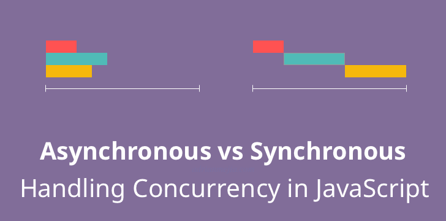

# 9_비동기_아니_줄_거_있다니까_어디_갔어
조금 더 생각해 보고 싶은 부분을 공부한 글입니다.

- 작성일: 2024-01-13
- 수정일: 

<br/>


#
### 주제를 선정한 이유
최근에 ajax를 통해 데이터를 받아와서 후처리를 진행하려고 코드를 작성했습니다.  
분명히 윗줄에서 먼저 데이터를 받아오고 아랫줄에서 코드가 실행되면 끝인데 중간에서 자꾸 데이터가 날아가서 몇 시간을 헤맸습니다. 알고 보니 함수가 비동기 방식으로 동작했기 때문이었습니다. 그리하여 잠시 잊고 있던 동기와 비동기에 대해 다시 한번 정리하고자 이 글을 작성하게 되었습니다.

<br/>


#
### 동기와 비동기의 개념
동기 방식은 직렬적 방식으로, 요청이 들어오면 차례대로 작업을 수행하고, 해당 작업이 수행 중이면 다음 작업은 대기하는 방식을 의미합니다.  
비동기 방식은 병렬적 방식으로, 요청이 들어오면 실행 중인 작업을 멈추거나 작업이 멈출 때까지 기다리지 않고 함께 실행하는 것을 의미합니다.  



간단하게 코드로 나타내면

- JS Code Playground
[JS Bin](https://jsbin.com/repujinawe/edit?js,console)


```javascript
function func1() {
  console.log('func1');
  func2();
}

function func2() {
  console.log('func2');
  func3();
}

function func3() {
  console.log('func3');
}

func1();

// 실행 결과
// func1
// func2
// func3
```

func1 -> func2 -> func3의 실행 결과의 순서가 보장되는 방식을 동기 방식이라고 합니다. 흔히 코드는 위에서 아래로 흐른다고 말하는 방식과 동일하게 동작합니다. 


그러나, 비동기 방식은

```javascript
function func1() {
  console.log('func1');
  func2();
}

function func2() {
  setTimeout(function() {
    console.log('func2');
  }, 0);

  func3();
}

function func3() {
  console.log('func3');
}

func1();

// 실행 결과
// func1
// func3
// func2
```

현재 진행 중인 작업이 끝나고 다음 작업이 실행되는 것이 아니기 때문에 실행 결과의 순서가 보장되지 않고, 코드가 위에서 아래로 흐른다는 말과도 맞지 않는 것처럼 보입니다.  
이러한 비동기 처리 방식의 장점은 대표적으로 성능 향상이 있습니다. 이는 앞선 느린 작업을 기다리지 않고 동시에 처리할 수 있기 때문입니다. 대표적으로는 인터넷에서 파일 다운로드와 동시에 웹 서핑도 함께 하는 것입니다.

<br/>


#
### 비동기를 동기로
비동기 방식으로 앞선 느린 작업을 기다리지 않아도 된다는 장점이 있지만, 때로는 실행 순서가 보장되어야 할 때도 있습니다.  

제 경우에는

1. A 함수 실행
2. A 함수의 지역 변수 -> B 함수의 인자로 전달
3. B 함수 실행
4. B 함수 결과 -> A 함수에 전달
5. B 함수 종료
4. A 함수 종료

위와 같은 실행 순서를 지켜야 했습니다.  

중요한 것은 B의 결과를 A가 받아서 사용한다는 점이었습니다.  

분명히 B가 제대로 된 결과를 반환하지만, A 함수에서 값을 못 받기에 열심히 찾아보니 사용했던 라이브러리 내 함수들이 비동기 처리 방식으로 실행되고 있었습니다.  

이 상황은 마치 
1. A가 먼저 밥을 먹고 있다가 
2. B가 들어왔는데, 
3. A가 B한테 내가 밥 살게. 편하게 먹어, 라고 했다가 
4. B가 메뉴판 보고 있을 때, A가 나가버린 상황이 된 것입니다.

B의 메뉴의 가격은 알지도 못한 채 본인의 음식값만 결제하고 간 A로 인해 문제가 생겼습니다.  
그래서 A가 B의 주문표를 받을 수 있게 비동기 방식을 동기 방식으로 바꾸는 방법에 대해 간단히 작성해 보고자 합니다.


1. `Callback 함수`  
콜백함수란 함수를 매개변수로 전달받아서 실행하는 함수입니다.  
실행 결과가 의존적일 때, 실행 순서를 보장하기 위해 사용하는 방식입니다.

```javascript
function doStep1(init) {
  return init + 1;
}

function doStep2(init) {
  setTimeout(function() {
    return init + 2;
  }, 500);
}

function doStep3(init) {
  return init + 3;
}

function doOperation() {
  let result = 0;
  result = doStep1(result);
  console.log(`result: ${result}`);
  result = doStep2(result);
  console.log(`result: ${result}`);
  result = doStep3(result);
  console.log(`result: ${result}`);
}

doOperation();
```

위의 코드를 동작시키면, 
1. doStep2의 setTimeout가 비동기 방식에 논블로킹 함수이기 때문에 doStep3가 실행되지만,
2. doStep2(result)의 결과가 반환되지 않아 result 변수가 undefined가 되고  
3. doStep3(result)에서는 숫자가 아닌 undefined에 숫자를 더하니 NaN가 반환됩니다.

이를 제대로 수행하기 위해서는 콜백 함수를 이용해 다음과 같이 작성할 수 있습니다.

```javascript
function doStep1(init, callback) {
  const result = init + 1;
  callback(result);
}

function doStep2(init, callback) {
  const result = init + 2;
  callback(result);
}

function doStep3(init, callback) {
  const result = init + 3;
  callback(result);
}

function doOperation() {
  doStep1(0, (result1) => {
    doStep2(result1, (result2) => {
      doStep3(result2, (result3) => {
        console.log(`result: ${result3}`);
      });
    });
  });
}
```

그러니, 콜백함수를 많이 쓰게 되면, `콜백 지옥(callback hell)` 또는 `파라미드 오브 둠(pyramid of doom)`이라 불리는 깊고 깊은 함수가 될 수 있습니다.  
가독성뿐만 아니라, 동작 오류가 발생했을 때 디버깅도 어렵습니다.  

이러한 문제를 해결하기 위해 나온 것이 `Promise`입니다.


2. `Promise`
Promise 객체는 자바스크립트에서 비동기적인 프로그래밍을 위해 사용되며, 비동기 작업의 완료 또는 실패와 그 결괏값을 나타냅니다

프로미스를 사용하면 비동기 메서드에서 마치 동기 메서드처럼 값을 반환할 수 있는데, 최종 결과가 아닌 미래에 결과를 제공하겠다는 '약속'(프로미스)을 반환합니다.

```javascript
// 1. Promise 객체를 생성하는 시점: Pending 상태
new Promise(function(resolve, reject) {
  // ...
}); 

// 2. resolve() 실행: Fulfilled 상태
new Promise(function(resolve, reject) {
	resolve(); 
}); 

// 3. reject() 실행: Rejected 상태
new Promise(function(resolve, reject) {
	rejected(); 
}); 

// 4. 기본 형식
const promise = new Promise((resolve,reject) =>{
    console.log('Doing Something')
    setTimeout(()=>{
        resolve('success');
        // reject(new Error('network error'));
    },500)
})

promise
.then((value) => {
    console.log(value);
})
.catch(error => {
    console.lot(error);
})
.finally(()=>{
    console.log('finally')
})

// 실행 결과
// Doing Something
// success
// finally
```

Fulfilled 상태가 되면 then()메서드를 이용한 체이닝이 가능합니다. 따라서 순서대로 메서드가 동작하도록 만들 수 있습니다.

```javascript
function add10(a) {
  return new Promise(resolve => setTimeout(() => resolve(a + 10), 100));
}
add10(10)
  .then(add10)
  .then(add10)
  .then(add10)
  .then((res) => console.log(res))

// 실행결과
// 50
```

3. `Async/Await`
마지막으로는 가장 최근 자바스크립트 문법에 추가된 비동기 처리 패턴인 Async/Await가 있습니다. Promise의 가독성이 보완되었습니다.  
사용할 함수 앞에 async라는 키워드를 붙이고 선언된 async 함수 안에서만 await 키워드를 사용할 수 있습니다. 이때, await 대상 메서드는 반드시 Promise 객체를 반환해야 합니다.

```javascript
function add10(a){
    return new Promise(resolve => setTimeout(() => resolve(a + 10),100));
}

async function asyncFunction() {
  let result = await add10(10);
  result = await add10(result);
  result = await add10(result);
  result = await add10(result);
  console.log(result)
}
asyncFunction();

// 실행결과
// 50
```

<br/>


#
### 정리
자바스크립트에서 비동기 메서드를 동기 방식으로 실행 순서를 보장하면서 작업을 수행하고 싶다면
- Callback 함수 이용
- Promise 이용
- ⭐ Promise + Async/Await 이용

<br/>


#
### 기타, Blocking과 Non-Blocking
- 동기/비동기
    - 요청한 작업에 대해 완료 여부를 신경 써서 작업을 순차적으로 수행할지 아닌지에 대한 관점
- 블로킹/논블로킹
    - 재 작업이 block(차단, 대기) 되느냐 아니냐에 따라 다른 작업을 수행할 수 있는지에 대한 관점

<br/>


#
### 📚참고 자료
[동기와 비동기? 무슨 차이일까?
](https://80000coding.oopy.io/ed22f6e8-89ea-4164-a86e-a6b92a1f54b4)  
[What every programmer should know about Synchronous vs. Asynchronous Code](https://adrianmejia.com/asynchronous-vs-synchronous-handling-concurrency-in-javascript/)  
[👩‍💻 완벽히 이해하는 동기/비동기 & 블로킹/논블로킹](https://inpa.tistory.com/entry/%F0%9F%91%A9%E2%80%8D%F0%9F%92%BB-%EB%8F%99%EA%B8%B0%EB%B9%84%EB%8F%99%EA%B8%B0-%EB%B8%94%EB%A1%9C%ED%82%B9%EB%85%BC%EB%B8%94%EB%A1%9C%ED%82%B9-%EA%B0%9C%EB%85%90-%EC%A0%95%EB%A6%AC)  
[동기/ 비동기의 이해 - callback함수, promise, async, await](https://lunuloopp.tistory.com/entry/%EB%8F%99%EA%B8%B0-%EB%B9%84%EB%8F%99%EA%B8%B0%EC%9D%98-%EC%9D%B4%ED%95%B4-callback%ED%95%A8%EC%88%98-promise-async-await)  
[<JavaScript> 동기/비동기와 CallBack,Promise and Async/Await](https://hongchangsub.com/javascript-asyncandsync/)  
[Promise](https://developer.mozilla.org/ko/docs/Web/JavaScript/Reference/Global_Objects/Promise)  
