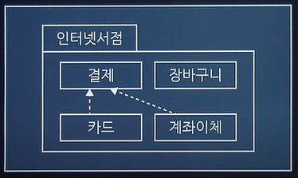
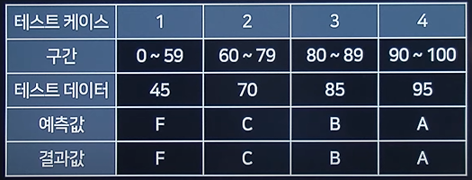
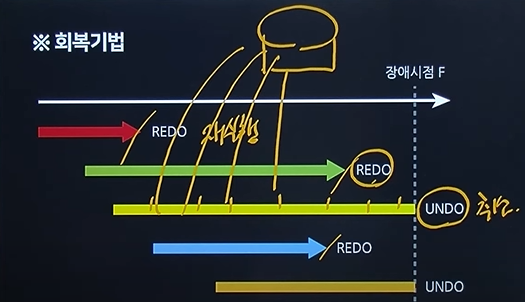
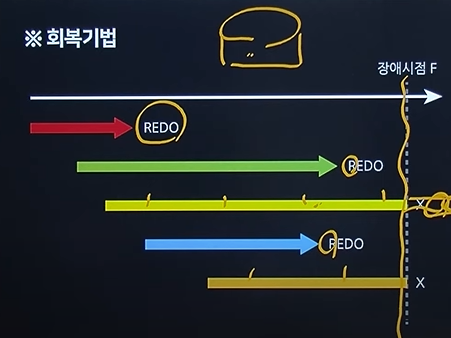

# 정보처리기사 실기

## 1. 디자인 패턴 (시험 직전에 확인)
### GoF(Gang of Four) 디자인 패턴
#### 생성 패턴(Creational Patterns) 5 : 객체 생성에 대한 패턴
|종류|설명|
|----|---|
|Abstract Factory|서브 클래스를 상세히 정의하지 않고도 서로 관련성이 있는 여러 객체들을 생성하기 위한 인터페이스를 제공하는 패턴|
|`Builder`|복잡한 객체들을 단계별로 생성하는 패턴|
|Factory Method|객체를 생성하는 인터페이스를 정의하고 객체의 타입은 서브클래스가 결정하도록 하는 패턴|
|Prototype|원본 객체를 복사하여 새 객체를 생성하는 패턴|
|`SingleTon`|오직 하나의 객체만을 생성하는 패턴|

#### 구조 패턴(Structural Patterns) 7 : 클래스나 객체를 조합해 더 큰 구조를 만드는 패턴
|종류|설명|
|----|---|
|`Adapter`|호환되지 않는 인터페이스를 가진 객체들간의 기능을 변환하여 호환성을 제공하는 패턴|
|Bridge|추상화 클래스 계층과 구현 클래스 계층을 분리하는 패턴|
|Composite|객체 집합 속에 또 다른 객체 집합을 갖는 패턴|
|Decorator|새로운 기능이 추가될 때마다 새로운 객체를 만들고, 이전 객체의 기능은 새로운 객체내에서도 그대로 유지되는 패턴|
|Facade|서브시스템이 복잡할 경우 간단한 인터페이스를 통해 서브 시스템의 주요기능을 사용할 수 있도록 하는 패턴|
|Fly Weight|인스턴스의 공유를 통해 불필요한 객체 생성을 하지 않도록 하는 패턴|
|Proxy|원래 객체에 대한 접근을 제어하여, 요청이 원래 객체에 전달되기 전 또는 후에 추가적인 작업을 수행할 수 있도록 하는 패턴|

#### 행위 패턴(Behavioral Patterns) 11 : 객체나 클래스 간 알고리즘이나 상호 작용을 정의하기 위한 패턴
|종류|설명|
|----|---|
|Chain of Responsibility|여러개의 객체를 체인으로 연결하여 그 객체의 체인을 순차적으로 걸어 가면서 최종적인 객체를 결정|
|Command|명령을 나타내는 클래스의 인스턴스를 하나로 표현|
|Interpreter|언어나 표현식을 해석하고 실행하는데 사용|
|Iterator|집합체의 요소에 차례로 액세스를 실시|
|Mediator|중개자을 통해서 행동을 일으키게 하는 방식|
|Memento|객체의 상태를 저장하고 복원하는 데 사용되며, 주로 "뒤로 가기" 기능이나 객체의 상태를 일시적으로 저장해야 하는 상황에서 유용|
|`Observer`|주로 분산 이벤트 핸들링 시스템을 구현하는데 사용|
|State|상태를 클래스로 표현하고 클래스를 전환하여 상태 변경을 나타내는 방법|
|Strategy|특정 작업 또는 알고리즘의 다양한 전략(방법)을 정의하고, 이들을 동적으로 교체하여 사용할 수 있게 하는 패턴|
|Template Method|슈퍼 클래스로 처리의 틀을 정해서 서브 클래스로 그 구체적 내용을 정하는 방식|
|Visitor|데이터 구조와 처리를 분리하는 방법|

<br/>

## 2. UML(Unified Modeling Language) (시험 직전에 확인)
: 표준화된 모델링(개발하기 위한 그림을 그려주는) 언어

### 종류
### 구조적(정적) 다이어그램
- 객체: 객체 정보
- 클래스: 시스템을 구성하는 `클래스 사이의 관계` 표현
- 패키지: 클래스 다이어그램의 `집합, 그룹`

- 컴포넌트: 컴포넌트끼리의 구조 관계를 표현
- 컴포지트: 복합구조
- 배치(Deployment): SW, HW 등을 포함한 시스템의 물리적 구조를 나타냄

### 행위적(동적) 다이어그램
- `유스케이스`: 사용자 관점에서 바라본 시스템을 표현
    - 구성요소(Component): System, Actor, UseCase, Relation
        - System: 만들고자 하는 프로그램
        - Actor: 시스템의 외부에 있고 시스템과 상호작용을 하는 사람(시스템의 기능을 사용하는 사람), 시스템(시스템에 정보를 제공하는 또 다른 시스템)
        - UseCase: 사용자 입장에서 바라본 시스템의 기능
        - Relation: 액터와 유스케이스 사이의 의미있는 관계
            - `연관`: 유스케이스와 액터간의 상호작용이 있음
            - `확장`: "글을 등록한다" 기능을 수행 할 때 "파일을 첨부한다" 기능을 선택적으로 수행 할 수 있다는 것
            - `포함`: "글을 등록한다" 기능을 동작하기 위해서 "로그인 한다" 기능이 반드시 동작되어야 한다는 것
            - `일반화`: 그룹을 만들어 이해도를 높이기 위한 관계,  "글을 검색한다"를 "글쓴이로 검색한다"와 "날짜로 검색한다"로 구체화 한 것
- 활동: 활동의 흐름
- 상태: 객체의 상태 변화
- 순차: 시간의 흐름에 따른 객체 사이의 상호 작용
- 커뮤니케이션
- 인터렉션 오버뷰: 활동 + 순차
- 타이밍: 시간 흐름에 따른 상태 변화

<br/>

### UML 클래스 관계


1. `일반화 관계(Generalization)`: 상속
2. `실체화 관계(Realization)`: 구현
3. `의존관계(Dependency)`: 참조, 매개변수, 일시성
4. `연관관계(Association)`: 참조, 긴밀성, 양방향성
    - `직접 연관관계(Directional)`: 한쪽으로만 방향성이 있는 연관관계(명령/수행)
    - `집합 연관관계(Aggregation)`: 전체/부분 연관 관계, 전체가 삭제되더라도 부분은 삭제되지 않는 경우
    - `합성 연관관계(Composition)`: 전체/부분 연관 관계, 전체가 삭제되면 부분도 삭제되는 경우

<br/>

## 3. Test Oracle
: 테스트의 결과가 참인지 거짓인지를 판단하기 위해서 사전에 정의된 참값을 입력하여 비교하는 기법
- 종류
    - `참(True) 오라클`: 모든 입력값에 대해 기대하는 결과를 전수 검사
    - `샘플링 오라클`: 특정 몇몇 입력값에 대해서만 검사
    - `휴리스틱 오라클`: 특정 몇몇 입력값에 대해서만 검사 + 나머지는 추정으로 처리
    - `일관성 검사 오라클`: 이전 수행결과와 현재 수행결과가 동일한지 검사

<br/>

## 4. 테스트 기법
### 화이트/블랙박스 테스트
- 화이트 박스 테스트: 모듈 내부 소스 코드를 보면서 수행하는 테스트
    - 종류
        - 기본 경로 커버리지(Base Path Coverage): 수행 가능한 모든 경로 테스트
        - 데이터 흐름 테스트(Data Flow Testing): 프로그램에서 변수의 정의와 변수 사용의 위치에 초점을 맞추어 검사
        - 조건 커버리지(Condition Coverage): 각 개별 조건식이 적어도 한 번은 참과 거짓의 결과가 되도록 수행
        - 루프 테스트

- 블랙 박스 테스트: 외부 사용자의 요구사항 명세를 보면서 수행하는 테스트
    - `동등(동치, 균등) 분할 테스트(Equivalence Partitioning Testing)`: 입력값의 범위가 유사한 동등그룹으로 나누고 각 그룹마다 대표값을 선정하는 테스트 기법
    
    - `경곗값 분석 테스트(Boundary Value Analysis Testing)`: 경계값을 테스트 케이스로 선정하여 검사
    - `원인-결과 그래프 테스트(Cause-Effect Graphing Testing)`: 입력 데이터간의 관계와 출력에 영향을 미치는 상황을 체계적으로 분석하여 효용이 높은 테스트 케이스를 선정하여 검사
    - `오류 예측 테스트(Fault Based Testing)`
    - `의사 결정 테이블 테스트(Decision Table Testing)`
    - `상태 전이 테스트(State Transition Testing)`

<br/>

## 5. SQL
`SELECT 학과, COUNT(학과) AS '학과별 튜플수' FROM 학생 GROUP BY 학과;`

### 집계 함수 종류
AVG, SUM, MIN, MAX, COUNT

<br/>

## 6. Sniffing
네트워크 상 패킷들의 내용을 엿보는 행위

### 서비스 공격 유형 종류
### Dos(Denial of Service)
- `Ping Of Death`: 정상 크기보다 큰 ICMP 패킷을 작은 조각(Fragment)으로 쪼개어 공격 대상이 조각화된 패킷을 처리하게 만드는 공격
- `Smurf`: IP를 위조하여 ICMP 받을 대상에 과부하
- `Land Attack`: Packet의 보내는 사람과 받는 사람을 동일하게 설정
- `Teardrop Attack`: Fragment를 재조립 시 정확한 조립을 위해 오프셋이라는 값을 더하게 되는데 이 오프셋 값을 고의적으로 수정하여 시스템의 기능을 마비시켜 버리는 방법
- SYN Flooding: 접속을 요청하는 SYN Packet을 대량으로 전송해 네트워크를 마비 시킴
- UDP Flooding: 많은 수의 UDP packet을 전송하여 정상적인 서비스가 불가능하도록 하는 공격
- Ping Flooding: 많은 ICMP Echo를 보내 이에 대한 응답을 하기 위해 자원을 모두 사용해버려 시스템이 정상적으로 동작하지 못하도록 하는 공격

### DDoS (Distributed Denial of Service)
- `Phishing`: 사람들을 속이기 위해 악성 이메일을 보내는 것
- `Pharming`: 피싱 기법 중 하나로, 가짜 웹 페이지에 접속하게 하여 개인정보를 훔치는 것
- `Sniffing`: 네트워크 중간에서 남의 패킷 정보를 도청하는 것
- `Smishing`: SMS와 Phishing의 결합어로 사람들을 속이기 위해 악성 문자를 보내는 것
- `Qshing`: QR코드와 Phishing의 합성어로 사람들을 속이기 위해 악성 QR code를 보내는 것
- `Ransomware`: 컴퓨터 시스템을 감염시켜 접근을 제한하고 대금을 요구하는 것
- `Key Logger`: 컴퓨터 사용자의 키보드 움직임을 탐지해 개인 정보를 빼가는 공격
- `SQL Injection`: SQL 구문을 애플리케이션에 삽입하여 비정상적으로 데이터베이스를 조작하는 공격
- `XSS(Cross Site Scripting)`: 악의적인 스크립트를 포함시켜 정보 유출 등을 하는 것

### 기타
- `Rainbow Table Attack`: 해시 함수 입력값과 해시값을 저장한 테이블로 해시값을 통해 Key 값을 찾는 것
    - Salt: 레인보우 테이블이 있으므로, 다른 암호 값으로 저장되도록 입력값에 추가하는 값

<br/>

## 7. 정보보안의 3요소
- `기밀성`: 인가된 사용자만 접근
- `무결성`: 인가된 사용자만 인가된 방법으로 자원 수정
- `가용성`: 인가된 사용자가 필요할 때 언제든지 데이터에 접근할 수 있는 능력
    - DoS, DDos: 가용성을 떨어트리는 공격

<br/>

## 8. 이상 현상
데이터베이스 내의 데이터들이 중복돼 검색이나 조작 등을 제대로 수행할 수 없는 현상
- 삽입 이상: 릴레이션(테이블)에 데이터를 삽입할 때 의도와는 상관없는 값들도 함께 삽입되는 현상
- 삭제 이상: 릴레이션에서 한 튜플(행)을 삭제할 때 의도와는 상관없는 값들이 함께 삭제되는 현상
- 갱신 이상: 릴레이션에서 튜플에 있는 속성값을 갱신할 때 일부 튜플의 정보만 갱신되며 정보에 모순이 생기는 현상

### 정규화 종류
- 제 1정규형: 도메인이 원자값
- 제 2정규형: 부분 함수 종속성 제거
- 제 3정규형: 이행적 함수 종속성 제거
- BCNF: 결정자이면서 후보키가 아닌것 제거
- 제 4정규형: 다치 종속 제거
- 제 5정규형: 조인 종속 제거

<br/>

## 9. 회복 기법
- `로그 기반 회복 기법`
    - `즉시 갱신 기법`
        - 데이터 변경 시 로그와 DB에 즉시 갱신
        - 커밋되기 전에 장애가 나면 UNDO, 커밋 후에 장애가 나면 REDO를 수행
        
    - `지연 갱신 기법`
        - 트랜잭션 커밋 완료까지 갱신 내용을 로그에만 저장하고 DB에 저장하지 않고 지연
        - 중간에 갱신을 하지 않았음으로 UNDO가 필요 없고, REDO만 하면 됨
        
    - `체크포인트 회복 기법`
        - 로그 기록을 이용하되, 일정 시간 간격으로 검사 시점(Checkpoint)을 만들어두고 장애가 발생하면 가장 최근 검사 시점 이전의 트랜잭션에는 회복 작업을 수행하지 않고, 이후의 트랜잭션에만 회복 작업을 수행
- `비로그 기반 회복 기법`
    - `그림자 페이징 기법`
        - 로그를 사용하지 않고, 트랜잭션 실행동안 현재 페이지 테이블과 그림자 페이지 테이블 2개를 관리하는 기법
        - 데이터 변경 시 현재 페이지 테이블만 변경, 회복 시 현재 페이지 테이블을 그림자 테이블로 대체
    - 미디어 회복기법
        - 디스크와 같은 비휘발성 저장 장치의 내용이 손상되는 장애 발생 시 회복을 위한 기법

### REDO는 영속성을 보장 / UNDO는 원자성을 보장

<br/>

## 10. 프로세스 상태 전이도

+ 실행 → 대기: Block

<br/>

## 11. IP 주소 체계
- IPv4
    - 주소 길이: 32bit (8bit*4)
    - 주소 개수: 2^32개
    - 주소 할당: A, B, C 클래스 등 비순차적 할당
    - 주소 체계: `유니캐스트(1:1), 멀티캐스트(1:다), 브로드캐스트(방송)`
    - 보안: IPSec, SSL(HTTPS), S-HTTP Protocol 별도 설치
- IPv6
    - 주소 길이: 128bit (16bit*8)
    - 주소 개수: 2^128
    - 주소 할당: 순차적 할당
    - 주소 체계: `유니캐스트(1:1), 멀티캐스트(1:다), 애니캐스트(가장 자까운 수신자에게 전달)`
    - 보안: 자체 보안기능 제공

<br/>

### IPv4 → IPv6 전환 기술
- `듀얼 스택(Dual Stack)`
    - IPv4 / IPv6 동시 지원
- `터널링(Tunneling)`
    - 두 IPv6 네트워크 간 터널을 이용하는 기술
    - `캡슐화`
- `주소 변환(Addressing Translation)`
    - IPv4와 IPv6 간 주소를 변환하여 두 버전을 이용

### IP Class
A Class: 0 <br/>
B Class: 10 <br/>
C Class: 110

### 서브넷 마스크 구하기
203.241.132.82/27 <br/>
=> 1111 1111 . 1111 1111 . 1111 1111 . 1110 0000 <br/>
=> 255.255.255.224

<br/>

## 12. 운영 체제
UNIX
- 대부분 C언어로 작성되어 있어 이식성이 높음
- 트리 구조의 파일 시스템

<br/>


## 13. Hadoop
- 대규모 데이터 세트를 분산 처리할 수 있는 오픈 소스 프레임워크
- `일반 PC급 컴퓨터들`로 가상화된 대형 스토리지 형성
- `MapReduce`: 분산처리엔진 역할을 하는 하둡의 중심 모듈

### Data Mining
수많은 데이터에서 가치있는 유용한 정보를 찾아내는 것

### Data Warehouse
DB에 축적된 데이터를 공통의 형식으로 변환하여 관리하는 DB

### Data Mart
DB의 한 부분으로 비교적 작은 규모의 Data Warehouse
예시: Data Mart(삼성 물산, 삼성 전자, 삼성 화재) ▶ Data Warehouse(삼성)

### OLAP(Online Analytical Processing)
데이터 웨어하우스, 데이터 마트 또는 기타 중앙화된 통합 데이터 저장소의 대용량 데이터를 고속으로 다차원 분석하는 소프트웨어

### Mashup
웹에서 제공하는 정보 및 서비스를 이용하여 새로운 SW나 서비스, DB 등을 만드는 기술

<br/>

## 15. NAT(Network Address Translation)
한정된 공인 IP를 여러 개의 내부 사설 IP로 변환하기 위해 사용하는 기술

<br/>

## 16. C언어
```
void main(){
    char*p="KOREA";
    printf("%s\n", p); /* KOREA */
    printf("%s\n", p+3); /* EA */
    printf("%c\n", *p); /* K */
    printf("%c\n", *(p+3)); /* E */
    printf("%c\n", *p+2); /* M */
}

p   K   O   R   E   A
10  10  11  12  13  14
```

<br/>

## 17. JAVA
```
public static void main(String[] args){
    int[][] arry = new int[3][5];
    for(int i=0; i<3; i++){
        for(int j=0; j<5; j++){
            arry[i][j] = j*3 + (i+1);
            System.out.print(arry[i][j]+"");
        }
        System.out.println();
    }
}
```

<br/>

## 18. JAVA
`int[8] != a[8]`
```
// 처리 결과
00001010

int a[] = new int[8];
int i = 0, n = 10;
while(i < 8){
    a[i++] = (n % 2);
    n /= 2;
}

for(i = 7; i>=0; i--){
    System.out.printf("%d", a[i]);
}
```

<br/>

## 19. JAVA - Override
```
class Parent{
    int compute(int num){
        if(num <= 1)
            return num;
        return compute(num - 1) + compute(num - 2);
    }
}

class Child extends Parent{
    int compute(int num){
        if(num <= 1)
            return num;
        return compute(num - 1) + compute(num - 3);
    }

}

Parent obj = new Child();
System.out.println(obj.compute(4)); // 1

/*
풀이 과정

compute(3) + compute(1)
= (compute(2) + compute(0)) + compute(1)
= {(compute(1) + compute(-1)) + compute(0)} + compute(1)
= 1 + (-1) + 0 + 1
= 1 
*/

```

## 20. Python
```
lol = [[1, 2, 3], [4, 5], [6, 7, 8, 9]];

print(lol(lol[0])); # [1, 2, 3]
print(lol(lol[2][1])); # 7

for sub in lol:
    for item in sub:
        print(item, end=" "); # end = " ", 개행 대신 띄어쓰기
    print();

# 1 2 3
# 4 5
# 6 7 8 9
```
