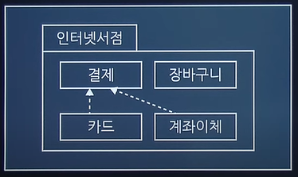

# 정보처리기사 실기

## 1. AD-hoc Network
네트워크의 구성 및 유지를 위해 기지국이나 엑세스 포인트와 같은 기반 네트워크 장치를 필요로 하지 않고, 멀티 홉 라우팅 기능에 의해 무선 인터페이스가 가지는 통신 거리상의 제약을 극복하며, 노드들의 이동이 자유롭기 때문에 네트워크 토폴리지가 동적으로 변화되는 특징을 갖고 있다.
응용 분야로는 긴급 구조, 긴급 회의, 전쟁터에서의 군사 네트워크 등이 있다.

### LAN 802.X
- 802.3: CSMA/CD, 유선랜 충돌 감지
- 802.11: CSMA/CA, 무선랜 충돌 회피
- 802.4: 토큰 버스
- 802.5: 토큰 링
- 802.15: 블루투스

<br/>

## 2. UI, UX
UI: 사용자가 제품, 서비스와 상호작용할 수 있도록 만들어진 매개체 <br/>
UX: 사용자 경험의 약자로, 사용자가 어떠한 서비스나 제품을 직간접적으로 이용하면서 느끼는 종합적인 만족

### UI 설계 원칙 4가지
- `직관성`
- `유효성`: 사용자의 목적을 정확하게 달성해야 함
- `학습성`
- `유연성`: 사용자의 요구사항을 최대한 수용해야 함

<br>

## 3. Python
```
a = 100;
result = 0;

for i in range(1,3):
    result = a>>i;
    result = result + 1;
print(result);

# a(2) = 1100100(2)
# a>>2 = 11001(2) = 25(10)
# 26
```

<br/>

## 4. 디자인 패턴 (시험 직전에 확인)
### 생성 패턴(Creational Patterns) 5 : 객체 생성에 대한 패턴
|종류|설명|
|----|---|
|Abstract Factory|서브 클래스를 상세히 정의하지 않고도 서로 관련성이 있는 여러 객체들을 생성하기 위한 인터페이스를 제공하는 패턴|
|`Builder`|복잡한 객체들을 단계별로 생성하는 패턴|
|Factory Method|객체를 생성하는 인터페이스를 정의하고 객체의 타입은 서브클래스가 결정하도록 하는 패턴|
|Prototype|원본 객체를 복사하여 새 객체를 생성하는 패턴|
|`SingleTon`|오직 하나의 객체만을 생성하는 패턴|

### 구조 패턴(Structural Patterns) 7 : 클래스나 객체를 조합해 더 큰 구조를 만드는 패턴
|종류|설명|
|----|---|
|`Adapter`|호환되지 않는 인터페이스를 가진 객체들간의 기능을 변환하여 호환성을 제공하는 패턴|
|Bridge|추상화 클래스 계층과 구현 클래스 계층을 분리하는 패턴|
|Composite|객체 집합 속에 또 다른 객체 집합을 갖는 패턴|
|Decorator|새로운 기능이 추가될 때마다 새로운 객체를 만들고, 이전 객체의 기능은 새로운 객체내에서도 그대로 유지되는 패턴|
|Facade|서브시스템이 복잡할 경우 간단한 인터페이스를 통해 서브 시스템의 주요기능을 사용할 수 있도록 하는 패턴|
|Fly Weight|인스턴스의 공유를 통해 불필요한 객체 생성을 하지 않도록 하는 패턴|
|Proxy|원래 객체에 대한 접근을 제어하여, 요청이 원래 객체에 전달되기 전 또는 후에 추가적인 작업을 수행할 수 있도록 하는 패턴|

### 행위 패턴(Behavioral Patterns) 11 : 객체나 클래스 간 알고리즘이나 상호 작용을 정의하기 위한 패턴
|종류|설명|
|----|---|
|Chain of Responsibility|여러개의 객체를 체인으로 연결하여 그 객체의 체인을 순차적으로 걸어 가면서 최종적인 객체를 결정|
|Command|명령을 나타내는 클래스의 인스턴스를 하나로 표현|
|Interpreter|언어나 표현식을 해석하고 실행하는데 사용|
|Iterator|집합체의 요소에 차례로 액세스를 실시|
|Mediator|중개자을 통해서 행동을 일으키게 하는 방식|
|Memento|객체의 상태를 저장하고 복원하는 데 사용되며, 주로 "뒤로 가기" 기능이나 객체의 상태를 일시적으로 저장해야 하는 상황에서 유용|
|`Observer`|주로 분산 이벤트 핸들링 시스템을 구현하는데 사용|
|State|상태를 클래스로 표현하고 클래스를 전환하여 상태 변경을 나타내는 방법|
|Strategy|특정 작업 또는 알고리즘의 다양한 전략(방법)을 정의하고, 이들을 동적으로 교체하여 사용할 수 있게 하는 패턴|
|Template Method|슈퍼 클래스로 처리의 틀을 정해서 서브 클래스로 그 구체적 내용을 정하는 방식|
|Visitor|데이터 구조와 처리를 분리하는 방법|

<br/>

### UML(Unified Modeling Language) (시험 직전에 확인)
: 표준화된 모델링(개발하기 위한 그림을 그려주는) 언어

### 종류
### 구조적(정적) 다이어그램
- 객체: 객체 정보
- 클래스: 시스템을 구성하는 `클래스 사이의 관계` 표현
- 패키지: 클래스 다이어그램의 `집합, 그룹`
    
- 컴포넌트: 컴포넌트끼리의 구조 관계를 표현
- 컴포지트: 복합구조
- 배치(Deployment): SW, HW 등을 포함한 시스템의 물리적 구조를 나타냄

### 행위적(동적) 다이어그램
- `유스케이스`: 사용자 관점에서 바라본 시스템을 표현
    - 구성요소(Component): System, Actor, UseCase, Relation
        - System: 만들고자 하는 프로그램
        - Actor: 시스템의 외부에 있고 시스템과 상호작용을 하는 사람(시스템의 기능을 사용하는 사람), 시스템(시스템에 정보를 제공하는 또 다른 시스템)
        - UseCase: 사용자 입장에서 바라본 시스템의 기능
        - Relation: 액터와 유스케이스 사이의 의미있는 관계
            - `연관`: 유스케이스와 액터간의 상호작용이 있음
            - `확장`: "글을 등록한다" 기능을 수행 할 때 "파일을 첨부한다" 기능을 선택적으로 수행 할 수 있다는 것
            - `포함`: "글을 등록한다" 기능을 동작하기 위해서 "로그인 한다" 기능이 반드시 동작되어야 한다는 것
            - `일반화`: 그룹을 만들어 이해도를 높이기 위한 관계,  "글을 검색한다"를 "글쓴이로 검색한다"와 "날짜로 검색한다"로 구체화 한 것
- 활동: 활동의 흐름
- 상태: 객체의 상태 변화
- 순차: 시간의 흐름에 따른 객체 사이의 상호 작용
- 커뮤니케이션
- 인터렉션 오버뷰: 활동 + 순차
- 타이밍: 시간 흐름에 따른 상태 변화

### UML 클래스 관계


1. `일반화 관계(Generalization)`: 상속
2. `실체화 관계(Realization)`: 구현
3. `의존관계(Dependency)`: 참조, 매개변수, 일시성
4. `연관관계(Association)`: 참조, 긴밀성, 양방향성
    - `직접 연관관계(Directional)`: 한쪽으로만 방향성이 있는 연관관계(명령/수행)
    - `집합 연관관계(Aggregation)`: 전체/부분 연관 관계, 전체가 삭제되더라도 부분은 삭제되지 않는 경우
    - `합성 연관관계(Composition)`: 전체/부분 연관 관계, 전체가 삭제되면 부분도 삭제되는 경우

<br/>

## 5. Transaction
- 원자성(Atomicity): Commit, Rollback
- 일관성(Consistency): 무결성
- 격리성(Isolation)
- 영속성(Durability)

<br/>

## 6. 정규형
### 정규화 종류
- 제 1정규형: 도메인이 원자값
- 제 2정규형: 부분 함수 종속성 제거
- 제 3정규형: 이행적 함수 종속성 제거
- BCNF: 결정자이면서 후보키가 아닌것 제거
- 제 4정규형: 다치 종속 제거
- 제 5정규형: 조인 종속 제거

### 이상 현상
데이터베이스 내의 데이터들이 중복돼 검색이나 조작 등을 제대로 수행할 수 없는 현상
- 삽입 이상: 릴레이션(테이블)에 데이터를 삽입할 때 의도와는 상관없는 값들도 함께 삽입되는 현상
- 삭제 이상: 릴레이션에서 한 튜플(행)을 삭제할 때 의도와는 상관없는 값들이 함께 삭제되는 현상
- 갱신 이상: 릴레이션에서 튜플에 있는 속성값을 갱신할 때 일부 튜플의 정보만 갱신되며 정보에 모순이 생기는 현상

### 데이터 모델링 3단계
1. 개념
    - ERD 생성
2. 논리
    - 정규화
    - Transaction Interface 설계
3. 물리
    - 성능 향상(인덱스, 파티션, 반정규화 등)
    - 물리 DB 성능 향상 활동 = 튜닝

### Index Hint
- 쿼리 실행 시 특정 인덱스를 사용하도록 강제하는 주석
- SELECT /*+ [힌트절] */ ... FROM ...;

### CRUD 매트릭스


### Key
1. Super Key: 유일성-대상을 유일하게 식별할 수 있으면 충족
2. Candidate Key: 유일성 + 최소성
    - Alternate Key: PK가 아닌 후보키
    - Primary Key: AK 중 가정 적합한 키(예: 학교에서 PK는 학번)

<br/>

## 7. 암호화 알고리즘
- 단방향(Hash): `MD ▶ SHA`
- 양방향
    - 대칭키
        - 빠른 속도
        - 많은 양
        - 키 개수: n*(n-1)/2
        - 종류
            - Stream: RC4
            - Block: `DES ▶ AES`, IDEA, SEED, ARIA
    - 비대칭키(공개키)
        - 느린 속도
        - 적은 양 ◀ 내용보다는 키를 암호화하는 방식으로 사용
        - 키 개수: 2*n
        - 종류
            - 소인수분해: RSA, Robin
            - 이산대수: DH, DSA, EIGmal
            - 타원곡선: ECC, ECDSA

<br/>

## 8. C
```
int main(){
    int array[3];
    int s = 0;

    *(array + 0) = 1;
    array[1] = *(array + 0) + 2;
    array[2] = *array + 3;
    for(int i=0; i<3; i++){
        s = s + array[i];
    }
    printf("%d", s);
}

/*
0 1 2
1 3 4

8
*/

```

<br/>

## 9. Java
```
public class Class01{
    public static void main(String[] args){
        Class01 c1 = new Class01();
        Class02 c2 = new Class02();
        System.out.println(c1.sum(3, 2) + c2.sum(3, 2));
    }
    int sum(int x, int y){
        return x + y;
    }
}
public class Class02 extends Class01{
    int sum(int x, int y){
        return x - y + super.sum(x, y);
    }
}

// c1.sum(3, 2) = 5
// c2.sum(3, 2) = 6

```

<br/>

## 10. SQL
```
  SELECT * 
    FROM 학생 
   WHERE 이름 
    LIKE '이%' 
ORDER BY 이름 DESC;

WHERE + 와일드 카드
%: 글자 수 제한 X
_: 1글자

```

<br/>

## 11. 병행 제어
1. 로킹(`Locking`)
: 트랜잭션이 어떤 데이터에 접근하고자 할 때 로킹을 수행하며 로킹을 한 트랜잭션만이 로킹을 해제할 수 있음
2. 2단계 로킹 규약
: 트랜잭션이 확장단계(Key 획득)와 축소단계(Key 반납)를 구분하여 실행됨
3. 타임스탬프(Time Stamp)
: Transaction 간의 처리순서를 미리 결정
4. 다중 버전 병행제어(Multi-version Concurrency Control)
: 트랜잭션의 데이터 접근 시, 해당 트랜잭션의 타임스탬프와 접근 데이터의 여러 버전의 타임스탬프를 비교하여 현재 실행중인 스케쥴의 직렬 가능성이 보장되는 버전 선택
5. 낙관적 병행제어(Optimistic Concurrency Control)
: 트랜잭션 수행 동안은 어떠한 검사도 하지 않고, 트랜잭션 종료 시에 일괄적으로 검사

### 병행 문제점
1. 비완료 의존성: 아직 Commit되지 않은 Transaction을 읽으려는 경우
2. 모순성: 데이터베이스의 일관성을 해치는 경우
3. 연쇄 복귀: 두개의 트랜잭션 중 한 개의 트랜잭션이 성공적으로 일을 수행하였다 하더라도 다른 트랜잭션이 처리하는 과정에서 실패하게 되면 두 개의 트랜잭션 모두가 복귀되는 경우
4. 갱신분실: 두 개의 트랜잭션이 같은 데이터에 대해서 동시에 갱신 작업을 하면 하나의 갱신 작업이 분실되는 경우

<br/>

## 12. 모듈의 독립성을 판단하는 두 가지 지표로, `결합도(Coupling)`는 모듈과 모듈간의 상호 의존 정도, `응집도(Cohesion)`는 모듈 내부의 기능적인 집중 정도이다.

### 결합도(Coupling)
: 모듈과 모듈간의 상호 의존 정도
1. 자료(`Data`): 파라미터로 `값`만을 전달하는 경우
2. 스탬프(`Stamp`): 파라미터로 배열이나 오브젝트, 스트럭쳐 등의 `객체`가 전달되는 경우
3. 제어(`Control`): 파라미터로 값뿐만 아니라 `제어 요소`도 전달되는 경우
4. 외부(External): 어떤 모듈에서 선언한 데이터(변수)를 외부의 다른 모듈에서 참조하는 경우
5. 공통(`Common`): 공유되는 `공통` 데이터 영역(`전역변수`)을 여러 모듈이 사용하는 경우
6. 내용(`Content`): 한 모듈이 다른 모듈의 내부 기능 및 그 내부 자료를 직접 참조하거나 수정하는 경우
    - 내용 결합도가 높을 경우, 스파게티 코드가 될 수 있음

- Spaghetti Code: 소스 코드가 복잡하게 얽힌 경우
- Alien Code: 아주 오래되거나 참고문서가 없어 유지보수가 어려운 경우
- Legacy Code: 더 이상 쓰기 힘들고 난해한 경우

### 응집도(Cohesion)
: 모듈 내부의 기능적인 집중 정도
1. 우연적(`Coincidental`): 모듈 내부의 각 구성요소들이 연관이 없을 경우
2. 논리적(`Logical`): 유사한 성격을 갖는 요소들이 한 모듈에서 처리
3. 시간적(`Temporal`): 특정 시간에 처리되어야 하는 활동들을 한 모듈에서 처리
4. 절차적(`Procedural`): 모듈 안의 구성요소들이 그 기능을 `순차적`으로 수행
5. 통신적(`Communicational`): `동일한 입력과 출력`을 사용하여 다른 기능을 수행하는 활동들이 모여있을 경우
6. 순차적(`Sequential`): 모듈 내에서 `한 활동에서 나온 출력값을 다른 활동이 사용`할 경우
7. 기능적(`Functional`): 모듈 내부의 모든 기능이 `단일한 목적`을 위해 수행되는 경우

<br/>

## 13. SQL
```
UPDATE 학생
   SET 과목평가 = 'A'
 WHERE 점수 >=90;

```
```
-- DML
INSERT INTO TABLE_NAME(COLUMN1, COLUMN2, ...) VALUES(VAL1, VAL2, ...);
SELECT ... FROM ... WHERE ... GROUP BY ... HAVING ... ORDER BY ...;
UPDATE TABLE_NAME SET COL1=VAL1, COL2=VAL2 WHERE ...;
DELETE FROM TABLE_NAME WHERE ...;

```

<br/>

## 14. 데이터 교환 방식
- 전용 회선: 회선을 직접 연결
- 교환 회선
    - 회선 교환 방식: 전화국에서 회선을 직접 연결해주는 형태
    - 축적 후 교환 방식
        - 메시지 교환: 길게 보냄
        - 패킷 교환: 짧게 보냄
            - 가상 회선: 패킷 전송을 하기 전에 논리적인 연결을 먼저 수행하여 패킷을 주고 받음
            - 데이터 그램: 각 패킷 전송을 미리 정해진 경로 없이 독립적으로 처리하여 교환하는 방식

<br/>

## 15. SQL
```
SELECT * 
  FROM 학과정보 T1 
  JOIN 학과정보 T2 
    ON T1.학과 = T2.학과;

```

<br/>

## 16. V모델
1. `단위(Unit) 테스트`
: 개발자가 명세서의 내용대로 정확히 구현되었는지 `단위 중심으로 테스트`
    - 정적
        - 소스코드의 실행없이 내부 확인
        - 도구
            - PMD, SonarQube, FindBugs, CheckStyle, CppCheck, Cobertura
    - 동적: 입력값에 대한 출력값 확인
2. `통합(Integration) 테스트`
: 단위 테스트를 통과한 컴포넌트 간의 `인터페이스를 테스트`
    - 빅뱅 테스트: 모든 모듈이 결합된 프로그램 전체가 대상
    - 상향식 테스트: 드라이버(`Driver`) 사용
    - 하향식 테스트: 깊이 우선 통합법, 넓이 우선 통합법 사용, 스텁(`Stub`) 사용
    - 혼합식 통합 테스트: : 하위 수준-상향식 통합, 상위 수준-하향식 통합 사용, 샌드위치(Sandwich)식 통합 테스트 방법
    - 회귀 테스팅(Regression Testing):  통합 테스트가 완료 된 후 변경된 모듈이나 컴포넌트가 있을 경우, 다른 부분에 영향을 미치는지 테스트하여 새로운 오류 여부를 확인
3. `시스템(System) 테스트`
: 전체 시스템 또는 제품의 동작에 대해 테스트
    - 기능 요구사항 테스트
    - 비기능 요구사항 테스트
4. `인수(Acceptance) 테스트`
: 계약상의 요구사항이 만족되었는지 확인
    - 알파 테스트: 개발자 + 사용자
    - 베타 테스트: 사용자
    - 형상 테스트: 구조 확인

<br/>

### Test Oracle
: 테스트의 결과가 참인지 거짓인지를 판단하기 위해서 사전에 정의된 참값을 입력하여 비교하는 기법
- 종류
    - `참(True) 오라클`: 모든 입력값에 대해 기대하는 결과를 전수 검사
    - `샘플링 오라클`: 특정 몇몇 입력값에 대해서만 검사
    - `휴리스틱 오라클`: 특정 몇몇 입력값에 대해서만 검사 + 나머지는 추정으로 처리
    - `일관성 검사 오라클`: 이전 수행결과와 현재 수행결과가 동일한지 검사

### 화이트/블랙박스 테스트
- 화이트 박스 테스트: 모듈 내부 소스 코드를 보면서 수행하는 테스트
    - 종류
        - `기본 경로 커버리지(Base Path Coverage)`: 수행 가능한 모든 경로 테스트
        - `데이터 흐름 테스트(Data Flow Testing)`: 프로그램에서 변수의 정의와 변수 사용의 위치에 초점을 맞추어 검사
        - `조건 커버리지(Condition Coverage)`: 각 개별 조건식이 적어도 한 번은 참과 거짓의 결과가 되도록 수행
        - 루프 테스트
        - 구조적 커버리지: 애플리케이션에서 테스트를 수행한 정도
            - 구문(문장) Coverage: 코드 구조 내의 `모든 구문`에 대해 한 번 이상 수행하는 테스트 커버리지
            - 조건 Coverage: 결정 포인트 내의 모든 `개별 조건식(if 조건문 내 and와 or로 연결된 개별 조건문)`에 대해 수행하는 테스트 커버리지
            - 결정(분기) Coverage: `결정 포인트(if 조건문 전체)` 내의 모든 `분기`문에 대해 수행하는 테스트 커버리지
            - 조건/결정 Coverage: 결정 포인트와 개별 조건식이 모두 T/F를 가져야 함
            - 변경/조건 Coverage: 모든 결정 포인트 내의 개별 조건식은 적어도 한 번의 T/F를 가져야 함
            - 다중 조건 Coverage: 결정 포인트 내의 모든 개별 조건식의 가능한 조합을 100% 보장

- 블랙 박스 테스트: 외부 사용자의 요구사항 명세를 보면서 수행하는 테스트
    - `동등(동치, 균등) 분할 테스트(Equivalence Partitioning Testing)`: 입력값의 범위를 유사한 특징을 갖는 동등그룹으로 나누고 각 그룹마다 대표값을 선정하는 테스트 기법
    - `경곗값 분석 테스트(Boundary Value Analysis Testing)`: 경계값을 테스트 케이스로 선정하여 검사
    - `원인-결과 그래프 테스트(Cause-Effect Graphing Testing)`: 입력 데이터간의 관계와 출력에 영향을 미치는 상황을 체계적으로 분석하여 효용이 높은 테스트 케이스를 선정하여 검사
    - `오류 예측 테스트(Fault Based Testing)`
    - `의사 결정 테이블 테스트(Decision Table Testing)`
    - `상태 전이 테스트(State Transition Testing)`

### SW 테스트 방법
- 결함 집중(파레토 법칙)
    - 대다수의 결함은 소수의 특정 모듈에 집중되는 경향이 있다.
- 살충제 패러독스
    - 동일한 테스트 케이스를 반복적으로 수행하는 경우 더 이상 새로운 결함을 찾아낼 수 없다.
- 오류-부재의 궤변
    - 거의 모든 결함을 확인 후 제거하였다고 해도 사용자의 요구 또는 비즈니스 목적을 충족시키지 못하는 경우 품질이 높다고 할 수 없다.

<br/>

## 17. Java
```
public class ClassA{
    public static void main(String[] args){
        System.out.println(check(1));
    }
    static String check(int num){
        return num;
    }
}

```

<br/>

## 19. 객체지향적 분석 기법
: 상향식 접근 방식
- `Rumbaugh`: 가장 일반적으로 사용되는 방법으로 분석 활동을 객체, 동적, 기능 모델로 나누어 순서대로 수행
    - 객체 모델링(Object Modeling): 클래스 다이어그램을 이용하여 시스템에서 요구되는 객체을 표현한 것
    - 동적 모델링(Dynamic Modeling): 상태 다이어그램을 이용하여 시간의 흐름에 따른 객체들 사이의 동적인 행위를 표현한 것
    - 기능 모델링(Functional Modeling): 자료 흐름도(DFD)를 이용하여 다수의 프로세스들 간의 자료 흐름을 중심으로 처리 과정을 표현한 것
- Booch: 미시적(Micro) 개발 프로세스와 거시적(Macro) 개발 프로세스를 모두 사용
- Jacobson: UseCase를 강조하여 사용
- Coad와 Yourdon: E-R다이어그램을 사용
- Wirfs-Brock: 분석과 설계간의 구분이 없음

<br/>

## 20. C
```
int fp(int base, int exp){
    int result = 1;
    for(int i=0; i<exp; i++){
        result = result * base;
    }
    return result;
}

int main(){
    int result;
    result = fp(2 ,10);
    printf("%d", result);
    return 0;
}

/*
1024
*/
```
