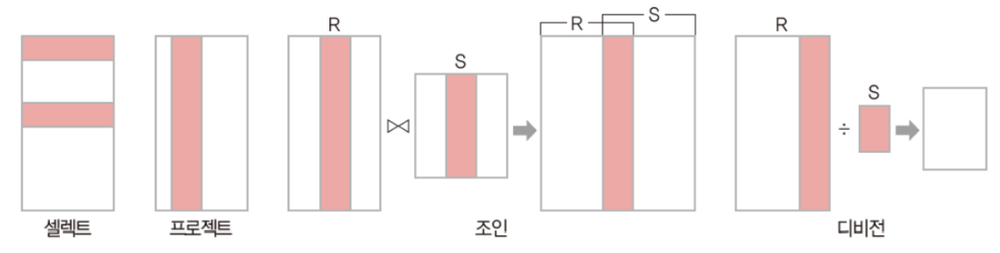

# 정보처리기사 실기

## 1. 관계 대수(Relation Algebra) & 관계 해석 (Relation Calculus)
### 관계 대수(Relation Algebra)
- 주어진 릴레이션 조작을 위한 연산 집합
- 원하는 정보를 얻기 위해 어떻게 질의를 해석하는지 기술한 절차적 언어
    - 일반 집합 연산: 합집합(∪), 교집합(∩), 차집합(-), 카티션 프로덕트(X)
    - 순수 관계 연산: SELECT(σ), PROJECT(∏), DIVISION(÷), JOIN(▷◁)
        
        - SELECT(σ)
            - σ조건(테이블): 테이블에서 조건을 만족하는 튜플을 구하기 위한 연산
        - PROJECT(∏)
            - ∏속성리스트(테이블): 테이블에서 주어진 속성들의 값으로만 구성된 튜플 반환 
        - JOIN(▷◁)
            - R▷◁S: 테이블 R과 테이블 S에서 공통으로 가지고 있는 속성을 이용해서 하나의 새로운 테이블을 만드는 연산자
        - DIVISION(÷)
            - X⊃Y인 두 개의 릴레이션 R(x)와 S(y)가 있을 때, R의 속성이 S의 속성 값을 모두 가진 튜플에서 S가 가진 속성을 제외한 속성만을 구하는 연산
                ```
                R1          S1      S2
                A B C       A       B C
                1 2 3       1       5 6
                4 5 6               8 9
                4 8 9
                5 2 3
                3 5 6

                R1 ÷ S1     R1 ÷ S2
                B C         A
                2 3         4 (56, 89를 모두 갖고 있는 A값)

                ```

### 관계 해석 (Relation Calculus)
- 원하는 정보가 무엇인지만 정의하는 `비절차적` 특성

<br/>

## 2. 암호화 알고리즘
- 단방향(Hash Algorithm): `MD ▶ SHA`
- 양방향
    - 대칭키(암호화키 == 복호화키)
        - 빠른 속도
        - 많은 양
        - 키 개수: n*(n-1)/2
        - 종류
            - Stream: RC4
            - Block: `DES ▶ AES`, IDEA, SEED, ARIA
                - DES: 페이스텔 구조 <br/>
                
                - AES
                    - SPN 구조 <br/>
                    
                    - 레인달에 기반한 암호화 방식
                - IDEA: 페이스텔과 SPN 중간 구조
    - 비대칭키(공개키 알고리즘, 암호화키 != 복호화키)
        - 느린 속도
        - 적은 양 ◀ 내용보다는 키를 암호화하는 방식으로 사용
        - 키 개수: 2*n
        - 종류
            - 소인수분해: `RSA`, Robin
            - 이산대수: DH, `DSA`, EIGmal
            - 타원곡선: `ECC`, ECDSA

### 공격 기법
### Dos(Denial of Service)
- `Ping Of Death`: 정상 크기보다 `큰 ICMP 패킷`을 작은 조각(Fragment)으로 쪼개어 공격 대상이 조각화된 패킷을 처리하게 만드는 공격
- `Smurf Attack`: `IP를 위조`하여 ICMP 받을 대상에 과부하
- `Land Attack`: Packet의 `보내는 사람과 받는 사람을 동일`하게 설정
- `Teardrop Attack`: Fragment를 재조립 시 정확한 조립을 위해 오프셋이라는 값을 더하게 되는데 이 `오프셋` 값을 고의적으로 수정하여 시스템의 기능을 마비시켜 버리는 방법
- SYN Flooding: 접속을 요청하는 SYN Packet을 대량으로 전송해 네트워크를 마비 시킴
- UDP Flooding: 많은 수의 UDP packet을 전송하여 정상적인 서비스가 불가능하도록 하는 공격
- Ping Flooding: 많은 ICMP Echo(Ping)를 보내 이에 대한 응답을 하기 위해 자원을 모두 사용해버려 시스템이 정상적으로 동작하지 못하도록 하는 공격

### DDoS (Distributed Denial of Service)
- `Phishing`: 공격자가 사람들을 속이기 위해 악성 이메일을 보내는 것
- `Pharming`: 피싱 기법 중 하나로, 정확한 웹 페이지 주소를 입력해도 `가짜 웹 페이지에 접속하게 하여` 개인정보를 훔치는 것
- `Sniffing`: 네트워크 중간에서 남의 패킷 정보를 `도청`하는 것
- Smishing: SMS와 Phishing의 결합어로 문자메시지를 이용한 피싱
- Qshing: QR코드와 피싱(Phishing)의 합성어로 QR코드를 이용한 피싱
- `Ransomware`: 컴퓨터 시스템을 감염시켜 `접근을 제한`하고 일종의 몸값을 요구하는 악성 소프트웨어
- `Key Logger`: 컴퓨터 사용자의 `키보드 움직임을 탐지`해 ID, 패스워드 등 개인의 중요한 정보를 몰래 빼가는 해킹 공격
- SQL Injection: 임의로 작성한 SQL 구문을 애플리케이션에 삽입하는 공격 방식
- `XSS`(Cross Site Scripting): 악의적인 스크립트를 포함하여 정보 유출 등의 공격을 하는 것

### 기타
- `Rainbow Table Attack`
    - 해시함수에 입력한 값과 해시값을 저장한 일종의 정답지를 갖고 일치하는 해시값을 통해 Key 값을 찾는 방식
    - `Salt`: 해커들의 레인보우 테이블이 키 값에 대한 해시값을 갖고 있으므로, 해당 값에 다른 값을 덧붙여서 다른 암호 값으로 저장되도록 추가하는 값
- `Session HiJacking`
    - 다른 사람의 세션 상태를 훔치거나 가로채는 해킹 기법
    - 로그인된 상태를 가로채는 것

<br/>

## 3. VPN
- 인터넷 등 통신 사업자의 공중 네트워크에 암호화 기술을 이용하여 사용자가 마치 자신의 `전용 회선`을 사용하는 것처럼 해주는 보안 솔루션
- 이용자가 인터넷과 같은 공중망에 사설망을 구축하여 마치 `전용망`을 사용하는 효과를 가지는 보안 솔루션

### 보안 솔루션
- 방화벽(Firewall): 네트워크 간에 전송되는 정보를 선별하는 기능을 가진 침입 차단 시스템
    - 웹 방화벽(Web Firewall): 웹 기반 공격을 방어할 목적으로 만들어진 웹서버 특화 방화벽
- 침입 탐지 시스템(IDS: Intrusion Detection System): 컴퓨터 시스템의 비정상적인 사용, 오용 등을 실시간으로 탐지하는 시스템
    - `이상 탐지`: 정상에서 벗어날 경우, 탐지(오류율↑)
    - 오염 탐지: 잘못될 경우 탐지(사용↑)
- 침입 방지 시스템(IPS: Intrusion Prevention System): 방화벽과 침입탐지 시스템을 결합한 것
- 데이터 유출 방지(DLP: Data Language/Loss Prevention): 내부 정보의 유출을 방지하기 위한 보안 솔루션
    - USB ▶ 컴퓨터: 데이터 전송 가능 / 컴퓨터 ▶ USB: 데이터 전송 불가능
- NAC(Network Access Control): 네트워크에 접속하는 내부 PC의 MAC 주소를 IP 관리 시스템에 등록한 후 일관된 보안 관리 기능을 제공하는 보안 솔루션
- ESM(Enterprise Security Management): 다양한 장비에서 발생하는 로그 및 보안 이벤트를 통합관리하는 보안 솔루션

<br/>

## 4. Routing Protocol
- 정적: 관리자가 직접 라우터에 경로 설정
- 동적: 라우터가 직접 경로 설정
    - `EGP`: 외부 게이트웨이 프로토콜
        - `BGP`: Board Gateway Protocol
    - `IGP`: 내부 게이트웨이 프로토콜
        - `Distance Vector`
            - `RIP`: Routing Information Protocol
                - 인접한 라우터간 일정 시간마다 상태 공유
                - 최대 홉수 15로 제한
        - `Link State`
            - `OSPF`: Open Shortest Path First (Protocol)
                - 변경된 데이터가 있을 때마다 상태 공유
                - 가장 많이 사용되는 내부 라우팅 프로토콜
                - 홉 수 제한 X

<br/>

## 5. V모델
1. `단위(Unit) 테스트`
: 개발이 명세서의 내용대로 정확히 구현되었는지 `단위 중심으로 테스트`
    - 정적
        - 소스코드의 실행없이 내부 확인
        - 도구
            - PMD, SonarQube, FindBugs, CheckStyle, CppCheck, Cobertura
    - 동적: 입력값에 대한 출력값 확인
2. `통합(Integration) 테스트`
: 단위 테스트를 통과한 컴포넌트 간의 `인터페이스를 테스트`
    - 빅뱅 테스트: 모든 모듈이 결합된 프로그램 전체가 대상
    - `상향식` 테스트: 드라이버(`Driver`) 사용
    - `하향식` 테스트: 깊이 우선 통합법, 넓이 우선 통합법 사용, 스텁(`Stub`) 사용
    - 혼합식 통합 테스트: : 하위 수준-상향식 통합, 상위 수준-하향식 통합 사용, 샌드위치(Sandwich)식 통합 테스트 방법
    - `회귀` 테스팅(Regression Testing):  통합 테스트가 완료 된 후 변경된 모듈이나 컴포넌트가 있을 경우, 다른 부분에 영향을 미치는지 테스트하여 새로운 오류 여부를 확인
3. `시스템(System) 테스트`
: 전체 시스템 또는 제품의 동작에 대해 테스트
    - 기능 요구사항 테스트: 기능 관련
    - 비기능 요구사항 테스트: 기능 외 성능, 보안, 품질 관련
4. `인수(Acceptance) 테스트`
: 계약상의 요구사항이 만족되었는지 확인
    - 알파 테스트: 개발자 + 사용자
    - 베타 테스트: 사용자
    - 형상 테스트: 구조 확인

### 애플리케이션 테스트 유형 구분
- 프로그램 실행 여부
    - 정적 테스트: `소스코드의 실행없이` 코드의 의미를 분석하여 결함을 찾아내는 코드 분석 기법
    - 동적 테스트: `소스코드를 실행하여` 프로그램의 동작이나 결과를 확인하고, 메모리 누수, 스레드 결함등을 분석하는 기법
- 테스트 기법
    - 화이트박스 테스트
    - 블랙박스 테스트
- 테스트에 대한 시각
    - 검증 테스트: 개발자 주도
    - 확인 테스트: 사용자 주도
- 테스트 목적
    - `회복`: 시스템에 여러 가지 결함을 주어 실패하도록 한 후 올바르게 `복구`되는지를 확인
    - 안전: 불법적인 침입으로부터 시스템을 보호할 수 있는지를 확인
    - `강도`: `과부하` 시에도 소프트웨어가 정상적으로 실행되는지를 확인
    - 성능
    - 구조
    - `회귀(Regression)`: `변경 또는 수정된 코드에 새로운 결함이 없음을 확인`
    - 병행: 변경된 소프트웨어와 기존 소프트웨어에 동일한 데이터를 입력해 결과를 비교
- 테스트 기반
    - 명세 기반 테스트: 사용자의 요구사항 명세를 빠짐없이 구현하고 있는지 확인
    - 구조 기반 테스트: 소프트웨어 내부의 논리 흐름에 따라 테스트 케이스를 작성하고 확인
    - `경험 기반 테스트`: `테스터의 경험을 기반으로 수행`
`
### 테스트 하네스(Test Harness)의 구성 요소
1. 테스트 `드라이버`: 상향식 테스트에서 사용하는 임시 모듈, 가상의 서버 역할
2. 테스트 `스텁`: 하향식 테스트에서 사용하는 임시 모듈, 가상의 클라이언트 역할
3. 테스트 `슈트`: 테스트 케이스의 집합
4. 테스트 `케이스`: 사용자의 요구사항을 정확하게 준수했는지 확인하기 위한 입력 값, 실행 조건, 기대 결과 등으로 만들어진 테스트 항목의 명세서
5. 테스트 `스크립트`: 자동화된 테스트 실행 절차에 대한 명세서
6. `목 오브젝트`: 사전에 사용자의 행위를 조건부로 입력해 두면, 그 상황에 맞는 예정된 행위를 수행하는 객체

### Test Oracle
: 테스트의 결과가 참인지 거짓인지를 판단하기 위해서 `사전에 정의된 참값을 입력하여 비교`하는 기법
- 종류
    - `참(True) 오라클`: `모든` 입력값에 대해 기대하는 결과를 전수 검사
    - `샘플링 오라클`: 특정 `몇몇` 입력값에 대해서만 검사
    - `휴리스틱 오라클`: 특정 `몇몇` 입력값에 대해서만 검사 + 나머지는 `추정`으로 처리
    - `일관성 검사 오라클`: 이전 수행결과와 현재 수행결과가 동일한지 검사

### 화이트/블랙박스 테스트
- 화이트 박스 테스트: 모듈 내부 소스 코드를 보면서 수행하는 테스트
    - 종류
        - `기본 경로 커버리지(Base Path Coverage)`: 수행 가능한 모든 경로 테스트
        - `데이터 흐름 테스트(Data Flow Testing)`: 프로그램에서 변수의 정의와 변수 사용의 위치에 초점을 맞추어 검사
        - 구조적 커버리지: 애플리케이션에서 테스트를 수행한 정도
            - `구문(문장) Coverage`: 코드 구조 내의 `모든 구문`에 대해 한 번 이상 수행하는 테스트 커버리지
            - `조건 Coverage`: 결정 포인트 내의 모든 `개별 조건식(if 조건문 내 and와 or로 연결된 개별 조건문)`에 대해 수행하는 테스트 커버리지
            - `결정(분기) Coverage`: `결정 포인트(if 조건문 전체)` 내의 모든 `분기`문에 대해 수행하는 테스트 커버리지
            - 조건/결정 Coverage: 결정 포인트와 개별 조건식이 모두 T/F를 가져야 함
            - 변경/조건 Coverage: 모든 결정 포인트 내의 개별 조건식은 적어도 한 번의 T/F를 가져야 함
            - 다중 조건 Coverage: 결정 포인트 내의 모든 개별 조건식의 가능한 조합을 100% 보장
        - 루프 테스트

- 블랙 박스 테스트: 외부 사용자의 요구사항 명세를 보면서 수행하는 테스트
    - `동등(동치, 균등) 분할 테스트(Equivalence Partitioning Testing)`: 입력값의 범위를 유사한 특징을 갖는 동등그룹으로 나누고 각 그룹마다 대표값을 선정하는 테스트 기법
    - `경곗값 분석 테스트(Boundary Value Analysis Testing)`: 경계값을 테스트 케이스로 선정하여 검사
    - `원인-결과 그래프 테스트(Cause-Effect Graphing Testing)`: 입력 데이터간의 관계와 출력에 영향을 미치는 상황을 체계적으로 분석하여 효용이 높은 테스트 케이스를 선정하여 검사
    - `오류 예측 테스트(Fault Based Testing)`
    - `의사 결정 테이블 테스트(Decision Table Testing)`
    - `상태 전이 테스트(State Transition Testing)`

### SW 테스트 방법
- `결함 집중(파레토 법칙)`
    - 대다수의 결함은 소수의 특정 모듈에 집중되는 경향이 있다.
- `살충제 패러독스`
    - 동일한 테스트 케이스를 반복적으로 수행하는 경우 더 이상 새로운 결함을 찾아낼 수 없다.
- `오류-부재의 궤변`
    - 거의 모든 결함을 확인 후 제거하였다고 해도 사용자의 요구 또는 비즈니스 목적을 충족시키지 못하는 경우 품질이 높다고 할 수 없다.

<br/>

## 7. 결합도(Coupling), 응집도(Cohesion)
모듈의 독립성을 판단하는 두 가지 지표
- `결합도(Coupling)`: 모듈과 모듈간의 상호 의존 정도
- `응집도(Cohesion)`: 모듈 내부의 기능적인 집중 정도

### 결합도(Coupling)
1. 자료(`Data`): 파라미터로 `값`만을 전달하는 경우
2. 스탬프(`Stamp`): 파라미터로 배열이나 오브젝트, 스트럭쳐 등의 `객체`가 전달되는 경우
3. 제어(`Control`): 파라미터로 값뿐만 아니라 `제어 요소`도 전달되는 경우
4. 외부(External): 어떤 모듈에서 선언한 데이터(변수)를 외부의 다른 모듈에서 참조하는 경우
5. 공통(`Common`): 공유되는 `공통` 데이터 영역(`전역변수`)을 여러 모듈이 사용하는 경우
6. 내용(`Content`): 한 모듈이 다른 모듈의 내부 기능 및 그 내부 자료를 직접 참조하거나 수정하는 경우
    - 내용 결합도가 높을 경우, 스파게티 코드가 될 수 있음

- `Spaghetti Code`: 소스 코드가 복잡하게 얽힌 경우
- `Alien Code`: 아주 오래되거나 참고문서가 없어 유지보수가 어려운 경우
- `Legacy Code`: 더 이상 쓰기 힘들고 난해한 경우

### 응집도(Cohesion)
1. 우연적(`Coincidental`): 모듈 내부의 각 구성요소들이 연관이 없을 경우
2. 논리적(`Logical`): 유사한 성격을 갖는 요소들이 한 모듈에서 처리
3. 시간적(`Temporal`): 특정 시간에 처리되어야 하는 활동들을 한 모듈에서 처리
4. 절차적(`Procedural`): 모듈 안의 구성요소들이 그 기능을 `순차적`으로 수행
5. 통신적(`Communicational`): `동일한 입력과 출력`을 사용하여 다른 기능을 수행하는 활동들이 모여있을 경우
6. 순차적(`Sequential`): 모듈 내에서 `한 활동에서 나온 출력값을 다른 활동이 사용`할 경우
7. 기능적(`Functional`): 모듈 내부의 모든 기능이 `단일한 목적`을 위해 수행되는 경우

<br/>

## 8. Web
`HTTP는` W3(World Wide Web)상에서 정보를 주고받을 수 있는 프로토콜이다.
GET, POSt 방식을 이용하여 문서를 주고받는데, 이 문서내에서 다른 문서의 링크 정보가 들어오는데, 이러한 링크정보를 만들 수 있는 게 `Hypertext`이다.
이런 Hypertext를 만들 수 있는 언어는 `HTML`이다.

### IP 주소 체계
- IPv4
    - 주소 길이: `32bit (8bit*4)`
    - 주소 개수: 2^32개
    - 주소 할당: A, B, C 클래스 등 비순차적 할당
    - 주소 체계: `유니캐스트(1:1), 멀티캐스트(1:다), 브로드캐스트(방송)`
    - 보안: IPSec, SSL(HTTPS), S-HTTP Protocol 별도 설치
- IPv6
    - 주소 길이: `128bit (16bit*8)`
    - 주소 개수: 2^128
    - 주소 할당: 순차적 할당
    - 주소 체계: `유니캐스트(1:1), 멀티캐스트(1:다), 애니캐스트(가장 자까운 수신자에게 전달)`
    - 보안: 자체 보안기능 제공

### IPv4 → IPv6 전환 기술
- `듀얼 스택(Dual Stack)`
    - IPv4 / IPv6 동시 지원
- `터널링(Tunneling)`
    - 두 IPv6 네트워크 간 터널을 이용하는 기술
    - `캡슐화`
- `주소 변환(Addressing Translation)`
    - IPv4와 IPv6 간 주소를 변환하여 두 버전을 이용

### SOAP
- HTTP, HTTPS 등을 통해 `XML` 기반의 메세지를 컴퓨터 네트워크 상에서 교환하는 프로토콜
- XML을 이용하여 분산처리환경에서 정보 교환을 쉽게 할 수 있도록 도와줌
- `WSDL: SOAP 사용 설명서, XML 형식 ▶ UDDI에 등록 ▶ SOAP을 이용해 실제 통신`
    - WSDL: 서비스 제공 장소, 서비스 메시지 포맷, 프로토콜 등 웹 서비스의 구체적 내용이 기술되어 있는 언어

<br/>

## 9. 객체지향 설계원칙, SOLID
1. 단일 책임 원칙 (Single Responsibility Principle)
: 모든 클래스는 각각 하나의 책임만 가져야 함
2. 개방-폐쇄 원칙 (Open Closed Principle)
: 확장에는 열려있고 수정에는 닫혀있어야 함
3. 리스코프 치환 원칙 (Liskov Substitution Principle)
: 자식 클래스는 언제나 자신의 부모 클래스를 대체할 수 있음
4. 인터페이스 분리 원칙 (Interface Segregation Principle)
: 자신이 사용하지않는 인터페이스는 구현하지 말아야 함
5. 의존 역전 원칙 (Dependency Inversion Principle)
변화하기 쉬운 것 또는 자주 변화하는 것보다는 변화하기 어려운 것, 거의 변화가 없는 것에 의존해야 함

### 객체지향 프로그래밍(OOP: Object-Oriented Programming) 구성요소
- 클래스(`Class`): 같은 종류(또는 문제 해결을 위한)의 집단에 속하는 속성(변수)과 행위(메소드)를 정의한 것
- 객체(`Object`): 클래스라는 일종의 설계도를 기반으로 실제로 생성된 그 실체가 바로 객체
- 메서드(`Method`): 객체에 명령을 내리는 행위
- 메시지(`Message`): 객체간의 통신이 이루어지는 방법, 메시지를 통해 메소드가 호출되어 사용

### UI 설계 원칙 4가지
- `직관성`
- `유효성`: 사용자의 목적을 정확하게 달성해야 함
- `학습성`
- `유연성`: 사용자의 요구사항을 최대한 수용하면서 오류를 최소화 해야함

### UI 설계 도구
1. 와이어프레임 (WireFrame): 기획 단계의 초기에 제작하는 것으로, 페이지에 대한 개략적인 레이아웃이나 UI 요소 등에 대한 뼈대를 설계하는 단계
2. 목업 (Mockup): 와이어프레임보다 좀 더 실제 화면과 유사하게 만든 정적인 형태의 모형
3. 스토리보드 (Story Board): 와이어프레임에 콘텐츠에 대한 설명, 페이지 간 이동 흐름 등을 추가한 문서
4. 프로토타입 (Prototype): 실제 구현된 것처럼 테스트가 가능한 동적인 형태의 모형
5. 유스케이스 (Use Case): 사용자 측면에서의 요구사항

### 애자일 방법론
: 고객의 요구사항 변화에 유연하게 대응할 수 있도록 일정한 주기를 반복하면서 개발 과정을 진행
- eXtreme Programming: 수시로 발생하는 고객의 요구사항에 유연하게 대응하기 위해 고객의 참여와 개발 과정의 반복을 극대화하여 개발 생산성을 향상시키는 방법
    - 5가지 핵심 가치: 의사소통, 피드백, 존중, 용기, 단순성
    - 12가지 기본 원리
- `Scrum`
    - 짧은 단위시간(Sprint) 내 실행가능한 SW 개발
    - 매일 15분 정도의 Scrum meeting 회의
- FDD(Feature-Driven Development): 기능주도 개발
- 크리스탈(Crystal)
- LEAN: 낭비 요소를 제거하여 품질을 향상

### 객체지향 분석의 방법론
1. `Rumbaugh`: 가장 일반적으로 사용되는 방법으로 분석 활동을 객체, 동적, 기능 모델로 나누어 수행
    -` 객체 모델링(Object Modeling)`: `클래스 다이어그램`을 이용하여 시스템에서 요구되는 객체을 표현한 것
    - `동적 모델링(Dynamic Modeling)`: `상태도`를 이용하여 시간의 흐름에 따른 객체들 사이의 동적인 행위를 표현한 것
    - `기능 모델링(Functional Modeling)`: `자료 흐름도(DFD)`를 이용하여 다수의 프로세스들 간의 자료 흐름을 중심으로 처리 과정을 표현한 것
2. `Booch`: 미시적(Micro) 개발 프로세스와 거시적(Macro) 개발 프로세스를 모두 사용
3. `Jacobson`: UseCase를 강조하여 사용
4. `Coad와 Yourdon`: E-R다이어그램을 사용
5. `Wirfs-Brock`: 분석과 설계간의 구분이 없음

<br/>

## 10. Subnet Mask
```
IP: 192.168.100.132
Subnet Mask: 255.255.255.192
1100 0000
총 26bit를 네트워크 주소로 사용
00: 000000 - 111111
01: 000000 - 111111
10: 000000 - 111111 ◀ 132
11: 000000 - 111111

네트워크 주소: 맨 앞(192.168.100.128)
브로드캐스트 주소: 맨 뒤
총 사용 가능한 주소 개수: 256 / 4 - 2 = 64 - 2 = 62

```

<br/>

## 11. SQL - 관계 대수
```
∏TTL(직원): 직원 테이블의 TTL SELECT

```

<br/>

## 12. SQL
`WHERE절에는 집계함수 쓰면 안되므로 MAX 불가`
```
SELECT * FROM 상품
WHERE 단가 > ALL(SELECT 단가 FROM 상품 WHERE 제조사 = 'B')

ALL: 서브쿼리 결과값보다 모두 커야하는 AND 조건
ANY: 서브쿼리 결과값보다 어느 하나라도 크면 되는 OR 조건

```

<br/>

## 13. SQL
`COUNT는 NULL을 COUNT하지 않음`
```
SELECT COUNT(COL2)
FROM TABLE
WHERE COL1 IN (2, 3) OR COL2 IN (3, 5);

-- 4

```

<br/>

## 14. 정규화
### 이상 현상
데이터베이스 내의 데이터들이 중복돼 검색이나 조작 등을 제대로 수행할 수 없는 현상
- 삽입 이상: 릴레이션(테이블)에 데이터를 삽입할 때 의도와는 상관없는 값들도 함께 삽입되는 현상
- 삭제 이상: 릴레이션에서 한 튜플(행)을 삭제할 때 의도와는 상관없는 값들이 함께 삭제되는 현상
- 갱신 이상: 릴레이션에서 튜플에 있는 속성값을 갱신할 때 일부 튜플의 정보만 갱신되며 정보에 모순이 생기는 현상

### 데이터 모델링 3단계
1. `개념적` 설계
    - 사람이 이해할 수 있는 형태의 정보구조를 만들어가는 과정
    - `ERD 생성`
2. `논리적` 설계
    - 개념적 설계에서 만들어진 구조를 컴퓨터가 이해하고 처리할 수 있도록 변환하는 과정
    - `정규화`
    - `Transaction Interface 설계`
3. `물리적` 설계
    - 실제 저장정치에 어떻게 저장할지 설계하는 단계
    - `성능 향상`(인덱스, 파티션, 반정규화 등)

### 정규화 종류
- 제 1정규형: 도메인이 원자값
- 제 2정규형: 부분 함수 종속성 제거
- 제 3정규형: 이행적(Transitive) 함수 종속성 제거
- BCNF: 결정자이면서 후보키가 아닌것 제거
- 제 4정규형: 다치 종속 제거
- 제 5정규형: 조인 종속 제거

### 반정규화
: 데이터 베이스 정규화 후 `성능향상`을 위해 정규화 기법에 위배된 의도적 수행기법
- 종류
    - 테이블 분할: 수평분할 / 수직분할
    - 테이블 중복: 통계 테이블 추가 / 진행 테이블 추가
    - 컬럼 중복: 중복 컬럼 추가 / 파생 컬럼 추가

<br/>

## 15. C
```
#include<stdio.h>
struct st{
    int x, y;
};
int main(){
    struct st dt[2];
    for(int i=0; i<2; i++){
        dt[i].x = i;
        dt[i].y = i + 1;
    }
    printf("%d", dt[0].x + dt[1].y);
}

/*
0 + 2 = 2
*/

```

<br/>

## 16. C
`문법: C언어에서 문자열은 기본적으로 \0(Null 문자)를 포함`
```
#include<stdio.h>
int main(){
    char *p1 = "2022";
    char *p2 = "202210";
    int i = func(p1);
    int j = func(p2);
    printf("%d", i + j);
    return 0;
}
int func(char *p){
    int cnt = 0;
    while(*p!='\0'){ /* *p: p의 값 */
        cnt++;
        p++;
    }
    return cnt;
}

/*
    100 101 102 103 104
p1    2   0   2   2  \0
    200 201 202 203 204 205 206
p2    2   0   2   2   1   0  \0

*/
```

<br/>

## 17. C
```
#include<stdio.h>
int main(){
    int a[4] = {0, 2, 4, 8};
    int b[3];

    int *p;

    int sum = 0;
    for(int i = 1; i<4; i++){
        p = a + i;
        b[i-1] = *p - a[i-1]; /* *p: p의 값 */
        sum += b[i-1] + a[i];
    }
    printf("%d", sum);
}

    100 101 102 103
a     0   2   4   8
100
     0   1   2
b   2-0 4-2 8-4

sum = 4 + 6 + 12 = 22

```

<br/>

## 18. Java
```
public static void main(String[] args){
    int i = 3;
    int sum = 0;
    switch(i){
        case 0: sum++;
        case 1: sim += 3;
        case 2: sum -= 10;
        case 3: sum = 0;
        case 4: sum += 3;
        case 5: sum -= 10;
        default: sum--;
    }
    System.out.println(sum);
}

// -8

```

<br/>

## 19. Java
`obj의 func를 호출한 것이므로 obj의 a를 사용해야 함` <br/>
`return값이 b인지 a+b인지 확인`
```
class Cal{
    int a;
    Cal(int a){
        this.a = a;
    }
    int func(){
        int b = 1;
        for(int i=1; i<a; i++)
            b = a * i + b;
        return a + b;
    }
}

public class Main{
    public static void main(String[] args){
        Cal obj = new Cal(3);
        obj.a = 5;
        int b = obj.func();
        System.out.println(obj.a + b);
    }
}

// a = 5

// b = 5*1 + 1 = 6
// b = 5*2 + 6 = 16
// b = 5*3 + 16 = 31
// b = 5*4 +  31 = 51

// obj.func() = 56

// 5 + 56 = 61

```

<br/>

## 20. Python
`Python에서 slice는 끝자리 제외`
```
str1 = "REMEMBER NOVEMBER";
str2 = str1[:3] + str1[12:16];
str3 = "R AND %s" % "STR"; # %s = % 뒤의 string을 대입
print(str2 + str3);

# str2 = REMEMBE
# str3 = R AND STR
# REMEMBER AND STR

```

<br/>

### 정보보안의 3요소
- `기밀성`: 인가된 사용자만 접근
- `무결성`: 인가된 사용자만 인가된 방법으로 자원 수정
- `가용성`: 인가된 사용자는 언제든지 접근 가능

<br/>

### 소프트웨어 생명 주기
- `Agile 방법론`
    - 개발과 함께 즉시 피드백을 받아서 유동적으로 개발하고 절차보다는 사람이 중심이 되어 변화에 유연한 방법론
- `폭포수 모형 (Waterfall Model)`
    - 계획 → 분석 → 설계 → 구현 → 테스트 → 유지보수
    - 이전 단계로 돌아갈 수 없다는 전제
    - 각 단계가 끝난 후에는 다음 단계를 수행하기 위한 `결과물`이 명확하게 산출되어야 함
- `나선형 모델`
    - `계획 및 정의 → 위험 분석 → 공학적 개발 → 고객 평가`
- 프로토타입 모형(Prototype Model, 원형 모델)
    - 실제 개발될 소프트웨어에 대한 `견본품`을 만들어 최종 결과물을 예측하는 모형
- RAD 기법 모델
    - `짧은 개발 기간`동안 개발하기위한 순차적 프로세스 모델
- V 모델
    - `단위 테스트 → 통합 테스트 → 시스템 테스트 → 인수 테스트`
    - 작업 결과의 `검증(테스트)`에 초점
- 4세대 기법
    - `자동화 도구`들을 이용하여 요구사항 명세서로부터 실행코드를 자동으로 생성할 수 있게 해주는 방법

<br/>


📚 참고 자료 <br/>
https://ckim0531.tistory.com/entry/%EC%A0%95%EB%B3%B4%EC%B2%98%EB%A6%AC%EA%B8%B0%EC%82%AC-1%EA%B3%BC%EB%AA%A9-%EB%8D%B0%EC%9D%B4%ED%84%B0%EB%B2%A0%EC%9D%B4%EC%8A%A4-3-%EA%B4%80%EA%B3%84-%EB%8D%B0%EC%9D%B4%ED%84%B0%EB%B2%A0%EC%9D%B4%EC%8A%A4-%EB%AA%A8%EB%8D%B8%EA%B3%BC-%EC%96%B8%EC%96%B4-%EA%B4%80%EA%B3%84%EB%8C%80%EC%88%98-%EB%B0%8F-%EA%B4%80%EA%B3%84%ED%95%B4%EC%84%9D
